<div align="center">

# 🚀 EasyAds Agent / 개떡찰떡

### 자연어와 상품 이미지를 실제 광고 시안으로 연결하는 대화형 AI 광고 제작 에이전트

말로 요청하거나 상품 사진을 올리면, 상품 이해, 카피 설계, 이미지 생성, 품질 검수, 저장과 재개까지 하나의 워크플로우로 처리합니다.

<p>
  
  
  
  
  
  
  
  
</p>

</div>

---

<p align="center">
  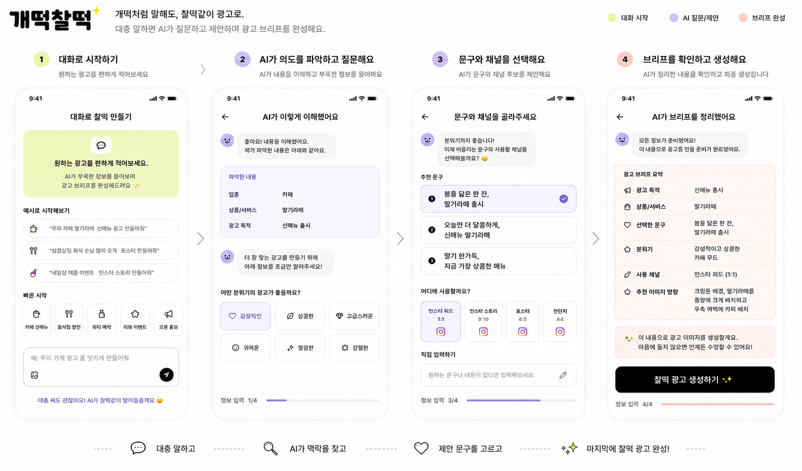
</p>

> [!NOTE]
> 이 저장소는 단순 이미지 생성 데모가 아닙니다.
> 사용자의 모호한 광고 요청을 구조화하고, 상태 기반 AI workflow로 카피, 이미지, 검수, 저장, 재개를 연결하는 **서비스형 광고 생성 파이프라인 MVP**입니다.

---

## 🔗 Project Links

| 항목                  | 링크                                                                               |
| ------------------- | -------------------------------------------------------------------------------- |
| Team Hub             | [Notion Team Hub](https://app.notion.com/p/easyads/3665cd53900f809f86e2d3dae2960a72)                                        |
| Website             | [easyads-agent.com](https://easyads-agent.vercel.app/)                                        |
| GitHub Repository   | [easyadsAGENT](https://github.com/ming2tofu33/pjt-sprint_ai07_easyadsAGENT)      |
| Architecture Map    | [`docs/FE_BFF_BE_LOGIC_MAP.md`](./docs/FE_BFF_BE_LOGIC_MAP.md)                   |
| LangGraph Schema    | [`docs/llm-langgraph-schema-v1.md`](./docs/llm-langgraph-schema-v1.md)           |
| Quality Gate Design | [`docs/ad-compliance-gate-design-v1.md`](./docs/ad-compliance-gate-design-v1.md) |
| Database Schema     | [`docs/supabase-db-schema-v1.md`](./docs/supabase-db-schema-v1.md)               |
| 협업 일지             | [Notion Logs](https://app.notion.com/p/easyads/Logs-3665cd53900f80ad9589c257acd28297)                                        |

---

## 🧭 Project Overview

### Problem

소상공인과 소규모 브랜드가 광고 한 장을 만들려면 상품 정보 정리, 문구 작성, 이미지 제작, 위험 표현 검토, 결과 저장을 각각 처리해야 합니다.

또한 실제 사용자는 보통 다음처럼 모호하게 요청합니다.

```text
우리 카페 신메뉴 홍보할 포스터 만들어줘
```

이 한 문장에는 업종, 광고 목적, 상품 정보, 톤앤매너, 채널, 이미지 스타일, 문구 길이, 규제 위험, 결과물 포맷 등 여러 결정 요소가 숨어 있습니다.

EasyAds Agent는 이 모호한 요청을 광고 제작에 필요한 구조화된 브리프로 바꾸고, 카피와 비주얼 전략을 함께 결정해 최종 광고 에셋으로 연결합니다.

---

### Goal & Solution

EasyAds Agent의 목표는 사용자가 짧고 불완전한 요청을 입력하더라도 AI가 다음 과정을 자동으로 수행하도록 만드는 것입니다.

1. 사용자의 광고 의도 분석
2. 부족한 정보에 대한 추가 질문
3. 업종과 목적에 맞는 카피 후보 생성
4. 광고 포맷에 맞는 비주얼 전략 선택
5. 이미지 생성 또는 템플릿 합성
6. OCR, 가독성, 광고 규제, 이미지 품질 검증
7. 최종 마케팅 에셋 저장 및 재개 지원

---

## 📌 Project Summary

| 항목       | 내용                                              |
| -------- | ----------------------------------------------- |
| 프로젝트명    | EasyAds Agent / 개떡찰떡                            |
| 목표       | 대화형 인터페이스를 통한 맞춤형 다채널 마케팅 에셋 자동 생성              |
| 주요 사용자   | 소상공인, 로컬 비즈니스 운영자, 1인 마케터                       |
| 핵심 파이프라인 | 입력 이해 → 카피 전략 → 비주얼 전략 → 이미지 생성 → 품질 검수 → 저장/재개 |
| 입력 방식    | 텍스트, 이미지, 텍스트 + 이미지                             |
| 프론트엔드    | Next.js, React, TailwindCSS                     |
| BFF      | Fastify, Zod                                    |
| 백엔드      | FastAPI, LangGraph, Pydantic                    |
| 데이터베이스   | Supabase Postgres, local memory fallback        |
| 스토리지     | Cloudflare R2, local development storage        |
| 품질 검증    | OCR Gate, VLM Gate, Compliance Gate, E2E QA     |

---

## 🧠 Core Design Principles

| 원칙                   | 적용 방식                                                           |
| -------------------- | --------------------------------------------------------------- |
| Evidence First       | 사용자 텍스트, 이미지 관찰, 레퍼런스, 사용자 선택을 근거 단위로 추적                        |
| Stateful & Resumable | LangGraph state와 checkpointer를 이용해 질문, 승인, 외부 작업 대기 상태를 중단하고 재개 |
| Text-layout First    | 텍스트를 마지막에 합성하더라도 안전영역과 텍스트 공간은 이미지 생성 전에 설계                     |
| Bounded Context      | Product, Business, Campaign, Scene, Style 정보를 분리해 해석            |
| Quality Gate         | 이미지 생성 후 OCR, 가독성, 광고 규제, 비즈니스 적합성을 별도 검증                       |
| Cost-safe Execution  | 실제 외부 API 호출과 mock test를 분리하고, actual smoke는 명시적으로 실행           |
| Persistent Output    | 생성 결과를 브라우저 상태가 아니라 작업, 출력, 대화, 보관함 단위로 저장                      |

---

## ✨ Key Features

| 기능                            | 설명                                        |
| ----------------------------- | ----------------------------------------- |
| Conversational Intake         | 사용자의 모호한 요청을 분석하고 필요한 정보를 대화로 보완          |
| Multimodal Input              | 텍스트, 이미지, 텍스트 + 이미지 입력을 하나의 광고 제작 흐름으로 처리 |
| Copy Recommendation           | 업종, 목적, 톤앤매너에 맞는 헤드라인, 서브카피, CTA 후보 생성    |
| Visual Strategy Routing       | 광고 목적, 업종, 포맷에 따라 비주얼 방향과 레이아웃 전략 결정      |
| Format-aware Rendering        | 포스터, 피드, 스토리, 배너 등 채널별 결과물 생성             |
| Reference / Source Image Flow | 사용자가 업로드한 이미지나 레퍼런스를 광고 생성 흐름에 연결         |
| Quality Gate                  | 텍스트 길이, safe area, 가독성, 이미지 품질, 광고 적합성 검증 |
| OCR / VLM Validation          | 가짜 텍스트, 워터마크, 로고, 카피 누락, 비즈니스 적합성 검토      |
| Compliance Gate               | 광고 문구와 표현의 위험 요소를 사전에 점검                  |
| Archive & Resume              | 생성 결과, 작업방, 대화 흐름, 결과 복구 지원               |
| Usage Tracking                | 이미지 생성, 스토리지, GPU 또는 API 사용량 추적 기반 마련     |

---

## 📊 What We Improved

| Baseline 한계         | 개선 방식                                                    |
| ------------------- | -------------------------------------------------------- |
| 사용자의 막연한 요청 처리 어려움  | 챗봇 형태의 대화형 브리프 생성으로 누락 정보를 능동적으로 파악                      |
| 상품 이미지와 자연어 요청의 분리  | 텍스트, 이미지, 텍스트 + 이미지 입력을 evidence 기반으로 통합                 |
| 브랜드와 맞지 않는 뻔한 광고 문구 | 비즈니스 도메인 맞춤형 카피 추천 및 톤앤매너 매칭 로직 도입                       |
| 이미지 생성 후 텍스트 배치 실패  | Text-layout First 원칙으로 이미지 생성 전 safe area와 copy space 설계 |
| 광고 규제 위험            | Compliance Gate와 사용자 확인 흐름 도입                            |
| 브라우저 이탈 시 결과 유실     | GenerationJob, Thread, Output, Archive 기반 저장 및 재개 구조 도입  |
| 결과물 품질 검증의 어려움      | OCR, VLM, E2E QA, copy lineage 기반 검증 체계 구축               |

---

## 🧩 Supported Workflows

| Workflow                        | 설명                                |
| ------------------------------- | --------------------------------- |
| Text-to-Ad                      | 텍스트 요청만으로 광고 생성                   |
| Image-to-Ad                     | 업로드한 상품 이미지 또는 매장 이미지를 기반으로 광고 생성 |
| Text + Image Ad                 | 사용자 설명과 이미지 관찰 결과를 함께 반영          |
| Reference-guided Ad             | 레퍼런스 이미지의 분위기, 구도, 스타일을 반영        |
| Template Composite              | 템플릿과 카피를 조합해 최종 에셋 생성             |
| Native Typography               | 이미지 생성 모델이 광고 문구를 이미지 안에 직접 포함    |
| Quality Feedback / Regeneration | 검수 실패 원인을 기반으로 부분 재생성 또는 수정 요청 연결 |

---

## 🔄 User Flow

<p align="center">
  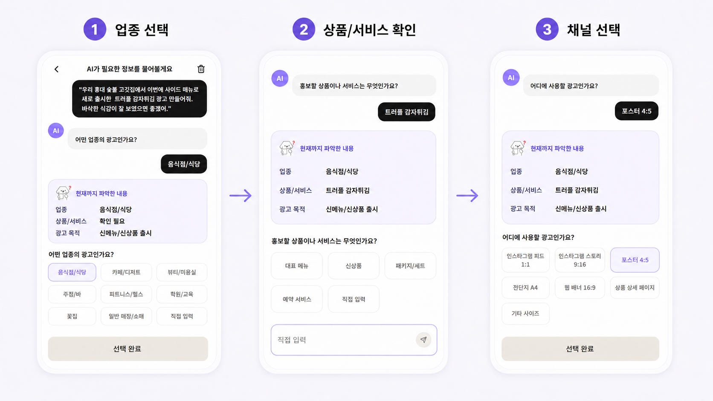
  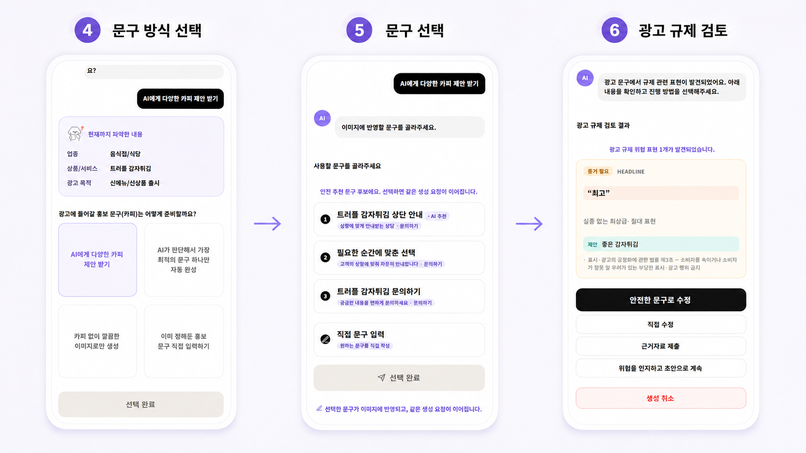
  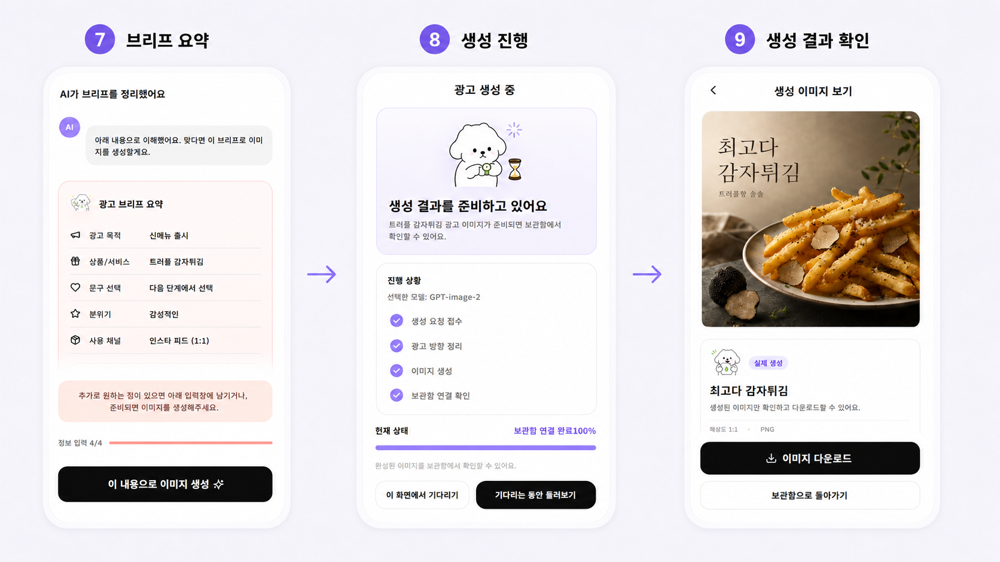
</p>

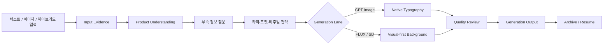

---

## 🏗 Architecture

### Full-stack Architecture

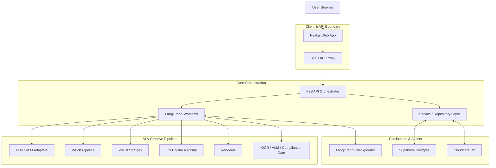

---

## 🧱 Core Pipeline

### 1. Intake Understanding

사용자의 채팅 입력을 분석하여 광고 목표, 업종, 홍보 대상, 포맷, 톤앤매너 등 광고 생성에 필요한 정보를 파악합니다.

부족한 정보가 있으면 AI가 추가 질문을 던져 대화형 브리프를 완성합니다.

예시 질문 항목:

* 업종
* 광고 목적
* 홍보 상품
* 타겟 고객
* 원하는 분위기
* 광고 채널
* 강조하고 싶은 장점
* 지역 또는 시즌 맥락

---

### 2. Product & Evidence Understanding

사용자의 자연어 입력과 업로드 이미지를 evidence로 정리합니다.

처리 대상:

* 사용자 텍스트
* 업로드 이미지
* 레퍼런스 이미지
* 사용자 선택
* VLM 이미지 관찰 결과

이 과정을 통해 상품 정체성, 업종, 캠페인 목적, 장면, 스타일 정보를 분리합니다.

---

### 3. Copy & Visual Strategy

광고 목적에 맞는 카피 후보와 비주얼 전략을 생성합니다.

주요 결정 요소:

* headline
* supporting copy
* CTA
* copy tone
* visual mood
* layout direction
* ad format
* copy space
* background strategy

---

### 4. Generation Lane

이미지 생성은 모델 특성에 따라 다른 lane으로 실행됩니다.

| Lane                    | 설명                               |
| ----------------------- | -------------------------------- |
| Mock                    | 비용 없는 로컬 개발 및 테스트                |
| Native Typography       | 승인된 카피를 이미지 생성 프롬프트에 포함해 한 번에 생성 |
| Visual-first Background | 이미지 품질을 우선하고 텍스트는 후처리 합성         |
| Remote GPU              | 무거운 이미지 모델을 원격 GPU worker에서 실행   |

---

### 5. Quality Gate

최종 렌더링 전후로 결과물이 실제 광고 에셋으로 사용 가능한지 검증합니다.

검증 항목:

* 카피 길이와 레이아웃 적합성
* 텍스트 safe area
* 한글 카피 누락 또는 변형 여부
* 배경 이미지의 가짜 글자, 로고, 워터마크 여부
* 상품 또는 음식의 가시성
* 업종과 광고 목적의 일치성
* 광고 규제 위험
* 최종 결과물의 상업적 사용 가능성

---

### 6. Archive & Resume

생성된 결과물과 작업 흐름을 저장하여 사용자가 브라우저를 닫거나 세션이 끊겨도 결과를 다시 확인할 수 있도록 합니다.

저장 대상:

* generation job
* selected copy
* copy alternatives
* visual strategy
* final image URL
* download URL
* quality summary
* warning codes
* retry history

---

## 📐 Supported Ad Formats

| Format          | 주요 용도           | 기준             |
| --------------- | --------------- | -------------- |
| Instagram Feed  | SNS 피드 광고       | 정사각형 또는 카드형 광고 |
| Instagram Story | 세로형 모바일 광고      | 모바일 세로형 광고     |
| Poster          | 매장 홍보물, 이벤트 포스터 | 세로형 홍보물        |
| Banner          | 웹 배너, 프로모션 영역   | 가로형 프로모션 광고    |

> 실제 이미지 크기와 safe area는 코드의 `AdFormatSpec` 및 rendering contract를 기준으로 관리합니다.

---

## 🖼️ Demo Images

<p align="center">
  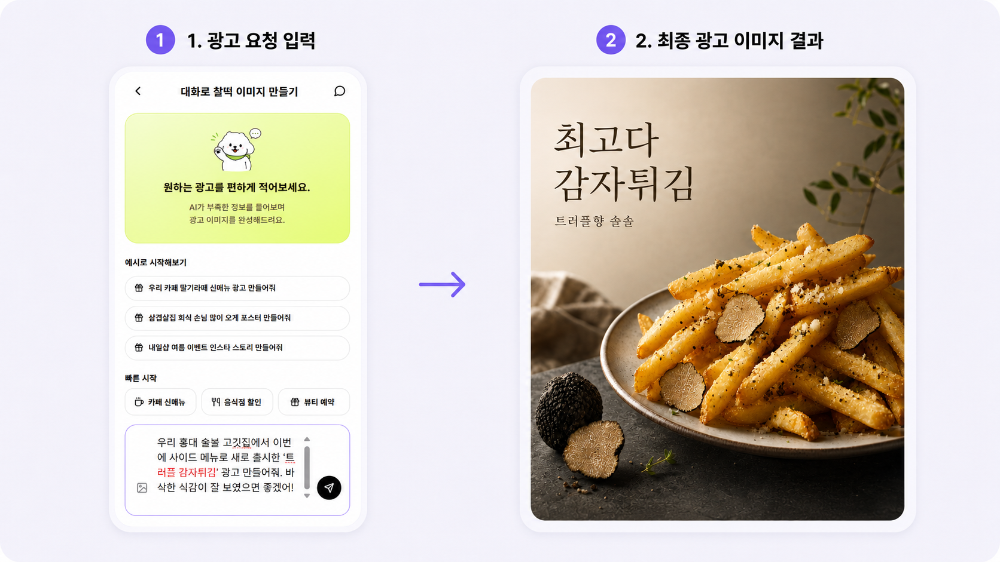 최종 광고 생성 결과 화면" width="380">
</p>


---

## 🧰 Tech Stack

| Category         | Stack                                        |
| ---------------- | -------------------------------------------- |
| Frontend         | Next.js, React, TypeScript, TailwindCSS      |
| BFF              | Fastify, Zod                                 |
| Backend          | Python 3.12, FastAPI, Pydantic               |
| AI Workflow      | LangGraph                                    |
| LLM / VLM        | OpenAI API, OpenAI-compatible adapters       |
| Image Generation | GPT Image, FLUX, SD 계열 실험                    |
| Rendering        | Pillow, typography layout, adaptive contrast |
| Database         | Supabase Postgres, local memory fallback     |
| Object Storage   | Cloudflare R2, local development storage     |
| QA / Evaluation  | OCR Gate, VLM Gate, Compliance Gate, E2E QA  |
| Infra / Tooling  | Docker Compose, Makefile, uv                 |

---

## 🗂 Project Structure

```text
pjt-sprint_ai07_easyadsAGENT/
├── apps/
│   ├── web/                    # Next.js frontend, user UI, PWA
│   └── bff/                    # Fastify BFF / API boundary
├── orchestrator/               # FastAPI + LangGraph backend
│   ├── app/
│   │   ├── api/                # REST API endpoints
│   │   ├── graph/              # LangGraph nodes and state transitions
│   │   ├── llm/                # Prompts, intent understanding, copy services
│   │   ├── vision/             # Image preprocessing and visual understanding
│   │   ├── t2i/                # Image generation engine registry
│   │   ├── rendering/          # Typography and asset composition
│   │   ├── quality_gate/       # OCR / VLM / compliance validation
│   │   ├── storage/            # Local / R2 asset storage abstraction
│   │   └── schemas/            # Pydantic schemas and contracts
│   └── tests/                  # Unit, contract, integration, E2E tests
├── scripts/                    # Smoke tests, diagnostics, maintenance scripts
├── docs/                       # Architecture, workflow, compliance, DB docs
├── supabase/                   # Supabase migrations and DB config
├── modal_apps/                 # Remote GPU worker entrypoints
├── data/                       # Local runtime artifacts, gitignored
├── Makefile                    # Build, test, run automation
└── README.md
```

> 배포 환경에서는 `data/outputs/...` 같은 local path를 최종 저장소로 사용하지 않고, Cloudflare R2 object key와 signed/public URL을 저장하는 구조를 권장합니다.

---

## 🚀 Quick Start

프로젝트 실행에 필요한 환경 변수 설정과 Docker, Python, Node.js 기반 실행 방법은 별도의 문서에서 안내합니다.

전체 실행 절차는 아래 Quick Start Guide를 참고해 주세요.

👉 **[Quick Start Guide](./docs/QUICK_START.md)**

## ✅ Evaluation & Testing

| 테스트 도구             | 실행 명령어                                                           | 검증 내용                           |
| ------------------ | ---------------------------------------------------------------- | ------------------------------- |
| Orchestrator Test  | `uv run python -m pytest orchestrator/tests --strict-markers -q` | 백엔드, 스키마, 그래프, 파이프라인 로직 검증      |
| BFF Test           | `cd apps/bff && npm test`                                        | BFF API boundary 검증             |
| Web Test           | `cd apps/web && npm run test`                                    | 프론트엔드 컴포넌트 및 흐름 검증              |
| Web Build          | `cd apps/web && npm run build`                                   | 배포 가능 여부 확인                     |
| Compile Check      | `uv run python -m compileall orchestrator scripts`               | Python syntax 검증                |
| Actual Model Smoke | 별도 actual flag 사용                                                | 실제 OpenAI 또는 이미지 provider 호출 검증 |

> [!IMPORTANT]
> 실제 외부 API를 호출하는 테스트는 비용이 발생할 수 있습니다.
> 로컬 개발 시에는 기본적으로 mock provider를 사용하고, actual smoke는 별도 flag와 로그를 남겨 실행합니다.

---

## 🛡 Quality & Compliance

EasyAds Agent는 단순히 이미지를 생성하는 데서 끝나지 않고, 결과물이 실제 광고물로 사용 가능한지 여러 단계에서 검증합니다.

### Copy Quality

* 업종별 카피 톤 검증
* generic placeholder 표현 제거
* 헤드라인, 서브카피, CTA 역할 분리
* 카피 후보 생성 및 선택 이력 관리
* copy lineage 기반 재생성 지원

### Visual Quality

* 상품 또는 음식의 가시성 확인
* 배경 복잡도와 텍스트 공간 확인
* 광고 템플릿다운 구도 검증
* 이미지와 문구의 의미적 일치 여부 검토

### OCR Gate

* 배경 이미지에 생성된 가짜 글자, 로고, 워터마크 탐지
* 최종 이미지의 한글 카피 누락, 오독, 변형 여부 확인
* TextRenderer가 합성한 문구의 가독성 검증

### VLM Quality Gate

* 최종 광고 상용성 검토
* 업종 적합도 검토
* copy safe area 검토
* business fit 검토
* manual review 또는 retry action 분기

### Compliance Gate

* 광고 표현 위험 요소 검토
* 규제 위험 문구 탐지
* evidence / manual review 흐름 지원
* 검수 결과를 warning code와 suggested action으로 구조화

> [!WARNING]
> Compliance Gate는 위험 표현을 줄이기 위한 보조 장치이며, 법률 자문을 대체하지 않습니다.

---

## 🧯 Issue Management

프로젝트 진행 중 발생한 오류, UI/UX 피드백, 런타임 이슈, 품질 개선 사항은 별도의 Issue & Feedback 문서로 관리했습니다.

각 이슈는 단순 기록에 그치지 않고 원인 분석, 해결 과정, 재발 방지 기준으로 정리하여 QA와 기능 개선에 반영했습니다.

---

## 🔒 Security & Operations

* `.env`, API key, token, model weight, generated output은 commit하지 않습니다.
* OpenAI API Key, Supabase service role key, R2 secret key는 서버 사이드에서만 사용합니다.
* 생성 이미지와 업로드 이미지는 DB에 직접 저장하지 않고 Object Storage에 분리하여 저장합니다.
* 운영 환경에서는 public bucket 대신 signed URL 또는 제한된 public access 정책을 사용합니다.
* GenerationJob은 user/workspace scope를 기준으로 생성, 조회, 응답, polling이 일관되게 동작해야 합니다.
* 내부 Orchestrator endpoint는 internal secret 또는 service-to-service 인증으로 보호합니다.
* actual model smoke 결과는 artifact path, model metadata, token usage, image path가 있을 때만 완료로 기록합니다.

---

## 🚢 Deployment

권장 배포 구조는 다음과 같습니다.

```text
Vercel
  └─ Next.js Web

Railway 또는 Cloud Run
  ├─ Fastify BFF
  └─ FastAPI Orchestrator

Supabase
  ├─ Auth
  └─ Postgres

Cloudflare R2
  └─ source / generated / thumbnail assets

Modal 또는 GPU Runtime
  └─ image generation workers
```

배포 환경 변수와 세부 설정은 `docs/deployment-setup-guide.md`를 기준으로 관리합니다.

---

## 🤝 Team & Contributions

| Member | Main Role                  | Contributions                                                    |
| ------ | -------------------------- | ---------------------------------------------------------------- |
| 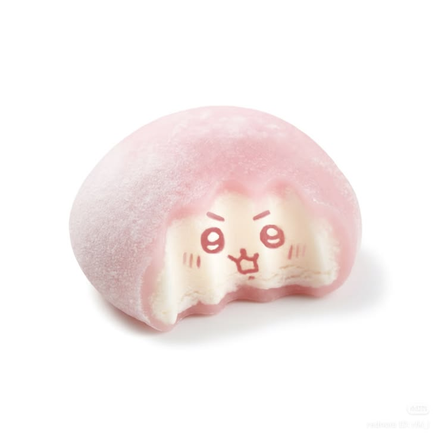<br>김도민 | PM / Vision          | - 프로젝트 일정과 MVP 범위를 관리하고 우선순위 조정, 노션/이슈보드 운영<br>- 모바일 UI 및 광고 생성 플로우 설계<br>- MVP 배포 구조를 설계하고, 생성 결과 저장·보관함이 안정적으로 동작하도록 서비스 운영 기반 정리<br>- Supabase/Postgres 기반 DB 스키마 설계 및 데이터 저장 구조 정리<br>- 한국 광고 규제 대응을 위한 Compliance Gate 설계 및 검증 |
| 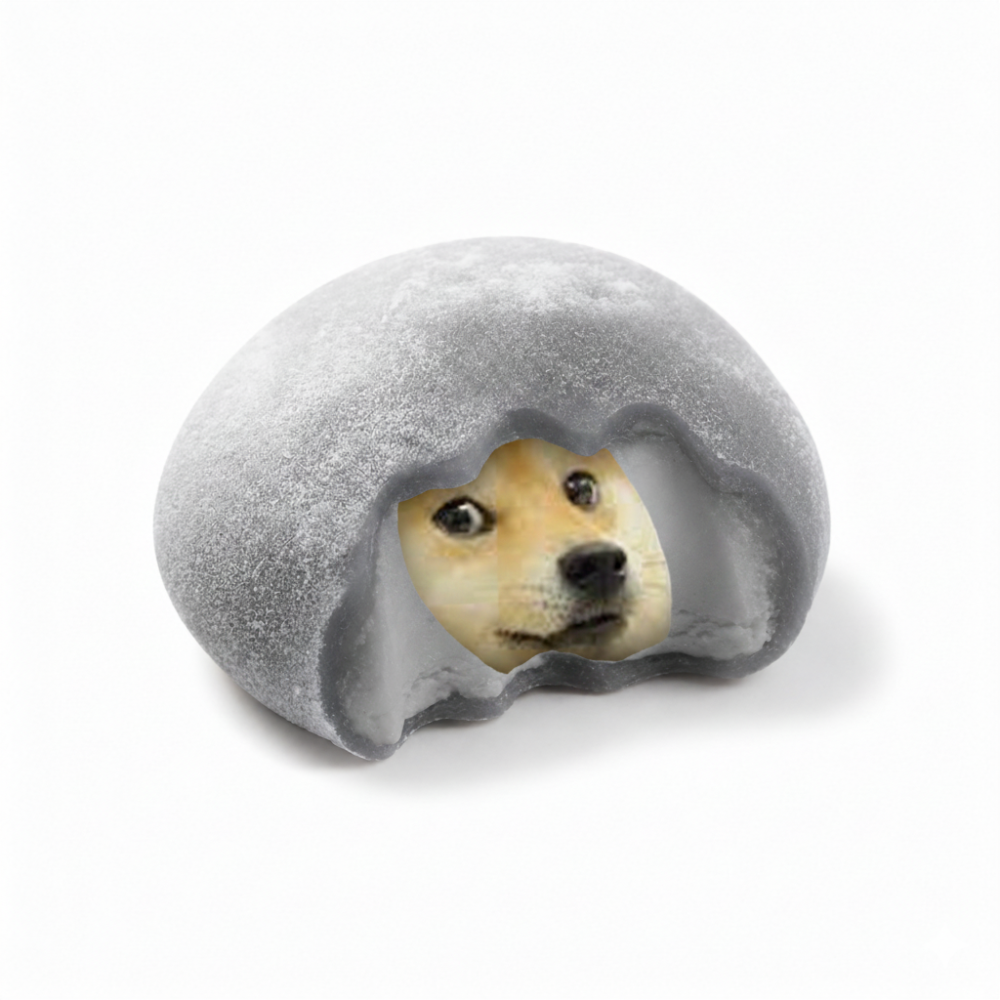<br>박수성 | LLM / AI Serving                 | - 광고 카피 생성 정책과 copy tone 기준 정리<br>- 업종/목적/채널별 문구 후보 다양성 개선<br>- LLM structured output, metadata contract, fallback 흐름 정리<br>- 카피 품질 평가 기준과 문구 검수 로직 보완 |
| 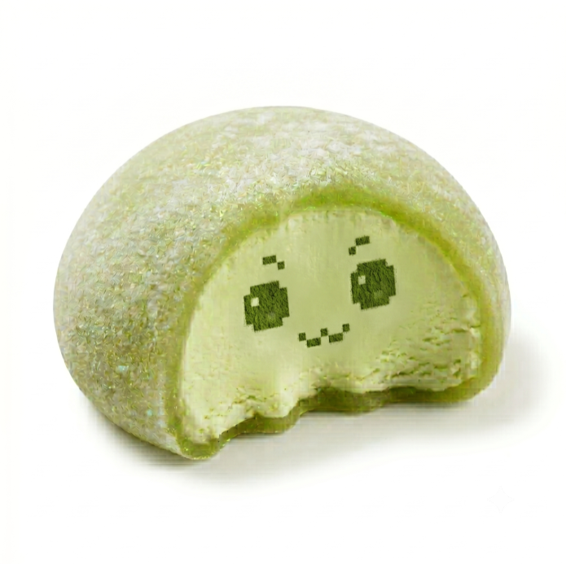<br>양수빈 | Vision / Evaluation        | - 사용자 업로드 이미지 전처리와 source/reference image 흐름 정리<br>- PIL/HTML-CSS 렌더러 비교 및 native typography 품질 검증<br>- 실제 생성 이미지 품질 평가와 개선 포인트 도출<br>- Vision Pipeline MVP, 제품 이미지 보존, 이미지 품질 테스트 자료 정리 |
| <br>임운하 | Evaluation / PM                 | - Docker, 로컬 실행 환경, <br>- 배포 환경 설정 정리MVP 기준 평가 방식과 QA 테스트 시나리오 설계eval 파이프라인, <br>- 평가 지표, 테스트 결과 정리생성 결과 품질 평가와 오류 케이스 재현/검증운영 문서, <br>- 환경 설정 문서, 발표용 보완 자료 정리 |
| 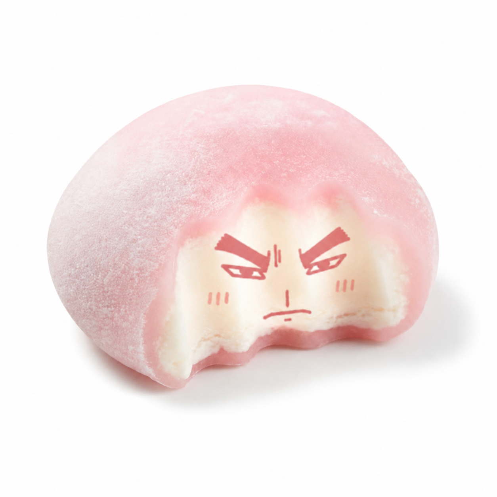<br>조찬영 | Generative Image / AI Serving | - LangGraph 기반 광고 생성 파이프라인과 MarketingState 구조 설계 <br>- T2I wrapper, GPT Image/SD3.5/FLUX lane, TLFP 구조 구현<br>- Visual Strategy, 이미지 프롬프트, 텍스트 레이아웃/렌더링 흐름 고도화<br>- GPT Image QA, checkpoint/performance 분석, backend 테스트 보강 |

---

## ⚠️ Known Limitations

* Native typography 품질은 이미지 생성 모델과 프롬프트 안정성에 따라 달라질 수 있습니다.
* Product/source image preservation은 입력 이미지 품질과 배경 복잡도에 영향을 받습니다.
* OCR/VLM Quality Gate는 위험을 줄이기 위한 검증 장치이며, 법적 적합성을 완전히 보장하지 않습니다.
* actual model smoke test는 비용이 발생할 수 있으므로 mock test와 분리해서 실행해야 합니다.
* 최종 배포 환경에서는 local path가 아니라 R2 기반 object storage를 사용해야 합니다.
* 테스트 수치와 coverage는 최신 commit에서 재실행한 로그가 있을 때만 README에 입력합니다.

---

<div align="center">

**EasyAds / 개떡찰떡은 이미지 모델을 한 번 호출하는 프로젝트가 아니라,
모호한 광고 요청을 이해하고 생성·검수·저장·재개하는 전체 제작 흐름을 구현한 프로젝트입니다.**

</div>
