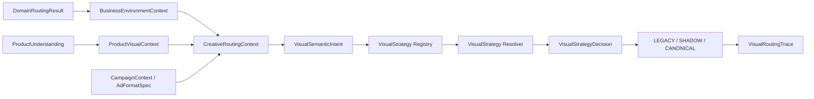
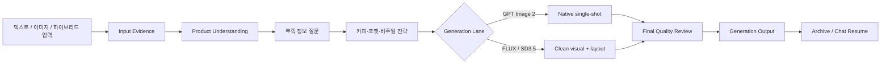
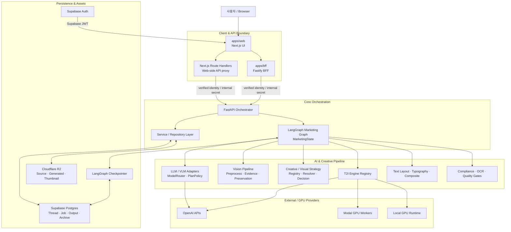
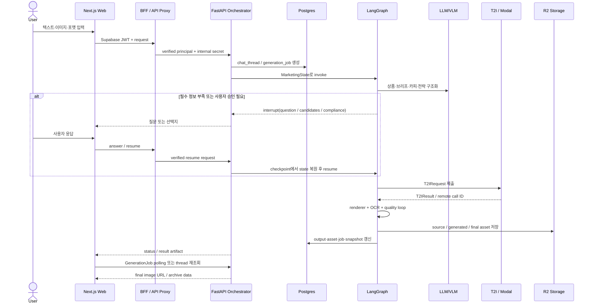
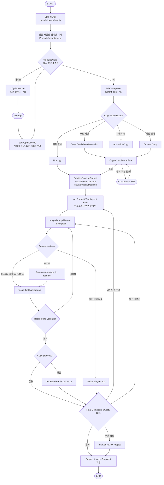

<div align="center">

# EasyAds / 개떡찰떡

### 자연어와 상품 이미지를 실제 광고 시안으로 연결하는 대화형 AI 광고 제작 에이전트

말로 요청하거나 상품 사진을 올리면, 상품 이해·카피 설계·이미지 생성·품질 검수·저장·재개까지 하나의 워크플로우로 처리합니다.

<p>
  
  
  
  
  
  
</p>

</div>

<p align="center">
  
</p>

> [!NOTE]
> 이 저장소는 단순 이미지 생성 데모가 아닙니다.  
> 사용자의 모호한 광고 요청을 구조화하고, 상태 기반 에이전트 그래프로 카피·이미지·검수·저장·재개를 연결하는 **서비스형 생성 파이프라인 MVP**입니다.

---

## 프로젝트 개요

소상공인과 소규모 브랜드가 광고 한 장을 만들려면 상품 정보 정리, 문구 작성, 이미지 제작, 위험 표현 검토, 결과 저장을 각각 처리해야 합니다. EasyAds는 이 과정을 하나의 대화형 흐름으로 통합합니다.

```text
자연어 또는 상품 이미지
→ 입력 근거 정규화
→ 상품·업종·캠페인 이해
→ 카피와 비주얼 전략 결정
→ 이미지 생성
→ OCR·가독성·Compliance 검수
→ 결과 저장 및 대화 재개
```

### 핵심 목표

- 사용자가 복잡한 생성 설정을 직접 다루지 않아도 광고 제작을 시작할 수 있게 한다.
- 텍스트, 이미지, 텍스트+이미지 입력을 하나의 근거 구조로 통합한다.
- 상품과 업종·장면·스타일을 분리해 특정 상품 하드코딩을 줄인다.
- 이미지 생성 모델의 특성에 따라 실행 전략을 다르게 적용한다.
- 광고 카피의 규제 위험과 최종 합성 이미지 품질을 별도 게이트에서 검수한다.
- 생성 결과를 화면 상태가 아닌 작업·출력·대화·보관함 단위로 영속화한다.

### 핵심 설계 원칙

| 원칙 | 적용 방식 |
| --- | --- |
| Evidence first | 사용자 텍스트, 이미지 관찰, 레퍼런스, 사용자 선택을 `EvidenceItem`과 source-scoped reference로 연결 |
| Stateful & resumable | LangGraph `MarketingState`와 checkpointer를 이용해 질문·승인·외부 작업 대기 상태를 중단하고 재개 |
| Text-layout first | 텍스트는 마지막에 합성하더라도 안전영역과 텍스트 공간은 이미지 생성 전에 설계 |
| Bounded context | Product, Business, Campaign, Scene, Style 어휘를 분리하고 `CreativeRoutingContext` 경계에서 조합 |
| Canonical data separation | 실행 재개용 checkpoint, 관계 조회용 Postgres, 대형 binary용 R2의 책임을 분리 |
| Fail-safe migration | 신규 비주얼 라우팅은 `LEGACY → SHADOW → CANONICAL` 모드로 점진 전환하고 SHADOW에서는 기존 결과를 유지 |

---

## 주요 기능

### 1. 멀티모달 광고 입력

세 가지 입력 모드를 같은 파이프라인으로 처리합니다.

| 입력 모드 | 처리 방식 |
| --- | --- |
| Text only | 사용자 문장에서 상품 정체성, 목적, 포지셔닝을 추출하고 필요한 이미지를 생성 |
| Image only | VLM 관찰과 이미지 메타데이터를 근거로 상품을 이해하고 원본 재사용 또는 재생성 결정 |
| Text + Image | 사용자 명시 정보와 이미지 관찰을 통합하고 충돌 시 확인 또는 수동 검토 |

핵심 계약:

- `InputEvidenceBundle`
- `EvidenceItem`
- `ProductUnderstanding`
- `BusinessEnvironmentContext`
- `ProductVisualContext`
- `CreativeRoutingContext`

### 2. 오픈 도메인 상품 이해와 라우팅

상품명을 고정 enum이나 프리셋 ID에 직접 연결하지 않습니다.

```text
치즈케이크
감자튀김
된장찌개
세럼
운동화
교육 서비스
```

새 입력이 들어오면 다음을 분리해 해석합니다.

- 상위 업종 도메인
- 상품·서비스의 open-vocabulary category path
- 상품의 시각적 특성
- 사업장 환경
- 캠페인 목적
- 장면·스타일 태그
- 허용 가능한 추론과 금지 추론

현재 MVP의 specialized canonical domain은 다음과 같습니다.

```text
food_and_beverage
beauty
retail
```

그 외 도메인은 원래 의미를 보존한 채 명시적인 generic fallback으로 위임합니다. `restaurant_bbq` 같은 값은 업종이 아니라 레거시 비주얼 경로 또는 scene tag로 분리하는 SSOT 전환을 진행하고 있습니다.

비주얼 라우팅은 업종 문자열에서 preset을 바로 선택하지 않고 다음 계약을 순서대로 거칩니다.



현재 계약 계층에는 다음이 포함됩니다.

- source-scoped 상품·사업장·semantic evidence 조건
- template·mood preset·copy tone을 하나의 전략 결정에서 선택하는 Registry/Resolver
- `product_editorial`, `service_lifestyle`, `local_business`, `information_poster`, `brand_awareness` 역할의 명시적 fallback profile
- registry resource와 fallback coverage를 검사하는 integrity validator
- 기존 route를 유지하면서 신규 결과를 비교하는 shadow routing과 진단 trace

실제 production route는 기존 selector를 즉시 제거하지 않고 shadow 비교 결과를 관찰한 뒤 canonical decision으로 점진 전환합니다.

### 3. 대화형 HITL 광고 제작

LangGraph가 광고 제작 상태와 분기를 관리합니다.

- 부족 정보 질문
- 카피 후보 선택
- 사용자 직접 카피
- 카피 없는 이미지
- Compliance 위험 표현 확인
- 근거 제출 또는 수동 수정
- 중단된 작업 재개
- 실패 유형별 부분 재실행

### 4. 유연한 카피 전략

모든 광고에 `제목 + 설명 + CTA`를 강제하지 않습니다.

지원 전략:

- image only
- brand only
- product-name only
- headline only
- headline + supporting copy
- verified offer / proof
- information-oriented copy

카피 정책의 핵심 원칙:

- 상품과 입력 근거를 우선한다.
- 사용자의 요청 문장을 그대로 광고 문구로 노출하지 않는다.
- `메뉴 보기`, `자세히 보기` 같은 목적지 없는 generic CTA를 기본 생성하지 않는다.
- 이미지보다 카피의 순가치가 낮으면 텍스트를 줄이거나 제거한다.
- 사용자 직접 입력은 몰래 수정하지 않고 위험 정보만 제공한다.

### 5. 모델별 이미지 생성 Lane

모든 이미지 모델을 같은 방식으로 사용하지 않습니다.

| Lane | 엔진 | 전략 |
| --- | --- | --- |
| Mock | `mock` | 비용 없는 로컬 개발·테스트 |
| Native single-shot | GPT Image 2 | 승인된 카피와 타이포그래피를 이미지 생성 프롬프트에 포함, 이미지 호출 1회 |
| Local visual-first | FLUX / FLUX.2 Klein / SD3.5 | 상품과 배경 품질 우선, 이미지 내부 텍스트 최소화 |
| Remote GPU | Modal worker | 로컬에서 실행하기 무거운 모델을 비동기 실행 |

GPT Image 2 native lane은 다음을 강제합니다.

- 사전 승인된 headline/support만 사용
- 최대 2개 텍스트 블록
- raw user request 누출 금지
- generic CTA 차단
- 이미지 호출 최대 1회
- 자동 edit/retry 없음
- 외부 renderer fallback 없음

### 6. 최종 광고 품질 루프

배경만 검사하지 않고 **텍스트까지 포함된 최종 합성본**을 검수합니다.

주요 검증 항목:

- OCR expected-copy match
- clipping
- safe area
- text/product overlap
- contrast
- typography hierarchy
- visual clutter
- CTA dominance
- copy-visual alignment
- business/brand fit
- commercial viability

실패 유형에 따라 카피, 레이아웃, 텍스트 스타일, 배경 생성 중 필요한 단계만 재실행합니다. 반복 횟수는 예산으로 제한하고, 최종 실패는 `manual_review` 또는 `reject`로 명확히 종료합니다.

### 7. 광고 규제 Compliance Gate

한국 광고 규제 대응을 위한 별도 게이트를 제공합니다.

```text
입력 사전 검사
→ 생성 프롬프트 제약
→ deterministic rule engine
→ 사용자 확인(HITL)
→ 최종 OCR 재검증
```

판정:

- `pass`
- `warn`
- `evidence_required`
- `block`

> [!WARNING]
> Compliance 기능은 위험 표현을 줄이기 위한 보조 장치이며 법률 자문을 대체하지 않습니다.

### 8. 저장·재개·보관함

생성 결과는 브라우저 메모리에만 남지 않습니다.

- `generation_jobs`: 비동기 생성 작업과 상태
- `generation_outputs`: 후보 및 최종 출력
- `chat_threads` / `chat_messages`: 대화와 생성 이력
- LangGraph checkpointer: interrupt/resume 실행 상태
- `chat_state_snapshots`: UI용 read model
- `archive_items`: 보관함
- `assets`: 원본·결과·썸네일 메타데이터
- `usage_events`: 호출량·비용 추적

로컬 개발에서는 memory backend를 사용할 수 있고, 운영 환경에서는 Supabase Postgres와 Cloudflare R2를 연결할 수 있습니다.

### 9. 운영 관찰성과 성능 계측

기능 성공 여부뿐 아니라 실제 병목과 운영 비용을 분리해서 측정할 수 있는 계측 경계를 제공합니다.

- LangGraph node별 실행 시간과 state delta 크기
- Checkpoint read/write 횟수·지연·저장 크기
- DB query 수·duration·row·selected payload byte
- API/BFF request timing과 frontend waterfall
- GenerationJob polling 횟수와 완료 지연
- LLM/T2I usage event와 예상 비용

성능 측정 결과는 `data/performance/**`의 runtime artifact로 생성하며 source code와 분리하고 Git에는 포함하지 않습니다.

---

## 사용자 흐름



---

## 시스템 아키텍처

### 전체 컴포넌트 구성



> [!NOTE]
> 저장소에는 Next.js Route Handler 기반 proxy와 독립 Fastify BFF가 함께 존재합니다. 배포 프로필에 따라 실제 요청 경로는 달라질 수 있지만, 두 경계 모두 사용자 JWT를 검증한 뒤 Orchestrator에는 검증된 principal과 internal secret만 전달하는 동일한 보안 원칙을 따릅니다.

### 시스템 컴포넌트의 역할과 분리 이유

| 컴포넌트 | 주요 책임 | 대표 입력 / 출력 | 분리 이유 |
| --- | --- | --- | --- |
| `apps/web` | 대화형 생성 UI, 채널·포맷 선택, 보관함, polling·resume UX | 사용자 입력, 업로드 asset, API response | 화면 상태와 생성 파이프라인 상태를 분리하고 독립 배포 |
| Next API Route Handlers | Web 배포 환경의 인증·proxy 경계 | Supabase JWT → internal request | 브라우저에서 Orchestrator secret과 provider key를 숨김 |
| `apps/bff` | Fastify 기반 인증 principal 전달, 요청 검증, upstream proxy, 오류 표준화 | Public request → verified backend request | Frontend 계약과 내부 API 계약을 중재하고 서비스 경계를 고정 |
| FastAPI Orchestrator | REST API, thread/job lifecycle, LangGraph invoke/resume, 결과 DTO 구성 | Chat/Job request → status/result | 생성 제어 로직을 UI와 GPU 실행 환경에서 분리 |
| LangGraph Marketing Graph | 입력 검증, HITL, 카피·비주얼 전략, 생성·검수 분기, 재실행 | `MarketingState` delta → next node / interrupt / result | 조건 분기와 중단·재개가 많은 장기 실행 workflow를 명시적으로 관리 |
| LLM/VLM Adapter Layer | provider 호출 형식 통일, capability·plan 기반 model routing | Structured request → typed result | 특정 SDK와 도메인 로직의 결합을 줄이고 mock/local/API 교체 가능 |
| Vision Pipeline | 업로드 전처리, VLM 관찰, 상품 보존 정보, reference metadata | Image asset → evidence/artifact | 이미지 관찰과 생성 전략을 분리하고 근거 추적 가능하게 함 |
| Visual Strategy Layer | semantic intent를 template·preset·copy tone의 단일 결정으로 변환 | `CreativeRoutingContext` → `VisualStrategyDecision` | 업종별 문자열 분기와 preset/template 이중 해석을 제거 |
| T2I Engine Registry | GPT Image 2, FLUX, SD3.5, FLUX.2 및 mock/modal 실행 선택 | `T2IRequest` → `T2IResult` | 모델별 capability·비용·실행 방식을 공통 계약으로 감춤 |
| `modal_apps` | 무거운 이미지 모델의 원격 GPU 실행 | Prompt/size → generated asset | API 서버와 GPU dependency·memory·timeout을 격리 |
| Renderer / Quality Gates | 텍스트 공간 예약, 후합성, OCR·가독성·safe-area·compliance 검증 | Image + approved copy → final composite/report | 생성 모델 품질과 광고 문구·레이아웃 품질을 독립적으로 검증 |
| Supabase Postgres | 사용자·대화·작업·출력·보관함·usage의 canonical record | Repository transaction | 관계 조회·tenant scope·transaction·idempotency 보장 |
| LangGraph Checkpointer | node 실행 중간 상태와 interrupt/resume snapshot | `MarketingState` checkpoint | 서버 재시작 후에도 장기 실행 graph를 이어가기 위함 |
| Cloudflare R2 | 원본·생성본·썸네일 등 binary asset 저장 | Asset bytes ↔ signed/public URL | 대형 binary를 DB/checkpoint에서 분리하고 전달 비용을 낮춤 |
| `orchestrator/eval` | 품질·비용·회귀 평가와 운영 분석 | Output/report/events → score/trend | production workflow와 평가 실험을 분리 |

### 광고 생성 요청의 핵심 데이터 흐름



### 인증 경계

```text
Browser
  ── Supabase JWT ──▶ Next proxy / BFF
  ── verified identity + internal secret ──▶ Orchestrator
```

운영 환경에서는 Orchestrator를 공개 클라이언트에 직접 노출하지 않고 `EASYADS_INTERNAL_API_SECRET`으로 내부 호출자를 검증합니다.

자세한 내용: [Auth Boundary](docs/auth-boundary.md)

---

## LangGraph 오케스트레이션 구조

EasyAds의 핵심은 이미지 생성 API 호출 자체가 아니라, 모호한 입력을 검증 가능한 광고 결과로 바꾸는 **상태 기반 workflow**입니다. LangGraph는 다음 요구를 한 그래프에서 관리합니다.

- 여러 번의 사용자 질문과 선택
- `interrupt` 이후 서버 요청이 종료돼도 가능한 resume
- LLM·VLM·T2I·Modal 같은 서로 다른 실행 시간의 작업
- Compliance, OCR, background, final composite 검증 루프
- 실패 원인에 따른 부분 재실행
- thread/job/output과 연결되는 장기 실행 상태

### 논리적 그래프 흐름



> **Text-Layout-First 원칙**: 로컬 visual-first lane에서는 텍스트를 최종 단계에 합성하지만, 카피 길이·위계·safe area·negative space는 `ImagePromptPlanner` 이전에 계산합니다. 이미지가 먼저 완성된 뒤 남는 공간에 문구를 억지로 끼워 넣지 않습니다.

### `MarketingState`가 관리하는 핵심 정보

`MarketingState`는 모든 데이터를 한 번에 거대한 JSON으로 반환하는 객체가 아니라, 각 node가 필요한 부분만 읽고 변경분만 반환하는 공유 상태 계약입니다.

| 상태 영역 | 대표 계약·필드 | 용도 |
| --- | --- | --- |
| 실행 식별자 | `workspace_id`, `thread_id`, `job_id`, user/plan 정보 | tenant scope와 장기 실행 식별 |
| 대화·HITL | messages, missing fields, option question, user selection, `dirty_fields` | 질문·응답·부분 재계산 |
| 입력 근거 | `InputEvidenceBundle`, `EvidenceItem`, visual observations | 텍스트·이미지·사용자 선택의 provenance |
| 상품·사업 맥락 | `ProductUnderstanding`, `BusinessEnvironmentContext`, `ProductVisualContext`, `CampaignContext` | 상품과 사업장 정보를 섞지 않고 해석 |
| 브리프·카피 | `current_brief`, copy mode, candidates, approved copy | 카피 생성과 사용자 승인 |
| 비주얼 라우팅 | `CreativeRoutingContext`, `VisualSemanticIntent`, `VisualStrategyDecision`, routing trace | template·preset·copy tone의 단일 결정 |
| 포맷·레이아웃 | `AdFormatSpec`, text/layout plan, safe area | 이미지 생성 전에 텍스트 공간 예약 |
| 생성 실행 | `T2IRequest`, `T2IResult`, provider call ID, artifact refs | local/API/Modal 실행과 재개 |
| 검증 결과 | compliance, OCR, readability, background/final quality reports | 실패 유형별 재실행 판단 |
| 결과 참조 | generation output, asset ID, final result payload | 최종 저장·다운로드·보관함 연결 |

### 상태 갱신 원칙

- Node는 변경하지 않은 key를 다시 반환하지 않고 **sparse delta**만 반환합니다.
- Append-only channel은 reducer와 delta return을 사용하고 retry/resume 시 중복을 검사합니다.
- `current_brief`와 routing context는 in-place mutation 대신 immutable merge를 사용합니다.
- 상품·사업·캠페인·semantic context는 tuple/frozen contract를 사용해 실행 도중 변형을 막습니다.
- 이미지 bytes나 대형 binary는 state에 넣지 않고 `asset_id`·artifact reference로 연결합니다.
- raw user prompt, provider secret, 내부 object key는 performance log와 routing trace에 저장하지 않습니다.

### Checkpoint와 canonical data의 차이

| 저장 경계 | 저장하는 것 | 저장하지 않는 것 | 목적 |
| --- | --- | --- | --- |
| LangGraph Checkpointer | node별 state snapshot, interrupt/resume 정보 | 대형 이미지 bytes, 장기 조회용 전체 이력 | 실행 중단·재개 |
| `chat_threads` / `chat_messages` | 대화방과 메시지의 canonical history | graph 내부 임시 계산값 | 멀티턴 UX와 조회 |
| `generation_jobs` | 실행 상태, stage, progress, provider call reference | 전체 이미지 payload | polling·retry·idempotency |
| `generation_outputs` | 후보·최종 결과와 asset reference | binary 원본 | 결과 선택·Archive 연결 |
| `assets` + R2 | 파일 메타데이터와 실제 binary | graph 전체 state | 원본·생성본·썸네일 전달 |
| `chat_state_snapshots` | 프론트 복원에 필요한 read model | 모든 node 내부 상태 | 빠른 thread resume UI |
| `archive_items` | 사용자가 보관한 최종 결과 projection | 생성 과정 전체 | 목록·상세 조회 |

Checkpoint는 business data의 최종 진실원천이 아닙니다. 실행 상태는 checkpointer가 담당하고, 사용자에게 노출되는 canonical record는 repository 계층을 통해 Postgres에 저장합니다.

### 주요 분기와 재실행 기준

| 분기 | 판단 기준 | 다음 동작 |
| --- | --- | --- |
| Missing information | 필수 brief/product/format 정보 부족 | 질문 생성 후 `interrupt` |
| Copy mode | 후보·자동·직접·없음 | 해당 copy lane 실행 |
| Compliance | pass/warn/evidence/block | 계속 진행, HITL 또는 차단 |
| Generation engine | plan·format·capability·설정 | GPT Image 2, local, Modal, mock |
| Background validation | 상품 보존·구도·visual fact | prompt/background만 재실행 |
| Copy presence | 승인된 텍스트 존재 여부 | renderer 실행 또는 생략 |
| Final quality | OCR·safe area·contrast·overlap | layout 수정, 배경 재생성, manual review |
| Routing migration | `LEGACY`, `SHADOW`, `CANONICAL` | 기존 결과 사용, 비교 관찰, 신규 결과 사용 |

---

## 기술 스택

| 분류 | 기술 |
| --- | --- |
| Frontend | Next.js, React, TypeScript, Vitest, Playwright |
| BFF | Node.js, Fastify, Zod |
| API / Orchestrator | Python 3.12, FastAPI, Pydantic |
| Agent Workflow | LangGraph, Postgres Checkpointer |
| LLM / VLM | OpenAI Responses API, OpenAI-compatible adapters, local compatible endpoints |
| Image Generation | GPT Image 2, FLUX, FLUX.2 Klein, SD3.5, Diffusers, Modal |
| Rendering | Pillow, bundled fonts, pixel text metrics, adaptive contrast |
| Persistence | Supabase Postgres, repository layer |
| Object Storage | Cloudflare R2 또는 local development storage |
| Evaluation | deterministic gates, LLM-as-Judge, VLM evaluation, human evaluation |
| Tooling | uv, pytest, Docker Compose |

---

## 저장소 구조

```text
.
├── apps/
│   ├── web/                      # Next.js UI + route handlers
│   └── bff/                      # Fastify API boundary
├── orchestrator/
│   ├── app/
│   │   ├── api/                  # FastAPI routers and response contracts
│   │   ├── graph/                # MarketingState, nodes, routers, checkpointer
│   │   ├── schemas/              # Cross-component Pydantic contracts
│   │   ├── llm/                  # Product/copy/visual routing services and adapters
│   │   ├── t2i/                  # Engine registry and generation backends
│   │   ├── vision/               # Preprocess, VLM extraction, product preservation
│   │   ├── rendering/            # Font, typography, layout and final composition
│   │   ├── compliance/           # Rule engine and compliance contracts
│   │   ├── quality_gate/         # OCR, readability, final composite policies
│   │   ├── generation_jobs/      # Async job lifecycle and execution bridge
│   │   ├── chat_threads/         # Multi-turn thread/message services
│   │   ├── archive/              # Final output archive projection
│   │   ├── storage/              # Local/R2 asset storage abstraction
│   │   ├── observability/        # Performance and runtime instrumentation
│   │   ├── db/                   # Postgres session and repositories
│   │   └── ...
│   ├── eval/                     # Evaluation and observability tools
│   └── tests/                    # Unit, contract, integration and E2E tests
├── modal_apps/                   # GPU worker entrypoints
├── supabase/migrations/          # Database migrations
├── scripts/                      # Actual runners, smoke tests and maintenance tools
├── docs/                         # Architecture and implementation documents
├── pyproject.toml
├── docker-compose.yml
└── Makefile
```

---

## 빠른 시작

### 사전 요구사항

- Python `3.12`
- Node.js `20` 권장
- npm
- [uv](https://docs.astral.sh/uv/)
- Git

GPU는 mock/API 기반 개발에 필요하지 않습니다.

### 1. 저장소 준비

```bash
git clone <repository-url>
cd pjt-sprint_ai07_easyadsAGENT
```

### 2. Python 환경 설치

```bash
uv venv
uv sync --group dev
uv run python scripts/check_uv_env.py
```

Windows에서도 가상환경을 활성화하지 않고 `uv run`으로 실행할 수 있습니다.

### 3. Web/BFF 의존성 설치

```bash
cd apps/bff
npm install

cd ../web
npm install

cd ../..
```

### 4. 안전한 로컬 기본 설정

기본 설정은 memory DB, mock LLM, mock T2I를 사용하므로 실제 API 키 없이 개발할 수 있습니다. 명시적인 `.env`를 만들고 싶다면 다음처럼 시작합니다.

```dotenv
APP_ENV=local
EASYADS_ENV=local

EASYADS_DB_BACKEND=memory

EASYADS_LLM_PROVIDER=mock
EASYADS_ENABLE_LLM_CALLS=false

T2I_DEFAULT_ENGINE=mock
EASYADS_ENABLE_EXTERNAL_T2I=false
EASYADS_ENABLE_GPT_IMAGE_2=false
EASYADS_ENABLE_SD35_LOCAL=false
EASYADS_ENABLE_FLUX_LOCAL=false
EASYADS_ENABLE_FLUX2_KLEIN_LOCAL=false

EASYADS_ASSET_STORAGE_BACKEND=local_dev
```

### 5. 개발 서버 실행

터미널 세 개를 사용합니다.

#### Terminal 1 — Orchestrator

```bash
uv run uvicorn orchestrator.app.main:app \
  --host 0.0.0.0 \
  --port 8010 \
  --reload
```

#### Terminal 2 — BFF

Linux/macOS:

```bash
cd apps/bff
ORCHESTRATOR_BASE_URL=http://127.0.0.1:8010 PORT=4000 npm run dev
```

PowerShell:

```powershell
cd apps/bff
$env:ORCHESTRATOR_BASE_URL="http://127.0.0.1:8010"
$env:PORT="4000"
npm run dev
```

#### Terminal 3 — Web

Linux/macOS:

```bash
cd apps/web
NEXT_PUBLIC_BFF_BASE_URL=http://127.0.0.1:4000 npm run dev
```

PowerShell:

```powershell
cd apps/web
$env:NEXT_PUBLIC_BFF_BASE_URL="http://127.0.0.1:4000"
npm run dev
```

### 6. 접속 주소

| 서비스 | 주소 |
| --- | --- |
| Web | `http://127.0.0.1:3000/generate/chat` |
| BFF | `http://127.0.0.1:4000` |
| Orchestrator | `http://127.0.0.1:8010` |
| Health | `http://127.0.0.1:8010/health` |
| Swagger UI | `http://127.0.0.1:8010/docs` |
| ReDoc | `http://127.0.0.1:8010/redoc` |

Makefile을 사용할 수 있는 환경에서는 다음 명령도 제공합니다.

```bash
make dev-api
make dev-bff
make dev-web
```

---

## 실제 모델 사용

> [!IMPORTANT]
> 실제 LLM·VLM·이미지 생성은 비용이 발생합니다. 모든 actual lane은 환경변수와 호출 예산을 명시적으로 켜야 하며, 기본값은 비활성화입니다.

### OpenAI LLM/VLM

예시:

```dotenv
OPENAI_API_KEY=...

EASYADS_ENABLE_LLM_CALLS=true
EASYADS_LLM_PROVIDER=openai
EASYADS_LLM_API_STYLE=responses
EASYADS_LLM_MODEL=gpt-5.4

LLM_OPENAI_TEXT_MODEL_NANO=gpt-5.4-nano
LLM_OPENAI_TEXT_MODEL_MINI=gpt-5.4-mini
LLM_OPENAI_TEXT_MODEL_FULL=gpt-5.4
LLM_OPENAI_VISION_MODEL=gpt-5.4

LLM_PROVIDER_STRICT_MODE=true
```

### GPT Image 2

```dotenv
OPENAI_API_KEY=...

EASYADS_ENABLE_EXTERNAL_T2I=true
EASYADS_ENABLE_GPT_IMAGE_2=true
EASYADS_GPT_IMAGE_2_MODEL=gpt-image-2

T2I_ALLOW_API_CALLS=true
T2I_ENABLE_API_COST_GUARD=true
EASYADS_T2I_MAX_IMAGES_PER_JOB=1
```

### 로컬 GPU — SD3.5 / FLUX

일반 개발 환경과 GPU 환경을 분리합니다.

```powershell
uv pip install torch torchvision torchaudio \
  --index-url https://download.pytorch.org/whl/cu118

uv pip install -r requirements-gpu-cu118.txt
```

CUDA 확인:

```bash
uv run python -c "import torch; print(torch.__version__); print(torch.cuda.is_available()); print(torch.cuda.get_device_name(0) if torch.cuda.is_available() else 'CPU')"
```

상세 설정: [GPU CUDA 11.8 Setup](docs/gpu-cu118-setup.md)

### Modal

로컬 GPU 대신 Modal worker를 사용할 수 있습니다.

```dotenv
EASYADS_T2I_EXECUTION_BACKEND=modal
EASYADS_ENABLE_MODAL_EXECUTION=true
EASYADS_T2I_FLUX2_KLEIN_BACKEND=modal

MODAL_TOKEN_ID=...
MODAL_TOKEN_SECRET=...
```

상세 설정: [Modal GPU Execution](docs/modal-gpu-execution-backend-v1.md)

---

## 데이터베이스와 스토리지

### Memory mode

기본 개발 모드입니다.

```dotenv
EASYADS_DB_BACKEND=memory
EASYADS_ASSET_STORAGE_BACKEND=local_dev
```

### Postgres mode

```dotenv
EASYADS_DB_BACKEND=postgres
DATABASE_URL=postgresql://...
```

Postgres 모드에서는 LangGraph `PostgresSaver`를 사용해 HITL 중단 상태를 재시작 이후에도 복원할 수 있습니다.

- [Database Repository](docs/backend-db-repository-v1.md)
- [Postgres Checkpointer](docs/checkpointer-postgres.md)
- [Supabase Schema](docs/supabase-db-schema-v1.md)

### Cloudflare R2

```dotenv
EASYADS_ASSET_STORAGE_BACKEND=r2
EASYADS_R2_UPLOAD_REQUIRED=false

EASYADS_R2_BUCKET=...
EASYADS_R2_ENDPOINT_URL=...
EASYADS_R2_ACCESS_KEY_ID=...
EASYADS_R2_SECRET_ACCESS_KEY=...
EASYADS_R2_REGION=auto

EASYADS_R2_URL_MODE=signed
EASYADS_R2_SIGNED_URL_TTL_SECONDS=3600
```

상세 설정: [R2 Asset Storage](docs/r2-asset-storage-v1.md)

---

## API 개요

정확한 요청·응답 스키마는 실행 중인 Swagger UI를 기준으로 확인합니다.

주요 엔드포인트:

| Method | Endpoint | 설명 |
| --- | --- | --- |
| `GET` | `/health` | Orchestrator 상태 |
| `POST` | `/v1/marketing/chat/start` | 자연어 광고 생성 시작 |
| `POST` | `/v1/marketing/chat/answer` | 부족 정보/HITL 응답 |
| `POST` | `/v1/marketing/chat/brief` | 카피 선택 및 생성 계속 |
| `POST` | `/v1/marketing/photo/start` | 이미지 기반 생성 시작 |
| `POST` | `/api/v1/generation-jobs` | generation job 생성 |
| `GET` | `/api/v1/generation-jobs/{job_id}` | 작업 상태 조회 |
| `POST` | `/api/v1/generation-jobs/{job_id}/answer` | 대기 중 작업 재개 |
| `GET` | `/api/v1/generation-outputs` | 생성 결과 목록 |
| `POST` | `/api/v1/generation-outputs/{output_id}/select-final` | 최종 결과 선택 |
| `GET` | `/api/v1/chat-threads` | 대화방 목록 |
| `GET` | `/api/v1/archive/items` | 보관함 목록 |
| `GET` | `/api/v1/references` | 레퍼런스 카탈로그 |
| `POST` | `/api/v1/assets/uploads/presign` | 업로드 URL 발급 |
| `GET` | `/api/v1/usage/summary` | 사용량 요약 |

---

## 테스트

### Orchestrator

```bash
uv run python -m pytest orchestrator/tests --strict-markers -q
```

현재 테스트 체계는 다음 marker를 사용합니다.

```text
unit
integration
contract
e2e
regression
external
actual
slow
critical
security
transaction
graph
```

외부 호출을 제외한 테스트:

```bash
uv run python -m pytest orchestrator/tests \
  -m "not external and not actual" \
  --strict-markers \
  -q
```

### BFF

```bash
cd apps/bff
npm test
```

### Web

```bash
cd apps/web
npm run lint
npm run test
npm run build
npm run e2e
```

### Compile check

```bash
uv run python -m compileall orchestrator scripts
```

> [!TIP]
> 테스트는 실제 `.env`와 `docs/api_key.env`의 영향을 받지 않도록 dotenv isolation plugin을 사용합니다.

---

## 평가와 회귀 분석

`orchestrator/eval`은 생성 성공 여부뿐 아니라 카피·이미지·비용·운영 상태를 함께 평가합니다.

지원 평가:

- deterministic auto gates
- LLM-as-Judge
- VLM image evaluation
- human evaluation
- ensemble scoring
- 비용·토큰 추적
- 일별 품질 추세
- node execution log

비용 없는 smoke:

```bash
make eval-test RENDER=fast PLAN=free
```

실제 생성 및 평가:

```bash
make eval-sample-judge \
  N=5 \
  RENDER=premium_api \
  PLAN=premium \
  JUDGE=llm,vlm
```

> 실제 provider를 사용하는 평가는 비용이 발생합니다.

---

## Docker

기본 Orchestrator:

```bash
make up
make logs
make shell
make down
```

GPU 이미지:

```bash
make orchestrator-gpu
make gpu
```

평가용 JupyterLab:

```bash
make eval-notebook
make eval-notebook-down
```

Docker Compose는 팀 서버의 UID 기반 포트 분리와 공용 모델/기록/DB volume을 지원합니다.

---

## 배포

권장 배포 구조:

```text
Vercel
  └─ Next.js Web

Railway
  ├─ Fastify BFF
  └─ FastAPI Orchestrator

Supabase
  ├─ Auth
  └─ Postgres

Cloudflare R2
  └─ source / generated / thumbnail assets

Modal
  └─ GPU model workers
```

배포 순서와 환경변수는 [Deployment Setup Guide](docs/deployment-setup-guide.md)를 참고하세요.

---

## 주요 문서

| 주제 | 문서 |
| --- | --- |
| 로컬 Python 환경 | [UV Setup](docs/uv-setup.md) |
| GPU 환경 | [GPU CUDA 11.8 Setup](docs/gpu-cu118-setup.md) |
| 배포 | [Deployment Setup](docs/deployment-setup-guide.md) |
| 인증 경계 | [Auth Boundary](docs/auth-boundary.md) |
| 전체 Production Architecture | [Production Architecture Specification](docs/Production_Architecture_Specification.md) |
| LangGraph 상태 SSOT | [MarketingState Source of Truth](docs/state-source-of-truth.md) |
| Postgres Checkpointer | [Checkpointer](docs/checkpointer-postgres.md) |
| LLM 모델 정책 | [LLM Model Policy](docs/llm-model-policy.md) |
| 이미지 프롬프트 | [ImagePrompt v3](docs/image-prompt-v3-design.md) |
| 업종 라우팅 SSOT | [Domain Routing Roadmap](docs/2026-06-16-domain-routing-ssot-roadmap.md) |
| Compliance | [Compliance Gate Design](docs/ad-compliance-gate-design-v1.md) |
| 결과 저장 계약 | [Result Artifact Contract](docs/result-artifact-payload-storage-contract-v1.md) |
| R2 저장 | [R2 Asset Storage](docs/r2-asset-storage-v1.md) |
| Reference Catalog | [Reference Catalog](docs/reference-catalog-v1.md) |
| Vision MVP | [Vision Pipeline MVP](docs/vision-pipeline-mvp.md) |

---

## 현재 상태와 로드맵

### 구현된 핵심 범위

- 대화형 광고 생성 UX
- 텍스트·이미지·하이브리드 입력
- Evidence 기반 상품 이해
- Product / Business / Campaign bounded context와 `CreativeRoutingContext`
- Visual Semantic Intent·Strategy Registry/Resolver/Decision·Integrity 계약
- 명시적 fallback profile과 LEGACY/SHADOW/CANONICAL 비교·routing trace
- LangGraph 분기·interrupt·resume
- 카피 후보/자동/직접/없음 모드
- Compliance HITL
- GPT Image 2 native single-shot
- FLUX / SD3.5 / FLUX.2 Klein lane
- typography·OCR·readability·final composite 검수
- GenerationJob·Output·Thread·Archive 영속화
- R2 asset contract
- Reference Catalog
- usage/cost tracking
- automated + LLM/VLM/Human evaluation

### 진행 중인 고도화

- 업종 라우팅 SSOT와 legacy selector의 production 교체
- Product / Business / Scene / Style 축의 production wiring 완성
- Visual Strategy SHADOW 관찰 지표 축적 후 CANONICAL 전환
- 레퍼런스의 domain/scene/style metadata 분리
- 실제 상품 보존을 위한 VLM·segmentation·inpainting
- 카피 순가치 평가와 사용자 선호 학습
- provider별 비용·지연시간 최적화
- 운영 모니터링과 품질 회귀 대시보드

---

## 보안 및 비용 정책

- `.env`, `*.env`, API key, 토큰을 커밋하지 않습니다.
- `docs/api_key.env`는 로컬 전용이며 gitignore 대상입니다.
- 모델 weight, cache, generated image, `data/outputs`, `data/logs`를 커밋하지 않습니다.
- 실제 API 호출은 명시적인 enable flag와 cost guard가 모두 필요합니다.
- 운영 환경의 Orchestrator는 BFF/Next proxy 뒤에 두고 internal secret을 사용합니다.
- 브라우저에 service-role key, OpenAI key, R2 secret을 노출하지 않습니다.

상세 정책: [Secrets](docs/secrets.md)

---

## 기여 가이드

1. 최신 `develop`에서 기능 브랜치를 생성합니다.
2. production 코드와 runtime artifact를 분리합니다.
3. 관련 focused test와 전체 회귀 테스트를 실행합니다.
4. API/schema 변경 시 FE-BFF-Orchestrator 계약을 함께 갱신합니다.
5. 실제 provider 호출 여부와 생성 artifact 경로를 PR에 명시합니다.
6. secret, model file, runtime output을 stage하지 않습니다.

PR 전 권장 검증:

```bash
uv run python -m compileall orchestrator scripts
uv run python -m pytest orchestrator/tests --strict-markers -q

cd apps/bff && npm test
cd ../web && npm run test && npm run build
```

---

## 라이선스

현재 저장소에는 별도 `LICENSE` 파일이 포함되어 있지 않습니다. 외부 공개·배포·재사용 전에 팀의 라이선스 정책을 확정하고 라이선스 파일을 추가해야 합니다.

---

<div align="center">

**EasyAds / 개떡찰떡은 이미지 모델을 한 번 호출하는 프로젝트가 아니라,  
모호한 광고 요청을 이해하고 생성·검수·저장·재개하는 전체 제작 흐름을 구현한 프로젝트입니다.**

</div>
