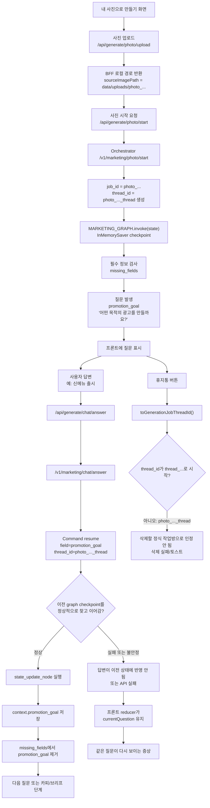
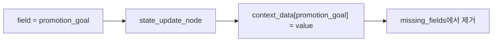
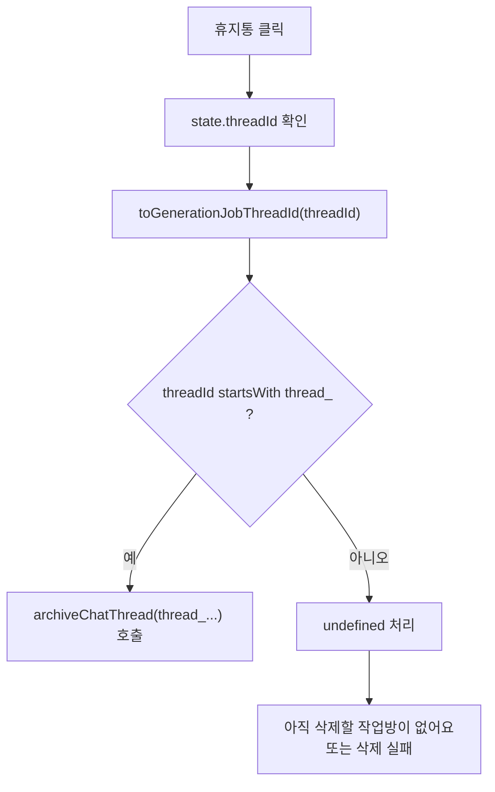
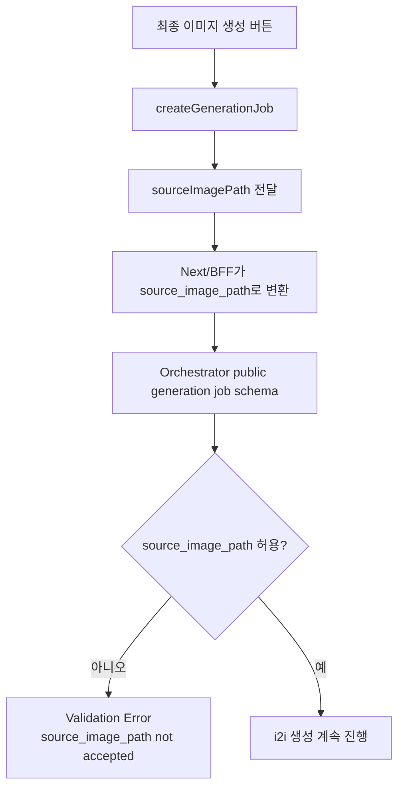

# 내 사진으로 만들기 i2i 흐름 문제 분석

작성일: 2026-06-15

## 요약

현재 develop 코드 기준으로, `내 사진으로 만들기`에서 `"어떤 목적의 광고를 만들까요?"` 질문 이후 답변해도 같은 질문이 반복되거나, 광고 생성 대화창의 휴지통 삭제가 동작하지 않는 문제는 LangGraph 내부의 `promotion_goal` 저장 로직 자체보다는 `photo/start` 흐름이 정식 `generation-jobs + thread_...` 작업방 체계와 다르게 동작하는 지점에서 발생했을 가능성이 높다.

핵심은 다음과 같다.

- `대화로 시작하기`와 `레퍼런스 템플릿 시작`은 주로 `/api/generation-jobs` 흐름을 타며 DB 작업방 `thread_...`와 연결된다.
- `내 사진으로 만들기`는 `/api/generate/photo/start` -> `/v1/marketing/photo/start` 흐름을 타며 `photo_..._thread`를 만든다.
- 프론트 삭제 로직은 `thread_...` 형태만 정식 작업방 ID로 인정한다.
- 사진 기반 최종 생성에서는 `sourceImagePath`를 전달하지만, public generation job schema는 `source_image_path`를 거부한다.

## 전체 흐름



## 문제 발생 지점 1: 질문 반복

증상:

```
"어떤 목적의 광고를 만들까요?" 질문 표시
-> 사용자가 선택지 답변
-> 선택지가 흐려지고 대기
-> 다시 같은 질문이 보임
```

코드상 `promotion_goal` 답변 저장 로직 자체는 정상으로 보인다. `state_update_node`까지 도달하면 `field="promotion_goal"` 값은 `context.promotion_goal`에 저장된다.



따라서 같은 질문이 반복된다면 더 유력한 원인은 다음 중 하나다.

- `/chat/answer`에서 `Command(resume=...)`가 이전 `photo_..._thread` graph checkpoint에 정상적으로 붙지 못함
- resume은 시도됐지만 백엔드에서 예외가 발생함
- 프론트가 실패 후 `currentQuestion`을 유지해서 같은 질문 화면이 그대로 남음
- sessionStorage에 저장된 이전 질문 snapshot이 다시 복원됨

즉, 문제는 `promotion_goal` 필드명이 틀린 문제가 아니라, `photo_..._thread` 기반의 이전 그래프 상태를 안정적으로 이어가는 과정에서 발생했을 가능성이 높다.

## 문제 발생 지점 2: 휴지통 삭제

삭제 문제는 코드상 더 직접적이다.



사진 플로우의 threadId:

```
photo_..._thread
```

삭제 함수가 기대하는 threadId:

```
thread_...
```

따라서 `내 사진으로 만들기`의 광고 생성 대화창에서 휴지통 버튼이 일반 작업방 삭제처럼 동작하지 않을 가능성이 크다.

## 문제 발생 지점 3: 고친 뒤에도 남을 수 있는 i2i 최종 생성 문제

질문 반복과 삭제 문제를 `generation-jobs + thread_...` 흐름으로 정리하더라도, 최종 이미지 생성 단계에서 별도 문제가 남을 수 있다.



현재 develop 코드에서는 public generation job schema가 `source_image_path`와 `reference_image_path`를 거부한다. 따라서 사진 기반 최종 생성은 `sourceImagePath` 대신 `sourceAssetId` 같은 정식 asset 기반 계약으로 맞추는 방향이 필요할 가능성이 높다.

## 코드 기준 관찰

주요 코드 위치:

- 사진 시작 API: `orchestrator/app/api/photo.py`
- 질문 답변 API: `orchestrator/app/api/chat.py`
- LangGraph 상태 업데이트: `orchestrator/app/graph/nodes.py`
- 그래프 빌더 및 checkpointer: `orchestrator/app/graph/builder.py`
- 프론트 질문/답변 처리: `apps/web/app/generate/chat/ChatGenerateClient.tsx`
- 프론트 상태 reducer: `apps/web/lib/chat-flow.ts`
- 최종 generation job schema: `orchestrator/app/api/schemas/generation_jobs.py`

## 결론

현재 가장 유력한 원인은 다음 구조적 불일치다.

```
내 사진으로 만들기:
photo_..._thread + 직접 graph resume + sourceImagePath

정식 생성/작업방 체계:
thread_... + generation-jobs + DB snapshot + assetId
```

따라서 문제의 중심은 LangGraph 내부의 `promotion_goal` 저장 로직이 아니라, `내 사진으로 만들기`가 정식 `generation-jobs/thread_.../assetId` 체계와 분리된 흐름을 타는 데 있다.