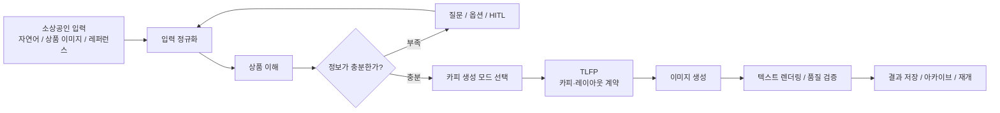
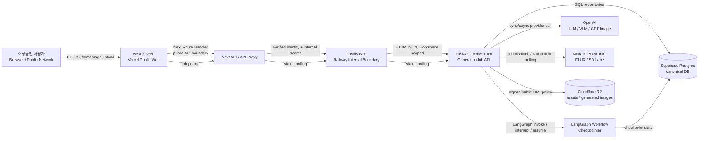
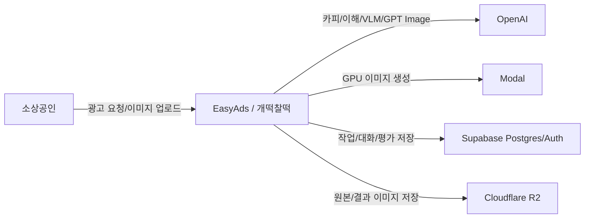
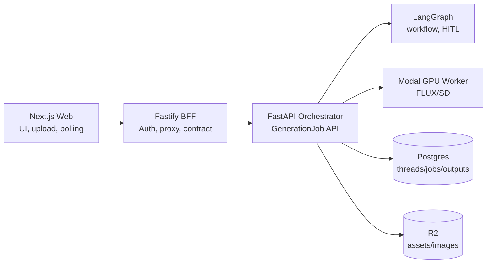
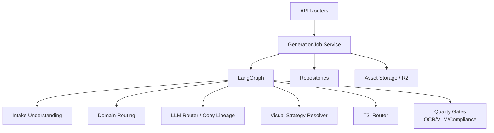
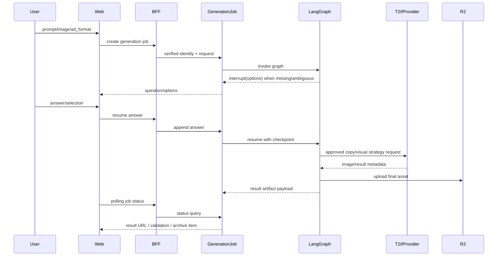
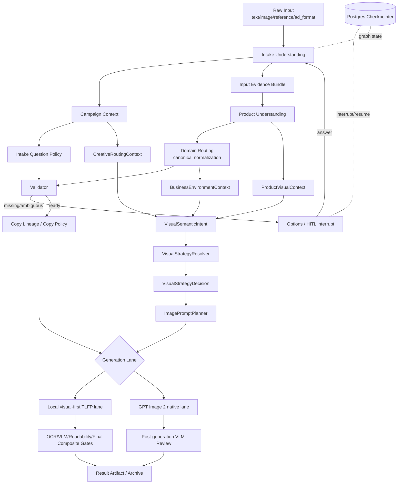
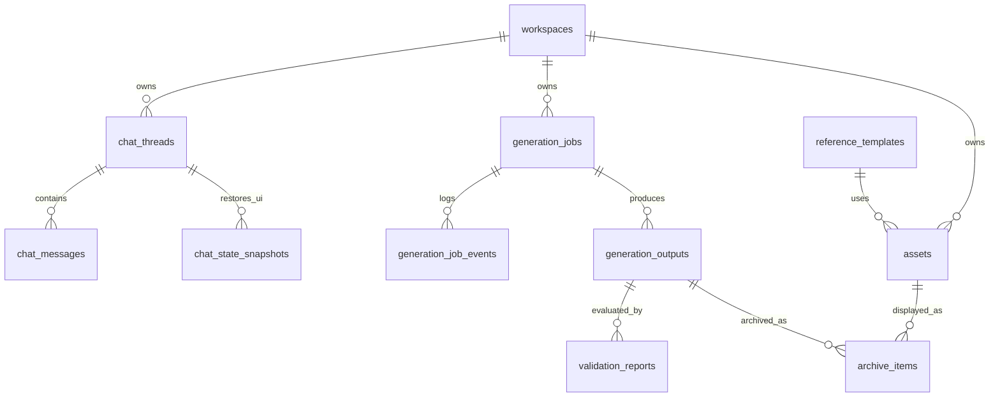
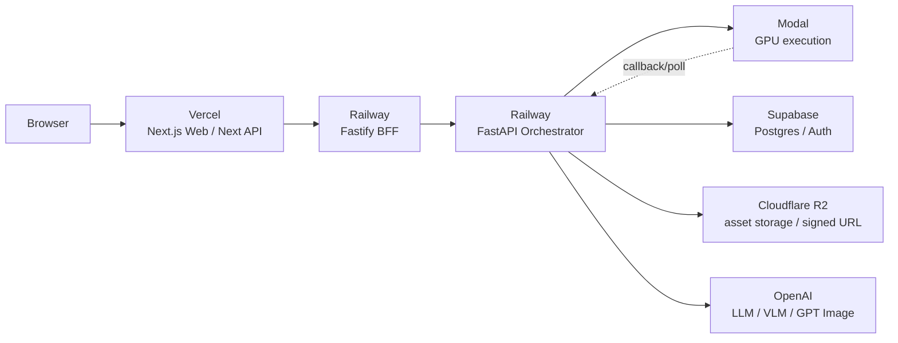

# 개떡찰떡: 소상공인을 위한 대화형 AI 광고 제작 에이전트 구현 보고서

작성일: 2026-06-18

버전: v12

프로젝트명: 개떡찰떡 / EasyAds

작성 기준: 실제 서비스 최종 코드인 `main`(PR #252까지 반영), 별도 첨부한 실험·검증 산출물, Issue & Feedback·Logs 로컬 Notion 아카이브, 팀원별 아카이브 통합본, 국가법령정보센터 및 식품안전나라 확인 자료

증거 범위: 최종 구현 상태는 `main`를 기준으로 하며, PR #201~#228은 도메인 불일치 문제를 해결한 Domain Routing·Visual Strategy 마일스톤으로 구분한다. PR #239의 Copy LLM lineage, PR #243의 Intake Understanding, PR #245의 Campaign-aware Question Policy를 포함한 이후 병합 내용도 현재 구현에 포함한다. 별도 첨부한 실험 결과는 각 artifact의 source commit을 별도로 따른다.

main SHA: `main@5b89c3247a4984e74a520bac69b4730fd85051ce`

## 목차

초록  
1. 프로젝트 개요  
2. 문제 정의와 사용자 요구사항  
3. 서비스 목표와 핵심 사용자 경험  
4. 시스템 설계  
5. 핵심 구현 내용  
6. 개발 진행 과정  
7. 테스트 및 검증  
8. 운영·성능·보안 검증  
9. Known Failures와 잔여 위험  
10. 요구사항 추적표  
11. 핵심 계약과 SSOT 지도  
12. 아키텍처 결정과 트레이드오프  
13. 한계와 개선 방향  
14. 결론  
15. 참고 자료  
부록 A. 재현성 정보  
부록 B. 실행 명령 기록

---
    

## 초록

본 프로젝트는 광고 제작 경험이 부족한 소상공인이 자연어와 상품·참고 이미지만으로 광고 제작을 시작할 수 있도록, 입력 이해부터 카피·이미지 생성, 검수, 저장과 재개까지 연결한 대화형 AI 광고 제작 웹앱을 구현한다. 시스템은 모호한 요청을 상품, 업종, 캠페인 목적, 톤과 근거 정보로 구조화하고, 부족한 정보만 질문한 뒤 모델 특성에 맞는 생성 경로를 선택한다.

구현은 Next.js 웹앱, BFF/API Proxy, FastAPI Orchestrator, LangGraph, Supabase/Postgres, R2, GPT Image·FLUX·SD 계열 생성 lane, Compliance Gate와 Eval Layer로 구성된다. 본 보고서는 `main@5b89c324`의 최종 구현, PR #201~#228의 라우팅 개선 마일스톤, 실제 실험 artifact를 구분한다. 테스트 수치는 별도 첨부한 파일에서 재확인 가능한 값만 대표 수치로 사용하고, 설계·계약·unit·integration·mock E2E·actual·deployed runtime의 성숙도를 구분한다.

핵심 구현은 상품과 사업장 맥락의 분리, Domain Routing 및 Visual Strategy SSOT, Intake Understanding과 Campaign-aware Question Policy, 강화된 LLM copy lineage, TLFP 기반 visual-first 합성 lane과 GPT Image 2 native single-shot lane, 품질·규제 검증, 작업 저장과 복구이다. OCR/VLM 상시 운영, RLS rollout, 제품 보존 편집, 완전 자동 self-healing과 외부 사용자 검증은 잔여 과제로 남는다.

## 1. 프로젝트 개요

### 1.1 프로젝트 배경

소상공인과 소규모 매장 운영자는 광고 제작을 꾸준히 해야 하지만, 광고 전문 인력이나 디자인 리소스를 갖추기 어렵다. 홍보할 상품은 알고 있어도 어떤 문구를 써야 하는지, 어떤 분위기의 이미지를 만들어야 하는지, 가격·효능·최고·1위 같은 표현을 써도 되는지, 만든 결과를 다시 수정하거나 저장하려면 어떻게 해야 하는지까지 스스로 판단해야 한다.

생성형 AI는 광고 제작 부담을 줄일 수 있지만, 일반적인 이미지 생성 도구는 사용자가 좋은 프롬프트를 작성해야만 원하는 결과가 나온다. 또한 이미지 모델에게 한국어 광고 문구까지 한 번에 그리게 하면 오탈자, 깨진 문자, 낮은 가독성, 원하지 않는 로고나 워터마크, 문구와 이미지의 불일치가 발생할 수 있다. 따라서 개떡찰떡은 “이미지 한 장 생성”이 아니라 “광고 제작 과정 전체를 구조화하는 웹앱”을 목표로 했다.

프로젝트명 개떡찰떡은 “말은 개떡같이 해도 광고 결과는 찰떡같이 나오게 한다”는 서비스 정체성을 담고 있다. 사용자는 복잡한 프롬프트를 몰라도 자연어, 상품 이미지, 참고 이미지, 광고 형식 선택만으로 시작하고, 시스템은 이를 광고 제작 근거로 정리해 카피·이미지·검수·저장 흐름으로 연결한다.

### 1.2 프로젝트 목표

본 프로젝트의 목표는 다음과 같다.

| 목표 | 설명 |
| --- | --- |
| 자연어 요청 구조화 | 사용자의 모호한 입력을 상품, 업종, 목적, 톤, 타깃, 근거 정보로 정리한다. |
| 부족 정보 보완 | 정보가 부족하면 질문, 옵션 제안, 후보 선택으로 사용자 입력을 보완한다. |
| 카피 생성 방식 분기 | 카피 후보 제안, 자동 생성, 사용자 직접 입력, 무카피 흐름을 지원한다. |
| 모델별 생성 전략 | FLUX/SD 계열은 TLFP 기반 visual-first composite lane으로, GPT Image 2는 승인 카피 기반 native single-shot lane으로 분리한다. |
| 모델별 generation lane 구성 | GPT Image, SD3.5, FLUX, mock lane을 구분하고 환경변수와 비용 가드로 실제 호출을 제어한다. |
| 광고 문구 리스크 관리 | 근거 없는 효능, 가격, 보장, 최고 표현 등을 Compliance Gate에서 검토한다. |
| 저장과 재개 | 생성 작업, 대화 상태, 산출물, 아카이브를 저장해 사용자가 다시 이어갈 수 있게 한다. |
| Eval Layer | Auto, LLM, VLM, Human 평가 계약과 verdict 구조를 두되, actual/mock 여부와 artifact 증거를 분리한다. |

### 1.3 프로젝트 범위

본 프로젝트는 T2I-first MVP에서 출발했지만, 최종적으로는 “사용자 입력이 광고 카피와 이미지 결과로 이어지고 저장·재개되는 end-to-end 광고 제작 흐름”을 중심 범위로 삼았다. 구현 범위에는 자연어 기반 대화 시작, 이미지/레퍼런스 입력, 카피 생성 분기, TLFP, 이미지 생성 요청 구성, mock 및 guarded actual T2I lane, 결과 저장, 아카이브, Eval Layer 설계가 포함된다.

반면 실제 상품 영역을 완벽히 보존하는 segmentation/inpainting, 모든 업종을 포괄하는 production-grade Compliance Rule Pack, 운영 환경에서 완전히 검증된 Supabase Auth/RLS, 완전 자동 self-healing 재생성 루프는 후속 고도화 대상으로 분리하였다. OCR/VLM은 schema·node·gate·adapter와 일부 actual call 또는 opt-in 검증 경로가 존재하지만, 운영 트래픽에서 항상 동작하는 production-grade 품질 게이트로 검증되었다고 보지는 않는다. 따라서 본 보고서에서는 design, schema, unit, integration, mock E2E, actual local, deployed runtime을 maturity level로 구분한다.

### 1.4 기술 스택

| 영역 | 기술/구조 | 역할 |
| --- | --- | --- |
| Frontend | Next.js, React | 사용자 입력, 이미지 업로드, 대화형 생성 UI, 결과 확인, 아카이브 화면 |
| BFF/API Proxy | Next Route Handler, Fastify BFF, Zod | 인증 경계, 요청 검증, Orchestrator proxy, 에러 응답 표준화 |
| Backend | FastAPI Orchestrator, Pydantic | 생성 작업 API, 상태 관리, schema 기반 데이터 계약 |
| Workflow | LangGraph | 입력 정규화, 생성·검증·저장 분기와 상태 전이 관리 |
| LLM | OpenAI 계열, OpenAI-compatible adapter, mock adapter | 상품 이해, 카피 생성, structured output, fallback |
| T2I | GPT Image 2, SD3.5, FLUX/FLUX2, mock engine | 모델별 이미지 생성 lane, guarded actual execution |
| Rendering | PIL 기반 TextRenderer | 한국어 카피 후합성, CTA 버튼/플레이트 처리, 폰트 fallback |
| Storage | Supabase/Postgres, Cloudflare R2 | 작업 상태, 대화, 산출물, 에셋, 아카이브 저장 |
| Infra | Docker, uv, Modal, Makefile | 실행 환경과 반복 명령 표준화, GPU worker 분리, local/CI/actual lane 구분 |
| QA | Vitest, Playwright, smoke test scripts | Backend·Frontend 단위/통합 테스트, API 계약 검증, 브라우저 E2E와 회귀 방지 |
| Eval | SQLite, JupyterLab/Notebook, Polars, Auto Gate/LLM/VLM/Human Judge, pytest | tracked graph 실행 기록, 자동 게이트, 품질 채점·앙상블, 비용·추세 조회와 결과 분석 |

---

## 2. 문제 정의와 사용자 요구사항

### 2.1 소상공인의 광고 제작 난점

소상공인에게 어려운 것은 AI 이미지 생성 버튼을 누르는 일이 아니라, 광고 제작에 필요한 판단을 연속적으로 수행하는 일이다. 예를 들어 카페 신메뉴를 홍보하려면 상품의 매력, 계절감, 가격 정책, 브랜드 톤, 이미지 분위기, 문구의 안전성, 채널 형식, 저장과 재수정까지 고려해야 한다.

| 문제 | 설명 | 시스템으로 연결되는 해결 방향 |
| --- | --- | --- |
| 강조점 선택의 어려움 | 맛, 가격, 분위기, 시즌성 중 무엇을 앞세울지 정하기 어렵다. | Product Understanding, Campaign Context |
| 광고 문구 작성의 어려움 | “홍보하고 싶다”는 의도는 있지만 실제 광고 문구로 압축하기 어렵다. | Copy Candidate, Auto-pilot Copywriting |
| 업종·상품 분위기 판단 | 같은 음식점이어도 된장찌개, 디저트, 고깃집은 전혀 다른 분위기가 필요하다. | Product First, Domain Routing SSOT, Open-domain Visual Strategy |
| 이미지·문구 불일치 | 이미지는 괜찮아도 문구가 따로 놀거나 잘 읽히지 않을 수 있다. | TLFP, TextRenderer, ReadabilityGate |
| 광고 문구 리스크 | 할인, 효능, 보장, 1위, 최고 표현은 근거가 필요하다. | Compliance Gate, Rule Pack |
| 저장과 재수정 | 한 번 만든 결과를 다시 열고 문구만 수정하거나 이어서 작업해야 한다. | Generation Job, Archive, Chat Thread |

### 2.2 단순 이미지 생성 방식의 한계

단순 이미지 생성 방식은 사용자의 요청 문장을 그대로 프롬프트로 넘긴다. 이 경우 “손님 많이 오게 해줘”, “홍보하고 싶어”, “광고 만들어줘” 같은 문장이 실제 광고 문구처럼 이미지에 새어 들어갈 수 있다. 또한 업종명만 보고 상품 효능, 가격, 전문성, 시각 요소를 단정하면 실제 상품과 다른 광고가 만들어진다.

특히 한국어 광고 이미지는 이미지 모델이 글자를 직접 그릴 때 문제가 커진다. 한글이 깨지거나, 문구가 잘리거나, 이미지 내부에 의도하지 않은 숫자·로고·워터마크가 들어갈 수 있다. 개떡찰떡은 이러한 문제를 줄이기 위해 이미지 모델에게 텍스트 렌더링을 맡기지 않고, 카피와 레이아웃을 먼저 구조화한 뒤 이미지 생성 후 별도 렌더링과 검증을 수행하는 모델별로 다른 생성 전략을 쓰는 Model-aware Dual Generation Architecture를 채택했다. FLUX/SD 계열 local visual-first lane에서는 TLFP와 외부 renderer를 사용하고, GPT Image 2 native lane에서는 승인된 카피와 타이포그래피 의도를 single-shot으로 모델에 전달한다.

### 2.3 사용자 요구사항

사용자는 광고 제작 도구를 사용할 때 다음과 같은 경험을 기대한다.

1. 복잡한 설정 없이 자연어로 요청할 수 있어야 한다.
2. 상품 이미지나 참고 이미지를 함께 넣을 수 있어야 한다.
3. 부족한 정보가 있으면 시스템이 질문하거나 선택지를 제시해야 한다.
4. 광고 문구를 자동 생성하거나, 후보 중 고르거나, 직접 입력하거나, 아예 문구 없이 이미지만 생성할 수 있어야 한다.
5. 이미지 결과에서 한글 문구가 읽히고, 상품 영역과 겹치지 않아야 한다.
6. 위험한 표현은 시스템이 경고하거나 안전한 표현으로 유도해야 한다.
7. 만든 결과를 저장하고, 보관함에서 다시 열어 이어서 작업할 수 있어야 한다.

### 2.4 기능 및 비기능 요구사항

| 구분 | 요구사항 | 구현 방향 |
| --- | --- | --- |
| 기능 요구사항 | 자연어 기반 광고 생성 시작 | Chat/photo/generation job API |
| 기능 요구사항 | 카피 생성 모드 선택 | `suggest_candidates`, `auto_pilot`, `custom_input`, `no_copy` |
| 기능 요구사항 | 참고 이미지/템플릿 반영 | ReferenceTemplate flow, style metadata |
| 기능 요구사항 | 결과 저장과 아카이브 | GenerationJob, outputs, archive items |
| 기능 요구사항 | 품질 검증 | BackgroundValidation, SafeAreaGate, ReadabilityGate, FinalValidation |
| 비기능 요구사항 | 안전한 기본 동작 | actual model call은 명시적 flag와 credential이 있을 때만 허용 |
| 비기능 요구사항 | 재현 가능한 테스트 | mock/default lane은 외부 API·GPU 없이 동작 |
| 비기능 요구사항 | 책임 분리 | FE/BFF/Orchestrator/Worker/DB/Storage 역할 분리 |
| 비기능 요구사항 | 민감 정보 보호 | smoke/eval report에 raw API key, HF token, base64 image data 기록 금지 |
| 비기능 요구사항 | 운영 안정성 | 내부 시크릿, guarded lane, fail-closed, persistence 구조 |

---

## 3. 서비스 목표와 핵심 사용자 경험

### 3.1 개떡찰떡이 추구한 사용자 경험

개떡찰떡이 추구한 사용자 경험은 “설정을 잘 아는 사용자를 위한 생성 툴”이 아니라 “대화하듯 광고를 의뢰하면 시스템이 광고 제작 흐름으로 정리해 주는 서비스”이다. 사용자는 자연어, 상품 이미지, 참고 이미지, 광고 형식을 입력하고, 시스템은 이를 근거 정보로 정리한 뒤 생성 가능한 상태로 만든다.

**그림 3-1. 개떡찰떡 첫 진입 화면**  
`branch/commit=main@5b89c324` · `상태=deployed UI capture` · 사용자가 샘플, 사진, 대화 중 원하는 방식으로 광고 제작을 시작하는 화면

**그림 3-2. 자연어 광고 요청 입력 화면**  
`branch/commit=main@5b89c324` · `입력="우리 카페 딸기라떼 신메뉴 광고 만들어줘"` · `상태=deployed UI capture`

사용자 경험의 핵심 흐름은 다음과 같다.

### 3.2 대표 사용자 시나리오

대표 시나리오는 카페 신메뉴 홍보이다.

| 단계 | 사용자/시스템 동작 | 예시 |
| --- | --- | --- |
| 1 | 사용자가 자연어로 요청 | “우리 카페 신메뉴 딸기라떼 홍보 이미지 만들어줘. 상큼하고 귀엽게.” |
| 2 | 시스템이 입력을 정리 | 상품=딸기라떼, 업종=카페, 목적=신메뉴 홍보, 톤=상큼/귀여움 |
| 3 | 부족 정보 확인 | 광고 형식, 카피 방식, 레퍼런스 사용 여부 확인 |
| 4 | 카피 모드 선택 | 후보 3개 중 선택 또는 자동 생성 또는 직접 입력 또는 무카피 |
| 5 | TLFP 실행 | headline/subcopy/CTA 역할과 위치를 `TextLayoutSpec.slots`로 정리 |
| 6 | 이미지 생성 | 텍스트가 들어갈 영역을 비워 둔 배경 이미지 생성 요청 |
| 7 | 후합성 및 검증 | PIL 기반 TextRenderer로 한글 카피 합성, ReadabilityGate로 대비/잘림 점검 |
| 8 | 결과 저장 | output, metadata, validation, copy, layout 등 artifact 저장 |
| 9 | 재개 | 보관함 또는 작업방에서 다시 열어 수정 |

**그림 3-3. 필요한 순간에 맞춰 선택하는 광고 제작 안내**  
`branch/commit=main@5b89c324` · `상태=deployed UI capture` · 사용자가 AI 추천, 맞춤 선택, 직접 문의 흐름을 선택하는 화면

**그림 3-4. Generation job 진행 화면**  
`branch/commit=main@5b89c324` · `선택 모델=GPT-image-2` · `상태=deployed UI capture`

**그림 3-5. 생성 결과 확인 및 다운로드 화면**  
`branch/commit=main@5b89c324` · `상태=deployed UI capture` · 생성 결과를 확인하고 다운로드하거나 보관함으로 이동하는 화면

### 3.3 대화형 생성 흐름

대화형 생성 흐름의 특징은 한 번의 프롬프트로 끝나지 않는다는 점이다. 정보가 부족하거나 사용자의 선택이 필요한 경우 LangGraph가 interrupt 상태로 멈추고, 사용자의 답변을 받은 뒤 resume한다. 이 구조는 특히 카피 후보 선택, 직접 문구 입력, 광고 형식 확인, 위험 문구 검토, 수동 검토가 필요한 edge case에서 중요하다.

초기 설계의 핵심은 HITL을 “예외 처리”가 아니라 “광고 제작 흐름의 정상 경로”로 보는 것이었다. 소상공인의 요청은 처음부터 완전하지 않은 경우가 많기 때문에, 시스템이 임의로 단정해 생성하는 것보다 필요한 지점에서 사용자에게 묻고 이어가는 편이 더 안전하다.

---

## 4. 시스템 설계

**이 장의 핵심:** 시스템 경계, LangGraph 상태 전이, 저장 구조와 성숙도 기준을 중심으로 전체 설계를 설명한다.

### 4.1 전체 아키텍처와 Trust Boundary

개떡찰떡의 전체 구조는 Browser, Next.js Web/Next API, Fastify BFF, FastAPI Orchestrator, LangGraph, LLM/T2I Provider, Supabase/Postgres, Cloudflare R2로 나뉜다. 각 구성요소는 통신 방식, 동기/비동기 경계, 인증 경계, 상태 저장 위치, 실패 책임 주체를 기준으로 구분된다.

| 경계 | 통신 방식 | 저장/상태 | 실패 책임 |
| --- | --- | --- | --- |
| Browser → Web | HTTPS, 공개 라우트 | 브라우저 세션, 화면 상태 | UI 입력 오류, 업로드 실패 표시 |
| Web/Next API → BFF | JSON proxy, schema validation | 요청 payload 정규화 | 공개 API 계약 불일치, 인증 누락 |
| BFF → Orchestrator | 내부 secret, verified user/workspace | GenerationJob 생성 | user id spoofing 차단, upstream 오류 표준화 |
| Orchestrator → LangGraph | in-process graph invoke | checkpoint, graph state | interrupt/resume, partial rerun routing |
| Orchestrator → DB/R2 | repository, object storage service | canonical DB, R2 object key | 저장 실패, signed URL 만료, archive sync |
| Orchestrator → Provider | OpenAI/Modal 호출 | provider metadata, artifact manifest | 비용 guard, actual/mock 분리, provider fallback |

### 4.2 System Context / Container / Component / Sequence Diagram

### 4.2.1 System Context

### 4.2.2 Container Diagram

### 4.2.3 Orchestrator Component Diagram

### 4.2.4 Dynamic Sequence

### 4.3 설계 원칙과 maturity level

성숙도는 기능의 존재 여부가 아니라 확인 가능한 증거 단계로 판단한다.

| Level | 의미 |
| --- | --- |
| D0 | 설계 문서만 존재 |
| D1 | schema/contract가 코드에 존재 |
| D2 | unit test 존재 |
| D3 | integration 또는 graph 연결 존재 |
| D4 | mock E2E 통과 |
| D5 | actual local/provider 실행 artifact 존재 |
| D6 | deployed runtime 운영 조건 검증 |

| 기능 | 상태 | 증거 범위와 판단 |
| --- | --- | --- |
| 기존 LangGraph/TLFP/Job·Archive | D2~D4 | PR #201 이전부터 존재한 기반 구현과 테스트 |
| GPT Image actual lane | D5 | 별도 첨부한 actual batch 및 ad-format artifact 확인, D6 아님 |
| Intake Understanding | D3~D4 | PR #243 구현, graph 연결과 회귀 테스트 확인 |
| Campaign-aware 질문 정책 | D3~D4 | PR #245 병합, graph 연결과 회귀 테스트 확인 |
| Copy LLM lineage | D5 | PR #239 구현 및 actual 실행 기록 |
| Domain Routing / Visual Strategy | D3~D4 | PR #201~#228의 계약·정규화·resolver·trace·shadow wiring과 최신 main 회귀 테스트 확인 |
| VLM Gate | D3~D5 | opt-in actual 경로는 있으나 production always-on은 미검증 |
| OCR Gate | D2~D3 | 계약과 gate 중심, production-grade actual 검증 제한 |
| FLUX2/Klein | D2~D5 | engine·runner 기록은 있으나 실행 환경 의존 |
| R2 / Archive | D3~D5 | repository/API/FE 연결, signed URL 운영 검증은 잔여 위험 |
| Checkpoint | D3~D4 | graph state와 UI snapshot 분리, 운영 복구 추가 검증 필요 |
| Security / workspace scope | D3 | internal secret과 scoped query 중심, RLS rollout 제한 |
| Compliance Gate | D2~D4 | deterministic rule/HITL 구조, 법률 자문·자동 승인 아님 |
| Partial rerun | D2~D3 | contract/routing 존재, 완전 자동 self-healing 미완성 |

### 4.4 LangGraph 기반 생성 흐름

아래 흐름은 `main@5b89c324`의 구현을 기준으로 한다. Domain Routing과 Visual Strategy의 핵심 구조는 PR #201~#228에서 형성됐고, Intake Understanding과 Campaign-aware Question Policy는 각각 PR #243과 PR #245에서 graph 흐름에 연결됐다. Checkpointer는 graph 실행 상태를, `chat_state_snapshot`은 UI 복원 상태를 저장한다.

### 4.5 데이터 및 저장 구조

canonical DB는 서비스가 조회해야 하는 업무 데이터의 단일 진실원천이고, LangGraph checkpoint는 graph 실행을 재개하기 위한 실행 상태 저장소다. 대형 이미지/결과물은 DB blob이 아니라 R2 object로 두고 DB에는 public id, internal uuid, object key, signed/public URL 정책을 저장한다.

| 저장 대상 | 설명 | scope |
| --- | --- | --- |
| `workspaces` | 사용자/팀 작업 공간 | tenant root |
| `chat_threads`, `chat_messages` | 대화형 생성 기록 | workspace scoped |
| `chat_state_snapshots` | UI 복원용 snapshot | workspace/thread scoped |
| `generation_jobs`, `generation_job_events` | 생성 작업 lifecycle와 event | workspace scoped |
| `generation_outputs` | 결과 payload, model metadata | job scoped |
| `validation_reports` | OCR/VLM/Compliance/quality 결과 | output scoped |
| `assets` | 업로드/생성 이미지의 object metadata | workspace scoped, internal UUID/public ID 분리 |
| `archive_items` | 사용자가 보는 보관함 항목 | workspace scoped |
| `reference_templates` | 레퍼런스 카탈로그 | admin/public visibility |

### 4.6 Deployment Diagram

배포 구조는 Vercel, Railway, Modal, Supabase, Cloudflare R2로 나누어 본다. Browser → Public Web은 공개 인터넷 경계이고, Web/BFF → Internal Orchestrator는 내부 API 경계이며, Orchestrator → Provider와 Orchestrator → DB/R2는 외부 서비스 경계다. Modal callback/poll 경로는 GPU worker가 즉시 응답하지 않는 경우 상태 조회 또는 callback으로 job 상태를 갱신하는 비동기 경로로 분리한다. R2 signed/public URL 경로는 internal object key를 숨기고, 사용자에게 필요한 범위의 signed URL 또는 공개 read URL만 제공하는 정책으로 둔다.

### 4.7 외부 기준 기반 설계 근거

본 프로젝트는 생성형 AI를 이용해 광고 카피와 이미지를 만드는 서비스이므로, 단순히 모델 호출을 성공시키는 것만으로 충분하지 않다. 사용자의 모호한 요청을 광고 결과로 바꾸는 과정에서 근거 없는 효능·보장 표현, 시각 결과와 문구의 불일치, 원문 지시문 누수, provider 비용 폭주, workspace 간 데이터 혼선이 발생할 수 있다. 따라서 개떡찰떡은 프로젝트 내부 구현을 다음 외부 기준과 연결해 설계 근거를 정리한다.

| 외부 기준 / 공식 문서 | 프로젝트에서 연결한 지점 | 적용 방식 |
| --- | --- | --- |
| NIST AI RMF / GenAI Profile | Eval Layer, Compliance Gate, manual review | 생성형 AI 출력이 바로 최종 광고물이 되지 않도록 입력 근거, 카피, 이미지, 품질 검증, 수동 검토 상태를 단계적으로 둔다. |
| Google Cloud Well-Architected Framework | Trust Boundary, Deployment, 운영·비용·보안 | Browser/Public Web, BFF, Orchestrator, Provider, DB/R2 경계를 분리하고, actual model call은 flag와 credential이 있을 때만 허용한다. |
| LangGraph 공식 문서 | HITL, interrupt/resume, persistence | 정보 부족, 카피 선택, compliance 위험, manual review가 필요한 지점에서 graph를 멈추고 같은 job을 이어간다. |
| FastAPI / Pydantic 공식 문서 | API request/response schema | FE-BFF-Orchestrator 사이의 계약을 구조화하고, 잘못된 payload가 downstream node로 흘러가지 않게 한다. |
| OpenAI Structured Outputs | LLM structured generation | LLM 응답을 자유 텍스트가 아니라 `IntakeUnderstandingResult`, `MarketingCopyCandidate`, `ValidationReport` 같은 구조화된 계약으로 받는다. |
| Supabase RLS / Postgres 문서 | workspace scope, tenant isolation | job, output, archive, asset metadata를 workspace 기준으로 분리하고 운영 환경에서는 RLS rollout을 추가 검증 대상으로 둔다. |
| Cloudflare R2 문서 | 이미지 artifact 저장과 URL 정책 | DB에는 metadata와 object key를 저장하고, 이미지 binary는 R2에 저장해 signed/public URL 정책을 분리한다. |
| Modal 문서 | GPU worker 분리 | FLUX/SD 계열 actual generation을 일반 API 서버가 아니라 별도 GPU 실행 경계로 분리한다. |
| ACM Artifact Review 기준 | 재현성, artifact manifest | branch, commit SHA, 실행 환경, 명령, summary JSON, 이미지 hash, failure artifact를 문서화 대상으로 둔다. |

이 절은 외부 기준을 그대로 충족했다는 선언이 아니라, 프로젝트가 어떤 기준을 참고해 위험과 운영 경계를 설계했는지 설명하기 위한 근거이다. 예를 들어 NIST 기준은 Eval/Compliance의 방향성을 설명하는 기준이고, Google Well-Architected는 배포·보안·비용·운영 경계를 설명하는 기준이며, LangGraph와 Structured Outputs는 실제 구현 방식의 기술적 근거이다.

---

## 5. 핵심 구현 내용

**이 장의 핵심:** 입력 근거화, 상품·업종·장면 분리, 카피 생성, 모델별 이미지 생성과 검증이 하나의 흐름으로 연결된다.

### 5.1 Open-domain Intake Understanding

PR #243에서 추가된 `IntakeUnderstandingResult`는 입력 정규화와 상품 이해 사이에서 사용자가 실제로 광고하려는 대상과 캠페인 의도를 분리하는 현재 main의 구현 계약이다.

| 필드 | 역할 |
| --- | --- |
| `advertised_subject` | 광고의 실제 대상. 예: “딸기라떼”, “수학 학원”, “세럼”, “매장 자체”. |
| `advertised_subject_type` | 대상의 종류. product, service, place, class, brand, event 등으로 질문 정책에 사용한다. |
| `campaign_intent` | 홍보 의도. launch, awareness, visit, booking, sale, seasonal, brand_mood 등. |
| `evidence` | 원문·이미지·선택지에서 확인된 근거 조각. 추론이 아니라 source-scoped fact로 기록한다. |
| `confidence` | 현재 이해의 신뢰도. 낮으면 단정 생성 대신 질문 또는 fallback으로 보낸다. |
| `ambiguity` | “뷰티”, “고급진”, “우리 가게”처럼 해석이 여러 개인 부분. |
| `input_conflicts` | 텍스트와 이미지 또는 과거 context가 충돌하는 지점. |
| `intake_extraction_trace` | 어떤 후보를 추출하고 왜 채택/보류했는지 남기는 진단 trace. |

처리 흐름은 다음과 같다.

1. 원문 후보 추출: 사용자 문장에서 명시 상품, 매장/서비스, 캠페인 표현, 표시하면 안 되는 지시문을 분리한다.
2. evidence 검증: 이미지 관찰, 사용자 직접 사실, 기존 context와 대조해 근거 있는 항목만 verified fact로 올린다.
3. advertised subject 분리: “홍보하고 싶어”, “고급진 느낌”, “손님 많이 오게” 같은 campaign utterance를 표시 카피가 아니라 의도 정보로 보존한다.
4. campaign context 보존: 신메뉴·오픈·방문 유도 같은 의도는 질문 정책과 카피 정책에 넘기되, headline에 그대로 새지 않게 한다.
5. Domain Routing 연결: advertised subject와 business context를 canonical domain으로 정규화한다.

### 5.2 Advertised Subject와 Campaign-aware 질문 정책

PR #245에서 병합된 질문 정책은 정적 required-field 계산 대신 `intake_question_policy_decision`과 `campaign_context`를 함께 사용한다. 예를 들어 사용자가 “우리 수학 학원 홍보해줘”라고 하면 상품명이 없더라도 광고 대상은 학원 서비스일 수 있다. 이 경우 “어떤 상품을 팔나요?”라고 다시 묻기보다 대상 유형을 service/place로 잡고 필요한 질문만 좁힌다.

| 계층 | 책임 | 생산자 | 소비자 |
| --- | --- | --- | --- |
| Intake Understanding | 원문에서 광고 대상, 의도, 모호성, 충돌을 뽑는다. | Intake node | Validator, Campaign Context, Domain Routing |
| Campaign Context | 홍보 목적과 상황을 보존하되 표시 카피와 분리한다. | Intake/Campaign node | Copy policy, Question policy, Visual strategy |
| Question Policy | 정말 물어야 할 질문만 결정한다. | Validator policy | Options/HITL UI |
| Domain Routing | 업종/상품/장면/스타일을 canonical route로 정규화한다. | Domain router | Visual Strategy, Copy tone |
| Marketing Context | 사용자와 시스템이 합의한 광고 제작 상태를 유지한다. | State update | Copy, Image, Result |

### 5.3 Domain Routing SSOT와 canonical normalization

PR #201~#228에서 업종 라우팅이 여러 곳에 흩어진 문제를 단계적으로 정리했다. `BriefBusinessType`, `BUSINESS_TYPE_MAP`, `context.business_type`, visual preset, visual template, ScenePlan Literal, copy tone alias가 서로 다른 어휘를 사용하면서 다음 문제가 발생했다.

| 문제 | 증상 | 개선 방향 |
| --- | --- | --- |
| `beauty_salon → beauty_hair` 오라우팅 | 미용실/피부관리/스킨케어가 섞임 | beauty_salon을 skincare로 자동 변환하지 않고 추가 evidence 요구 |
| `beauty → skincare / salon` 불일치 | copy tone과 visual route가 다르게 선택 | canonical domain과 product tags 분리 |
| `fitness / education / service → generic` 증발 | 지원 가능성이 있는 서비스도 generic 처리 | unsupported hint와 fallback reason 기록 |
| `restaurant → BBQ tone` 왜곡 | 모든 음식점이 고깃집처럼 보임 | restaurant_bbq를 업종이 아니라 scene/legacy route로 격하 |
| 고깃집 감자튀김 → 불판 생성 | 사업장 환경이 상품 조리법을 덮어씀 | product-over-business invariant 적용 |

MVP specialized canonical domain은 `food_and_beverage`, `beauty`, `retail` 중심으로 두고, 미지원 도메인은 `other + unsupported_domain_hint`로 처리한다. 핵심은 상품·업종·장면·스타일을 분리하는 것이다.

| 축 | 예시 | 사용처 |
| --- | --- | --- |
| canonical business domain | food_and_beverage, beauty, retail, other | 큰 전략 및 fallback |
| business tags | cafe, bbq_restaurant, academy | 사업장 환경 힌트 |
| product tags | fries, serum, cheesecake, perfume | 상품 정체성 |
| scene tags | grill_table, kitchen, studio, counter | 배경/장면 |
| style tags | premium, cute, editorial, clean | 연출 톤 |
| legacy visual route | restaurant_bbq 등 | 기존 template/preset 호환 |

### 5.4 Open-domain Visual Strategy

PR #213~#226에서 Visual Strategy 계약과 resolver를 구현했고, PR #228에서 기존 production route를 유지한 채 canonical 결과를 비교하는 shadow wiring을 연결했다. 따라서 이를 기준 구현으로 기술하되, canonical route가 legacy route를 완전히 대체한 상태로 보지는 않는다.

| 계약/컴포넌트 | 설명 |
| --- | --- |
| `CanonicalBusinessDomain` | 업종명을 서비스 내부 표준 도메인으로 정규화한 값. |
| `BusinessEnvironmentContext` | 매장/업종/상권/공간 등 사업장 환경. 상품 자체와 분리한다. |
| `ProductVisualContext` | ProductUnderstanding에서 확인된 상품의 시각적 근거. 형태, 재료, 패키지, 색, 조리 상태 등. |
| `CampaignContext` | 런칭/방문/예약/브랜드 무드 등 광고 목적. |
| `CreativeRoutingContext` | BusinessEnvironment, ProductVisual, Campaign, AdFormatSpec을 묶은 라우팅 경계. |
| `VisualSemanticIntent` | 어떤 시각 단서가 필요한지 정리한 intent. 예: freshness, warmth, premium, product-centered. |
| `VisualStrategyRegistry` | LLM이 preset id를 발명하지 못하도록 허용된 strategy capability를 선언형 catalog로 관리한다. |
| `VisualStrategyResolver` | context와 intent를 보고 결정론적으로 profile을 고른다. |
| `VisualStrategyDecision` | template, preset, copy tone, guidance, negative constraints로 이어지는 최종 downstream 계약. |
| Strategy Integrity Validator | registry hash, required field, provenance, fallback reason을 검사한다. |
| Explicit Fallback Profiles | 단일 generic이 아니라 이유별 fallback을 명시한다. |
| Shadow Routing / Shadow Comparison | legacy와 canonical route를 같이 계산해 disagreement를 trace로 남긴다. |
| `VisualRoutingTrace` | LEGACY, SHADOW, CANONICAL 모드의 라우팅 진단 기록. |

실제 흐름은 `DomainRoutingResult → BusinessEnvironmentContext / ProductUnderstanding 분리 → ProductVisualContext + CampaignContext → AdFormatSpec 포함 CreativeRoutingContext → VisualSemanticIntent → Registry/Resolver → VisualStrategyDecision → ImagePromptPlanner` 순서다. 이 구조로 “고깃집”이라는 환경이 “감자튀김”의 상품 정체성을 덮어쓰지 못하게 하고, source-scoped grounding과 route disagreement trace로 오분류를 진단할 수 있게 했다.

Explicit fallback은 보고서 기준으로 다음 5종을 구분한다.

| fallback | 사용 조건 |
| --- | --- |
| `unsupported_domain` | canonical domain을 지원하지 않거나 근거가 부족한 경우 |
| `low_confidence` | evidence confidence가 낮아 특정 preset 선택이 위험한 경우 |
| `conflicting_evidence` | 텍스트/이미지/기존 context가 충돌하는 경우 |
| `registry_integrity_error` | registry hash 또는 capability catalog 무결성 문제가 있는 경우 |
| `safe_generic` | 광고 생성은 가능하지만 특정 업종 연출을 적용하면 왜곡 위험이 큰 경우 |

### 5.5 멀티모달 입력과 Product Understanding

`InputEvidenceBundle`은 텍스트, 이미지, 레퍼런스, 기존 context에서 확인된 정보를 한 곳에 모으는 계약이다.

**그림 5-1. 상품 이미지 업로드 및 입력 방식 선택 화면**  
`branch/commit=main@5b89c324` · `입력 모드=image_only 또는 text_and_image` · `상태=deployed UI capture`

| 필드 | 설명 |
| --- | --- |
| `input_mode` | text_only, image_only, text_and_image 등 입력 형태. |
| `explicit_product_mentions` | 사용자가 직접 언급한 상품/서비스명. |
| `explicit_user_facts` | 가격, 지역, 상권, 타깃처럼 사용자가 직접 제공한 사실. |
| `visual_observations` | 이미지에서 관찰된 시각 근거. VLM/vision 분석 결과. |
| `input_conflicts` | 텍스트와 이미지 또는 기존 상태의 충돌. |
| `unresolved_questions` | 생성 전 확인해야 하는 질문. |
| `overall_confidence` | 전체 근거 신뢰도. |

`ProductUnderstanding`은 광고 대상 상품의 정체성을 다룬다.

| 필드 | 설명 |
| --- | --- |
| `product_name` | 사용자에게 보여줄 수 있는 상품명. |
| `normalized_product_type` | 내부 정규화 타입. 예: cheesecake, serum, sneaker. |
| `broad_category` | food, beauty, fashion, service 등 큰 범주. |
| `category_path` | 계층형 분류 경로. |
| `verified_facts` | 증거로 확인된 상품 사실. |
| `visual_observations` | 상품 시각 특성. |
| `permissible_inferences` | 근거에서 허용 가능한 약한 추론. |
| `unknown_fields` | 아직 모르는 정보. |
| `unsupported_claim_categories` | 효능/최고/보장 등 지원하지 않는 claim 범주. |

Product Understanding actual 검증 기록에는 `text_only`, `image_only`, `text_and_image` 3개 입력 모드와 치즈케이크 actual 실행이 포함된다. 해당 실행은 OpenAI copy/product calls 3회, OpenAI VLM calls 3회, FLUX actual generation 1회, mock/fixture 0으로 정리되어 있다. 단, 이 수치는 현재 보고서에 연결된 로그 기준으로만 해석한다.

Product Understanding benchmark 대상은 마카롱, 딸기라떼, 숯불구이, 된장찌개, 세럼, 치즈케이크, 향수, 운동화로 정리한다. 각 case는 input mode, expected product, actual normalized type, confidence, 실패 여부를 기준으로 검증하며, 완결된 actual summary가 없는 항목에는 성공률을 부여하지 않는다.

### 5.6 카피 생성: LLM structured generation과 lineage

카피 후보 생성은 LLM structured generation을 우선 사용하고, provider 비활성 또는 schema 실패 시 deterministic fallback을 사용한다. mock/test에서는 외부 호출 없는 deterministic candidate를 사용한다.

| 구분 | 설명 |
| --- | --- |
| selected provider | 정책상 선택된 provider/model. |
| executed provider | 실제 실행된 provider. mock/fallback인지 OpenAI actual인지 구분한다. |
| OpenAI adapter | structured output, schema validation, provider metadata 기록. |
| gpt-5.4-mini 계약 | actual QA에서 `executed_provider=openai`, `executed_model=gpt-5.4-mini`, `fallback=0`로 확인된 실행을 별도 lineage로 기록한다. |

Copy lineage는 다음 순서로 남긴다.

1. input projection: 사용자의 raw utterance에서 표시 가능/불가능 조각을 분리한다.
2. prompt projection: LLM에 전달할 광고 브리프만 만든다.
3. LLM structured candidates: schema에 맞는 후보를 생성한다.
4. validation: 금지어, generic CTA, raw request leakage를 검사한다.
5. tone normalization: 과장되거나 업종에 끌려간 tone을 neutral/product-centered로 보정한다.
6. ranking: 근거성, 간결성, 상품 중심성, 목적 적합성으로 후보를 정렬한다.
7. compliance annotation: 위험 표현과 증빙 필요성을 표시한다.
8. API candidates: UI에 내려갈 후보와 lineage metadata를 분리한다.

### 5.7 Minimal copy / CTA 정책과 카피 계약

카피 계약은 제목+본문+CTA를 강제하지 않는다. 이미지 가치가 더 높거나 사용자가 명확한 CTA 목적지를 주지 않은 경우에는 image-only 또는 상품명-only가 더 안전하다.

| 정책 | 설명 |
| --- | --- |
| image-only 허용 | 카피가 이미지 품질을 낮추면 텍스트를 넣지 않는다. |
| 상품명-only 허용 | 광고 대상을 식별하는 최소 문구만 허용한다. |
| 최대 2개 text block | headline/body/CTA를 모두 강제하지 않는다. |
| CTA 기본 null | 목적지 없는 “메뉴 보기”, “자세히 보기”를 기본 생성하지 않는다. |
| 목적지 없는 action CTA 차단 | 실제 link/menu/booking contract가 없으면 action CTA를 차단한다. |
| Korean-first | 한식/국내 소상공인 맥락에서는 한국어 본문을 우선한다. |
| generic 문구 제거 | “신메뉴”, “새롭게 선보입니다” 같은 형식적 문구를 product-centered copy로 줄인다. |

관련 구조는 다음과 같다.

| 계약 | 역할 |
| --- | --- |
| `ProductCopyContext` | 상품명, 카테고리, evidence, unsupported claim을 카피 생성용으로 압축한다. |
| `MessageTerritory` | 어떤 메시지 영역을 사용할 수 있는지 정의한다. |
| `DynamicLanguagePolicy` | headline/body/CTA의 언어 정책을 정한다. |
| `MinimalCopyPresencePlan` | 텍스트를 넣을지, 얼마나 넣을지 결정한다. |
| `InteractionCopyPlan` | CTA 허용 여부와 목적지를 관리한다. |
| `MinimalCopyCandidate` | image-only, product-name-only, minimal copy 후보. |
| `PositioningRealizationPlan` | “고급진” 같은 포지셔닝을 직접 문구가 아니라 조명/구도/타이포그래피로 실현한다. |
| `ProductExpressionBasis` | 표시 문구가 어떤 상품 근거에서 나왔는지 보존한다. |
| `CampaignMessagePlan` | 캠페인 의도를 문구와 시각 연출로 어떻게 배분할지 정한다. |
| `TypographyDominancePlan` | 텍스트가 주연인지 보조인지 결정한다. |

대표 개선 사례는 다음과 같다.

| 단계 | 결과 |
| --- | --- |
| 입력 | “고급진 된장찌개를 홍보하고 싶어” |
| 초기 실패 | raw request가 그대로 headline으로 노출됨 |
| 1차 개선 | “품격 있게 즐기는 된장찌개”처럼 positioning literalization 발생 |
| 2차 개선 | “된장찌개” 중심의 minimal copy와 고급감은 lighting/composition/typography로 실현 |
| 지향점 | GPT Image 2 1회, edit/retry/external renderer 0, VLM accept를 목표로 하는 native single-shot flow |

### 5.8 Model-aware Dual Generation Architecture: TLFP와 Native Single-shot

TLFP는 모든 모델의 공통 경로가 아니라, 모델별 장단점에 맞춰 lane을 분리하는 Model-aware Dual Generation Architecture 안에서 사용된다.

| 항목 | Local visual-first composite lane | GPT Image 2 native single-shot lane |
| --- | --- | --- |
| 대상 모델 | FLUX, FLUX.2 Klein, SD3.5 | GPT Image 2 |
| 텍스트 처리 | clean visual 생성 후 외부 renderer 합성 | 텍스트와 타이포그래피를 모델에 맡김 |
| 카피 전달 | 이미지 내부 text 최소화, reserved area 중심 | 승인된 copy brief만 전달 |
| renderer | PIL/TextRenderer 사용 | external renderer 0 |
| edit/retry | readability/final composite 결과에 따라 partial rerun 가능 | 원칙상 image call 1회, edit 0, retry 0 |
| 검증 | OCR/readability/final composite | post-generation VLM/native review |
| 장점 | 한글 텍스트 제어, 비용/로컬 lane 유리 | 타이포그래피 통합감, single-shot 품질 |
| 단점 | 합성감, layout 보정 필요 | 비용, 제어 어려움, raw request leakage 방지 중요 |

Local visual-first lane은 `layout plan → clean background → external deterministic renderer → OCR/readability/final composite validation`으로 이어진다. GPT Image 2 native lane은 `Input Evidence → Product Understanding → GPT-5.4 copy candidate → semantic preflight → approved copy brief → GPT Image 2 single-shot → post-generation VLM` 흐름이다. raw request는 모델에 그대로 전달하지 않고, 승인된 카피와 시각 의도만 전달한다.

**그림 5-2. GPT Image 2 native single-shot 결과**  
`lane=GPT Image 2 native single-shot` · `image calls=1` · `edit/retry/external renderer=0` · `actual 생성 결과`

**그림 5-3. FLUX visual-first text-free background 결과**  
`lane=FLUX visual-first` · `text-free background` · `후속 external renderer 합성을 위한 여백 확보`

**그림 5-4. External renderer composite 최종 합성 결과**  
`lane=local visual-first composite` · `renderer=PIL/TextRenderer` · `review=readability/final composite 대상`

### 5.9 OCR / VLM / Quality Gate 상태

OCR/VLM/Quality Gate의 구현 상태는 다음과 같이 구분된다.

| 항목 | 상태 표현 |
| --- | --- |
| OCR | OCR validation 계약과 gate는 구현되어 있다. 다만 production-grade actual OCR 검증은 제한적이며 모든 운영 결과에 자동 적용됐다고 보지 않는다. |
| VLM | VLM schema/service/adapter/graph gate가 구현되어 있고, GPT-5.4 VLM actual call 수행 내역이 있다. 단 actual call은 opt-in이며 운영 상시 gate 검증은 제한적이다. |
| Final composite evaluation | local composite 결과에 대해 copy/visual/layout 품질을 종합 평가하는 구조가 있다. |
| Native generation post-review | GPT Image 2 native 결과는 post-generation VLM review로 accept/manual_review/reject를 판단한다. |

VLM/quality score는 다음 축을 갖는다.

| 점수/판정 | 설명 |
| --- | --- |
| `accept` | 사용자에게 노출 가능한 결과. |
| `manual_review` | 자동 판단만으로는 부족해 사람이 확인해야 하는 결과. |
| `reject` | 사용자에게 보여주기 부적절한 결과. |
| copy sensory score | 카피가 감각적·광고적으로 자연스러운지. |
| visual sensory richness score | 이미지가 밋밋하지 않고 광고물로 충분한지. |
| copy-visual alignment score | 문구와 이미지가 같은 상품/의도를 가리키는지. |
| campaign role fit | 캠페인 목적과 결과가 맞는지. |
| typography dominance fit | 텍스트 비중이 format과 목적에 맞는지. |

또한 synthetic expected copy를 OCR 결과처럼 복제하는 방식은 금지한다. 기대 문구와 실제 OCR/VLM 관찰값은 분리해야 한다.

### 5.10 Partial rerun과 자동 재실행 상태

“자동 재생성 루프 미구현”도 더 세분화한다. partial rerun contract와 graph routing은 구현 방향이 있으며, 모든 failure action이 production actual에서 안정적으로 닫히는지는 부분 검증 상태다. 완전 자동 self-healing loop는 아직 미완성이다.

| action | 의미 |
| --- | --- |
| `final_copy_revision` | 최종 문구만 수정한다. |
| `final_composite_revision` | 최종 합성/배치만 다시 수행한다. |
| `rewrite_copy` | 카피 의미를 다시 작성한다. |
| `shorten_copy` | 문구 길이를 줄인다. |
| `retry_layout` | text slot/position을 재계산한다. |
| `retry_text_style` | 폰트, 크기, 대비, tracking을 수정한다. |
| `reduce_cta_emphasis` | CTA 강조를 낮추거나 제거한다. |
| `regenerate_background` | 배경 이미지를 다시 생성한다. |
| T2I bypass | 문구/레이아웃만 바꾸는 경우 이미지 재생성을 건너뛴다. |
| retry budget | 무한 재시도를 막기 위한 실행 횟수 제한. |
| dirty/preserved fields | 변경된 필드와 보존할 필드를 구분해 partial rerun 범위를 제한한다. |

### 5.11 Typography 상태

타이포그래피 구조는 core font catalog, LLM-safe allowlist, font resolver trace, pixel-width wrap, tracking, binary-search autofit, adaptive contrast, TypographyLanguagePolicy를 포함한다.

| 항목 | 상태 |
| --- | --- |
| core font catalog | 23 active faces, 11 families 기준 catalog를 둔다. |
| LLM-safe allowlist | LLM이 임의 폰트명을 발명하지 못하도록 허용 목록을 사용한다. |
| font resolver trace | 어떤 family/weight/path로 resolve됐는지 기록한다. |
| pixel-width wrap | 글자 수가 아니라 실제 pixel 폭 기준으로 줄바꿈한다. |
| binary-search autofit | 영역에 맞을 때까지 font size를 탐색한다. |
| adaptive contrast | 배경 대비에 따라 text/background plate 전략을 조정한다. |
| `bilingual_editorial` | English headline + Korean body/CTA 같은 format-aware 조합을 지원한다. |
| actual typography runner | `font_path_null=0`, `fallback_font_count=0` 사례가 보고되었다. |

CTA button은 무조건 장점이 아니다. embedded CTA는 format/interaction contract가 허용할 때만 쓰며, Instagram feed는 기본 CTA 생략, Story는 platform CTA 우선, destination 없는 “메뉴 보기/자세히 보기”는 금지한다.

### 5.12 Compliance Gate와 Rule Pack

Compliance Gate는 법률 자문이나 자동 법적 승인 장치가 아니라, 광고 문구 생성 과정에서 위험 표현을 줄이기 위한 방어적 검증 단계다. 사용자가 직접 입력한 문구를 시스템이 임의로 고쳐 쓰는 것이 아니라, 위험 가능성을 표시하고 HITL 또는 manual review로 넘기는 구조를 기본으로 한다. 카피 생성 단계의 compliance annotation과 최종 이미지 단계의 OCR/VLM 기반 문구 확인도 분리한다.

| 계층 | 역할 |
| --- | --- |
| deterministic rule | 금지/위험 패턴, 최고/보장/효능/가격/인증 표현을 규칙으로 감지한다. |
| LLM advisory | 문맥상 위험하거나 근거가 필요한 표현을 보조 판단한다. |
| evidence check | 사용자가 제공한 가격, 기간, 인증, 효능 근거가 있는지 확인한다. |
| human decision | 사용자가 직접 입력한 문구 또는 민감 업종 문구를 사람이 승인/수정/철회한다. |
| legal review | 실제 법률 판단이 필요한 경우 서비스 자동 승인 범위를 벗어난다. |

| 처리 원칙 | 설명 |
| --- | --- |
| 자동 수정 금지 | 사용자 직접 문구는 임의 rewrite하지 않고 위험을 표시한다. |
| HITL | 위험만 표시하고 선택/수정/보류로 보낸다. |
| evidence 기록 | 가격, 인증, 효능 등은 증빙 가능 여부를 기록한다. |
| fail-closed | 불확실하거나 위험하면 자동 진행하지 않는다. |
| workspace별 기록 | 검토 결과와 사용자 선택은 workspace/job 단위로 남긴다. |

### 5.12.1 법적 근거와 프로젝트 반영 방식

개떡찰떡의 광고법 대응은 특정 법률 판단을 자동화하려는 것이 아니라, 국내 표시·광고 규제에서 반복적으로 문제되는 표현 유형을 생성 단계에서 줄이기 위한 방어적 설계다. 본 절은 국가법령정보센터와 식품안전나라에서 확인 가능한 법령·공공 안내를 기준으로 법적 근거를 분리한다. 확인일은 2026-06-17이며, 법령은 개정될 수 있으므로 운영 서비스에서는 rule pack 버전과 법령 확인일을 함께 관리해야 한다.

| 법령/공공 기준 | 공식 확인 기준 | 관련 위험 | 프로젝트 처리 | 적용 한계 |
| --- | --- | --- | --- | --- |
| 표시ㆍ광고의 공정화에 관한 법률 | 국가법령정보센터, 제3조. 거짓·과장, 기만, 부당 비교, 비방 표시·광고 금지 유형 | 소비자를 속이거나 잘못 알게 할 우려가 있는 표현, 근거 없는 최고/1위/유일/보장, 비교·비방 표현 | `unsupported_claim`, `superlative_claim`, `comparative_claim`, `guarantee_claim`으로 분류하고, evidence가 없으면 자동 생성하지 않는다. | 위법 여부 최종 판단은 법률 검토 영역이다. 시스템은 위험 탐지·완화만 담당한다. |
| 표시·광고 실증 제도 | 표시광고법 제5조 및 공정거래위원회 실증자료 제출 제도 안내 | 사실 관련 광고 표현의 실증 가능성. 가격, 할인율, 1위, 최고, 인증, 효능 주장 | `evidence_required=true`로 두고 사용자 근거가 없으면 `ask_evidence`, `rewrite_suggestion`, `manual_review`로 보낸다. | 실증자료의 충분성·적합성은 자동 판정하지 않는다. |
| 식품 등의 표시ㆍ광고에 관한 법률 | 국가법령정보센터, 제8조. 부당한 표시 또는 광고행위 금지 | 식품·음료를 질병 예방·치료 효능이 있는 것처럼 보이게 하거나 의약품으로 오인하게 하는 표현 | 카페·음식·건강식품 맥락에서 치료, 예방, 다이어트, 붓기 제거, 면역력 강화, 독소 배출 같은 claim을 민감 claim으로 분류한다. | 건강기능식품의 인정 기능성 등 예외 가능성은 별도 근거 없이는 적용하지 않는다. |
| 식품 등의 표시ㆍ광고에 관한 법률 시행령 별표 1 및 식품안전나라 안내 | 부당한 표시·광고 유형: 질병 예방·치료 효능 오인, 의약품 오인 등 | “디톡스”, “체지방 감소”, “붓기 제거”, “피부 개선” 등 일반 식품/음료에서 신체 효과로 읽힐 수 있는 표현 | Food claim policy에서 맛, 재료, 분위기, 경험 중심 표현을 우선하고 의학적 효능 암시는 차단한다. | 단어 자체만으로 일괄 금지하지 않고 업종·상품·근거·문맥을 함께 본다. |
| 의료법 및 의료법 시행령 | 국가법령정보센터, 의료광고 금지 기준. 치료효과 보장, 거짓·과장, 우월 비교, 부작용 누락 등 | 피부관리·시술·클리닉 유사 표현에서 치료 보장, before/after 확실, 완치, 개선 보장 등 | 의료행위 또는 치료 효과로 읽힐 수 있는 문구는 conservative policy로 `manual_review` 또는 `block` 처리한다. | 의료기관/의료인이 아닌 일반 업종에도 의료적 효능 암시를 보수적으로 제한한다. |
| 화장품법 | 국가법령정보센터, 제13조. 의약품 오인, 기능성화장품 오인, 사실과 다른 표시·광고 금지 | 피부 개선, 여드름 치료, 주름 개선 확실, 미백/탄력 보장 등 기능성·효능 표현 | Beauty claim policy에서 기능성·치료성 표현은 evidence 없이는 생성하지 않고, “산뜻한 사용감”, “피부에 닿는 부드러운 느낌”처럼 경험 중심 표현으로 완화한다. | 기능성화장품 심사·보고 여부와 실증자료를 자동 확인하지 않는다. |

따라서 Rule Pack은 단순 금지어 목록이 아니라 `claim_type`, `evidence_required`, `source_scope`, `risk_level`, `action`, `legal_basis_ref`, `review_required`를 함께 다루는 구조로 보는 것이 적절하다.

| 필드 | 예시 |
| --- | --- |
| `claim_type` | price, discount, efficacy, medical, ranking, certification, comparison, guarantee |
| `evidence_required` | true/false |
| `source_scope` | user_fact, uploaded_asset, verified_business_info, external_evidence, unknown |
| `risk_level` | low, medium, high |
| `action` | allow, warn, ask_evidence, rewrite_suggestion, manual_review, block |
| `legal_basis_ref` | 표시광고법 제3조, 식품표시광고법 제8조, 화장품법 제13조 등 |
| `review_required` | none, user_confirm, operator_review, legal_review |

예를 들어 사용자가 “디톡스 딸기라떼로 붓기 제거를 강조해줘”라고 입력하면, 시스템은 이를 그대로 광고 문구로 쓰지 않는다. `디톡스`, `붓기 제거`는 식품/음료 맥락에서 의학적·신체 효능으로 오해될 수 있으므로 high risk claim으로 표시하고, “상큼한 딸기라떼”, “가볍게 즐기는 달콤한 한 잔”처럼 맛·경험 중심의 안전한 표현을 제안한다. 다만 사용자가 직접 입력한 문구를 최종 사용하려는 경우에는 자동 대체가 아니라 위험 고지와 manual review 상태로 남긴다.

### 5.12.2 외부 기준과 Compliance/Eval 연결

Compliance Gate는 Eval Layer와도 연결된다. Eval은 광고 결과를 점수화하기보다, 결과물이 어떤 검증 단계를 통과했는지 기록한다. 예를 들어 `ValidationReport`는 문구 위험, 근거 누락, CTA 허용 여부, OCR/VLM 관찰값, manual review 필요 여부를 함께 남긴다. 이 방식은 생성형 AI 결과를 신뢰성·안전성·설명 가능성 관점에서 관리하라는 NIST AI RMF/GenAI Profile의 방향과 연결된다.

---

## 6. 개발 진행 과정

### 6.1 단계별 개발 요약

| 기간/단계 | 주요 내용 |
| --- | --- |
| 초기 skeleton | Orchestrator, T2I wrapper, negative prompt, GPT-image smoke, LLM/LangGraph schema 구성 |
| UI/저장 확장 | Next.js 모바일 웹, BFF proxy, archive, chat thread, generation job, Supabase/R2 저장소 연결 |
| 운영 안정화 | Compliance gate, usage tracking, asset upload, validation feedback, OCR/VLM/quality gate, checkpointer, auth boundary 도입 |
| 마감 품질 보강 | MarketingState 정리, domain/visual routing, native typography, actual model QA, failure hotfix, main release, 브랜드 아이콘 반영 |
| 라우팅 정합성 | PR #201~#228에서 Domain Routing SSOT, 단일 route key, Visual Strategy, trace와 shadow wiring을 단계적으로 병합했다. canonical 전면 전환이 아니라 legacy production route와 비교 가능한 상태다. |
| 입력 이해 | Intake Understanding 계약은 PR #243, Campaign-aware Question Policy는 PR #245에서 병합되어 현재 main graph 흐름에 포함된다. |

### 6.2 실패 → 개선 사례

| 사례 | 최초 증상 | 원인 | 수정 | 검증 근거 | 잔여 위험 |
| --- | --- | --- | --- | --- | --- |
| Raw request leakage | “고급진 된장찌개를 홍보하고 싶어”가 headline에 그대로 노출 | utterance와 display copy 미분리 | utterance / campaign intent / desired positioning / non-display fragment / display copy 분리 | `test_input_evidence_normalizer.py`, `native_copy_open_domain_v3.json`, PR #155~#156 | 실제 이미지 모델 prompt에서 다시 새지 않는지 VLM/OCR 검증 대상 |
| Positioning literalization | “고급진”이 “품격 있게 즐기는” 같은 직접 표현으로 변환 | 추상 positioning을 문구로 직접 번역 | lighting, composition, typography로 실현하고 카피는 상품 중심 최소화 | `native_copy_open_domain_v3.json`, native copy 관련 회귀 테스트 | 일부 업종에서 표현이 너무 담백해질 수 있음 |
| Campaign over-formalization | “된장찌개 신메뉴”, “새롭게 선보입니다” 반복 | campaign context가 launch announcement로 과해석 | campaign intent를 보존하되 launch 문구 강제 금지 | PR #248~#249, Campaign Semantics SSOT 및 copy lineage | 신메뉴가 실제로 핵심일 때는 별도 evidence가 요구됨 |
| Business preset contamination | 고깃집 감자튀김이 불판 이미지로 생성 | business environment가 product visual을 덮어씀 | business/product/scene/style 분리, product-over-business invariant, Domain Routing SSOT | `test_business_context.py`, PR #204~#228 | legacy route와 canonical route disagreement 모니터링 대상 |
| 전단지·상세페이지 actual 실패 | 초기 diagnosis에서 flyer와 product detail이 모두 `failed` | format-specific layout grammar와 copy density 부족 | format approved plan과 포맷별 layout grammar 보강 | `data_data/qa/ad_format_render_e2e_v1_diagnosis` → `ad_format_render_e2e_v1_final_v2`; actual 3/3 passed | 신규 템플릿·카피 밀도 변경 시 회귀 가능 |
| 문구 추천 lineage 실패 | actual LLM 5회 실행 중 failure 1건 | 구조화 출력과 실제 LLM/fallback provenance 구분 미흡 | lineage와 structured output 안정화 | `copy_recommendation_lineage_v1_before` → `copy_recommendation_lineage_v1_after`; failure 1→0, PR #238~#239 | provider schema 변경 시 fallback 비율 상승 가능 |
| 생성 실패 UX | 실패 시 첫 화면 reset 또는 편집 화면 경유 후 실패 표시 | job state와 UI route restore 불안정 | generation job interrupt/failed route와 snapshot 보강 | PR #231~#237, #250~#252 | 운영 네트워크 장애 시 재현 가능성 남음 |

**그림 6-1. Raw request leakage 개선 전**

`case_id=doenjang_native` · `input="고급진 된장찌개를 홍보하고 싶어"` · `lane=native single-shot` · `comparison_role=before` · `review=raw request leakage 발견` · `source=PR #155~#156`

**그림 6-2. 상품 중심 카피와 native 결과 개선 후**

`case_id=doenjang_native` · `input="고급진 된장찌개를 홍보하고 싶어"` · `lane=native single-shot` · `comparison_role=after` · `review=product-centered copy 적용` · `evidence=native copy 회귀 테스트 및 팀 QA 기록`

### 6.3 팀 역할과 협업

| 구성원 | 주요 담당/기여 영역 | 대표 근거 |
| --- | --- | --- |
| 박수성 | LLM metadata, copy tone, 광고법/프롬프트 실험, 보고서/발표 정리 | 개인 아카이브, copy tone/metadata 문서 |
| 양수빈 | UX 시나리오, 이미지 업로드/제품 보존, 렌더링 품질, 평가 기준 | 제품 이미지 업로드/포스터 렌더링/평가 기준 문서 |
| 임운하 | QA 시나리오, UI 연동 점검, 실전 테스트와 장애 기록 | 6/14~15 QA Test, 파이프라인 실전 테스트 |
| 김도민 | Orchestrator, DB/Auth/Job, Compliance, Domain Routing, state 정리 | PR/아카이브의 orchestrator/checkpointer/auth/routing 작업 |
| 조찬영 | LangGraph/BE, 이미지 생성, typography, T2I lane, 성능/인프라 | BE 구조/이미지 생성/typography/성능 문서 |

협업 방식은 기능별 브랜치/PR 중심으로 진행했고, develop에 기능을 모은 뒤 main 반영 또는 hotfix PR을 별도로 관리했다. 최종 서비스 코드는 PR #252까지 반영된 main을 기준으로 하며, 후반부에는 Domain/Visual Routing, actual QA, Intake/Campaign 정책과 대화 상태 복구가 집중됐다.

---

## 7. 테스트 및 검증

### 7.1 검증 기준

대표 수치는 별도 첨부 폴더에서 파일과 hash를 확인할 수 있는 artifact만 사용한다. PR·팀 로그에만 남은 다른 시점의 실행값은 기능 이력의 보조 근거로만 쓰고 대표 회귀 수치와 합산하지 않는다.

| 기준 | 기준일(KST) | 참고값 |
| --- | --- | --- |
| 현재 문서 구현 기준 | 2026-06-18 | 브랜치 `main`, commit `5b89c3247a4984e74a520bac69b4730fd85051ce`, PR #252까지 반영 |
| 과거 Backend 기준선 | 2026-06-13 | source commit `66cfd0837ad45e6eafca2dca9878f258de4711d5` |
| 과거 Backend 실행 결과 | 2026-06-13 | 1,399 collected, 1,397 passed, 2 skipped, 0 failed |
| 과거 Coverage | 2026-06-13 | line 87.95%, branch 65.51% |

현재 구현과 과거 Backend 기준선은 서로 다른 commit을 사용한다. 따라서 과거 실행 결과와 Coverage는 회귀 상태를 참고하기 위한 값이며, 현재 `main`의 재측정값으로 해석하지 않는다.

### 7.2 실험 및 테스트 결과

| 실행 기준 | 값 |
| --- | --- |
| 브랜치 | `main` |
| commit | `5b89c3247a4984e74a520bac69b4730fd85051ce` |
| 현재 구현 확인일 | 2026-06-18 KST |

| 시나리오 | 기준일(KST) | 확인 결과 | 근거 요약 | 자료 ID |
| --- | --- | --- | --- | --- |
| Backend baseline | 2026-06-13 | 1,399 collected, 1,397 passed, 2 skipped, 0 failed; normal 52.88s, coverage 150.88s; line 87.95%, branch 65.51% | 과거 회귀·Coverage 기준선 | T1 |
| 최신 main targeted verification | 2026-06-18 | Domain/Visual Routing 454건, Intake/Campaign/Graph 53건, 총 507건 통과 | 현재 `main` 핵심 경로 회귀 확인 | T2 |
| GPT Image 2 quality batch | 2026-06-01 | actual 3건 성공, 실패 0건; 35.27s / 38.78s / 42.26s | 실제 이미지 생성 확인 | T3 |
| Ad format E2E | 2026-06-17 | banner 1600x900, flyer 1240x1754, product detail 1200x1500 모두 passed; 각 1 billable call | 실제 포맷·렌더 확인 | T4 |
| Copy visual quality loop | 2026-06-02 | preview 3건 생성, overall pass 0건; contrast와 safe-area warning 확인 | 실패 원인과 개선 지점 확인 | T5 |
| Performance baseline | 2026-06-14 | 6개 시나리오, 외부 유료 호출 0, production DB 미사용 | mock/perf 기준선 | T6 |
| Checkpoint artifact 분석 | 2026-06-16 | 9,439,237 bytes, write ratio 0.0059, externalization no-go | 외부화 불필요 판단 | T7 |

| 자료 ID | 상세 자료 경로 |
| --- | --- |
| T1 | `보고서_첨부자료/test/backend_baseline_summary.json` |
| T2 | 2026-06-18 local pytest 실행 기록; commit은 위 실행 기준 참조 |
| T3 | `보고서_첨부자료/qa/gpt_image2_quality_batch_v1_20260601T140750Z.json` |
| T4 | `보고서_첨부자료/qa/ad_format_render_e2e_v1_final_v2_summary.json`, `보고서_첨부자료/images`의 final PNG |
| T5 | `보고서_첨부자료/qa/copy_visual_quality_loop_v1_20260602T014910Z.json` |
| T6 | `보고서_첨부자료/performance/baseline_v1_summary.json` |
| T7 | `보고서_첨부자료/performance/checkpoint_artifact_v1_summary.json` |

Copy lineage, FLUX.2 Klein, OpenAI·FLUX·VLM contract의 actual 실행은 PR·팀 로그에서 확인되지만 동일 형식의 제출 artifact가 없어 정량 대표값으로 사용하지 않는다. Product Understanding benchmark는 fixture와 테스트 구조가 있으나 별도 첨부 가능한 완결된 case summary가 없어 설계·테스트 근거로만 분류한다.

### 7.3 Eval Layer

Eval Layer는 단일 점수보다 결과가 어떤 검증을 통과했고 무엇 때문에 보류됐는지 기록한다.

| 평가 계층 | 평가 범위 | 산출물 | 항목 수 | 최종 점수 기여율 |
| --- | --- | --- | --- | --- |
| Auto Gate | schema, 크기, safe area, contrast, OCR match, 금지 표현 | pass/fail, reason code | 게이트 5종 | 10.0% |
| LLM Judge | 텍스트 증거 기반 컨텍스트·카피·레이아웃·신뢰성 | `score_items`의 `llm` 점수 | 11항목 | 24.5% |
| VLM Judge | 배경 이미지와 최종 광고의 브랜드 톤·OCR·구도·가독성·완성도 | `score_items`의 `vlm` 점수 | 5항목 | 16.4% |
| Human Judge | 컨텍스트·카피·레이아웃·이미지·비용을 사람이 직접 채점 | `score_items`의 `human` 점수 | 16항목 | 49.1% |
- 네 평가 계층이 모두 존재할 때의 최종 점수 기준이다. Auto Gate가 10%를 차지하고, 나머지 품질 점수 90%는 Human 0.6, LLM 0.3, VLM 0.2의 기본 가중치를 정규화해 합산한다. 일부 Judge 결과가 없으면 해당 계층을 제외하고 나머지 가중치를 다시 정규화한다. Auto Gate가 하나라도 실패하면 점수와 관계없이 `rejected`로 판정한다.

`EasyAds Eval 사용 가이드.md`의 초기 스냅샷에는 Human 항목이 13개로 적혀 있으나, 최신 `Eval 구조 로직.md`와 실제 `human_eval.py`에는 VLM 보정용 Human anchor가 추가된 16개가 정의돼 있다. 본 보고서는 최종 코드 기준인 16개를 사용한다.

워크플로 실행 기록은 `easyads_ops.db`, Auto Gate와 LLM·VLM·Human Judge 결과 및 앙상블 판정은 `easyads_eval.db`에 저장한다. Compliance는 운영 워크플로의 별도 정책 영역이므로 Eval 평가 계층에 포함하지 않는다.

### 7.3.1 평가 설계의 발전

초기 `평가방식 정리(MVP기준).md`는 입력부터 최종 산출물, 인프라까지 전체 파이프라인을 평가 후보로 정의한 설계 문서다. 이후 `EasyAds Eval 사용 가이드.md`는 이를 실제 실행자가 사용할 수 있는 LOG/JUDGE 절차로 구체화했고, `Eval 구조 로직.md`는 tracked graph, 두 개의 SQLite DB, 평가자별 모듈과 앙상블 수학으로 구현 범위를 확정했다.

| 단계 | 근거 문서 | 핵심 내용 | 최종 구현에서의 반영 |
| --- | --- | --- | --- |
| 초기 MVP 평가 설계 | `평가방식 정리(MVP기준).md` | 입력 검증, 카피 품질, 이미지 프롬프트, 최종 이미지, 인프라·보안·호환성을 P/F와 1~5점으로 구분 | 치명적 규칙은 Auto Gate, 품질 항목은 Judge 방식으로 분리하는 출발점으로 사용 |
| 실행 절차 정리 | `EasyAds Eval 사용 가이드.md` | tracked job만 평가하고 LOG와 JUDGE를 비용 기준으로 분리; 시나리오·명령·Verdict·재시도 방법 정의 | `make eval-test`, `make eval-sample`, `make eval-pending`, `make eval-human-pending`으로 반영 |
| 구조와 계산 확정 | `Eval 구조 로직.md` | 운영 그래프 재사용, ops/eval DB 분리, Auto·LLM·VLM·Human Judge, 가중치 재정규화와 멱등 처리 | `orchestrator/eval`의 18개 모듈과 `ensemble.py`의 최종 점수·Verdict 계산으로 구현 |

초기 MVP의 마지막 평가 매트릭스와 최종 구현의 대응 관계는 다음과 같다.

| 초기 MVP 평가 영역 | 초기 척도 | 현재 처리 방식 |
| --- | --- | --- |
| 입력 의도·엔티티 검증 | P/F | tracked graph의 상태·노드 출력 증거를 기록하고 컨텍스트 항목을 LLM/Human Judge가 채점 |
| 카피의 문법·맥락·마케팅 적합성 | 1~5점 | LLM Judge와 Human Judge의 컨텍스트·카피 항목으로 구체화 |
| 이미지 프롬프트 규격·텍스트 방지 | P/F + 1~5점 | Auto Gate `III-2`, `VI-1`과 카피·레이아웃 Judge 항목으로 분리 |
| OCR·왜곡·가독성·상용화 완성도 | P/F + 1~5점 | VLM Judge가 배경과 최종 광고 이미지 2장을 보고 5항목을 채점하고 Human Judge가 보정 |
| 폴백·호출 한도·비용 효율 | P/F + 1~5점 | Auto Gate `V-1`, `V-2`, `VI-3`과 신뢰성 점수 `V-3`, `V-4`, ops 비용 로그로 반영 |
| 동시성·Rate Limit·보안·브라우저 호환성 | P/F | Eval 점수에서 분리하여 8장의 QA·운영·보안 검증 대상으로 관리 |

즉, 초기 MVP의 넓은 평가 후보를 모두 Eval 점수에 넣지 않고, 한 job의 기록으로 재현 가능한 품질·규칙만 Eval에 남겼다. 부하, 보안, 클라이언트 호환성과 같은 시스템 속성은 별도 QA 영역으로 분리해 Eval과 QA의 책임을 구분했다.

### 7.3.2 시나리오 기반 Eval 실험

Eval 실험은 운영 마케팅 그래프와 같은 노드를 사용하는 tracked graph에 시나리오를 입력하고, HITL 질문에는 시나리오에 정의된 답을 자동 주입한 뒤 카피 선택과 최종 이미지 생성까지 수행하는 방식으로 설계했다. 전체 시나리오 세트는 117건이며, 단순 정상 사례에 치우치지 않도록 네 범주로 구성했다.

| 시나리오 범주 | 건수 | 실험 목적 | 대표 사례 |
| --- | --- | --- | --- |
| `relevant` | 50 | 일반 업종·상품·프로모션 요청의 정상 경로 확인 | `cafe_iced_americano`, `cafe_strawberry_latte_new`, `cafe_review_event` |
| `edge` | 50 | 사전 정의가 약한 업종과 nearest fallback, 고급 톤·포맷 변형 확인 | `jewelry_store`, `bespoke_florist`, `auto_detailing_ceramic` |
| `copymode` | 9 | 자동 카피, 카피 없음, 사용자 직접 입력 모드 확인 | `cafe_autopilot`, `cafe_nocopy`, `cafe_custom_copy` |
| `nsfw` | 8 | 성인 업종 및 유해·주입성 요청에 대한 안전 경로 확인 | `adult_goods_store`, `cafe_explicit_injection`, `store_nude_poster` |

| 실험 단계 | 수행 내용 | 기록·판정 |
| --- | --- | --- |
| 1. LOG | `make eval-test` 또는 `make eval-sample`로 tracked graph 실행; SEED를 지정하면 표본 재현 | 노드 상태, 출력 스냅샷, 스키마, LLM 호출, 비용을 `easyads_ops.db`에 기록 |
| 2. Auto Gate | 생성 직후 결정론 게이트 5종 실행 | P/F와 evidence를 `easyads_eval.db`에 저장; 실패 시 즉시 `rejected` |
| 3. JUDGE | 저장된 텍스트와 이미지 증거를 LLM·VLM·Human Judge가 각각 채점 | 이미 완료한 Judge는 건너뛰고 실패 재시도는 기본 2회로 제한 |
| 4. Ensemble | 존재하는 Judge만 사용해 가중치를 재정규화하고 Auto Gate 점수를 합산 | 0~5점과 `ship_ready`, `minor_revision`, `major_revision`, `rejected`를 산출 |

실제 이미지 품질을 평가할 때는 `RENDER=premium_api`로 생성한 배경·최종 이미지를 사용한다. `RENDER=fast`는 mock PNG를 사용하는 무과금 스모크 실험이므로 Auto Gate와 텍스트 기반 LLM Judge 확인에는 사용할 수 있지만 VLM/Human 시각 품질 결과로 해석하지 않는다. `PLAN=free` 역시 결정론적 폴백 카피 경로를 확인하기 위한 조건이며, 실제 LLM 카피 품질 실험과 구분한다.

제출본의 `records/easyads_ops.db`와 `records/easyads_eval.db`에는 2026-06-11 예비 실행이 남아 있다. 이는 전체 117건을 모두 채점한 결과가 아니라, 시나리오 실행과 Auto Gate 기록 경로를 확인한 초기 실험이다.

| 확인 항목 | 기록 결과 | 해석 |
| --- | --- | --- |
| Eval run | 7건 | `store_grand_open` 2회, `cafe_nocopy` 2회, `bar_happy_hour` 3회 |
| 실행 상태 | `done` 5건, `input_received` 2건 | 두 건은 최종 생성 완료 전 상태이므로 완결된 품질 실험으로 보지 않음 |
| 렌더 조건 | `fast/mock` 4건, `premium_api` 3건 | mock과 actual 계열 조건이 섞여 있어 시각 품질 평균을 산출하지 않음 |
| Auto Gate | 5종 × 7건, 35/35 pass | 기록된 다섯 규칙의 P/F 경로가 동작했음을 확인; 전체 품질 통과를 뜻하지 않음 |
| Judge 점수 | `score_items` 0건 | LLM·VLM·Human Judge 미실행 |
| Verdict | 7건 모두 `pending_scores` | 최종 점수와 출시 가능 여부는 산출되지 않음 |

따라서 본 보고서는 117건을 구현된 실험 모집단으로, DB의 7건을 Auto Gate까지 수행한 예비 실행으로 구분한다. 향후 동일 SEED의 표본을 `premium_api`로 LOG한 뒤 LLM·VLM Judge와 Human Judge를 순차 실행해야 평가자 편차, 최종 점수 분포, 카테고리별 실패율을 비교할 수 있다.

프로젝트 benchmark는 text/image/hybrid 입력과 food, beauty, retail, service 등 도메인을 함께 포함해야 한다. 핵심 지표는 product identity accuracy, unsupported claim rate, generic CTA rate, OCR match, product occlusion, copy-visual alignment, manual review rate, cost per accepted image이다. 현재 artifact가 있는 항목만 수치로 제시하고 나머지는 평가 설계로 남긴다.

### 7.3.3 Golden Set v1

Golden Set v1은 기존 fixture와 회귀 테스트에서 반복 검증한 대표 사례를 고정한 평가 입력 집합이다. 아래 표는 평가 범위와 기대 조건을 정의하며, 별도 actual 재실행 결과가 없는 항목에는 성공률을 부여하지 않는다.

| case_id | 입력 모드·요청 | 도메인 | 기대 lane/정책 | 성공 조건 | 근거 |
| --- | --- | --- | --- | --- | --- |
| `food_fries_bbq_conflict` | text: 고깃집의 감자튀김 홍보 | food | product-over-business visual routing | 불판·고기·숯불 장면을 상품 근거 없이 강제하지 않음 | `test_business_context.py`, PR #204~#228 |
| `doenjang_native` | text: 고급진 된장찌개를 홍보하고 싶어 | food | GPT Image native, minimal copy | raw request와 positioning token이 display copy로 그대로 노출되지 않음 | `native_copy_open_domain_v3.json`, native copy tests |
| `strawberry_latte_hybrid` | text+image: 딸기라떼 신메뉴 | food | multimodal product understanding | food domain과 상품 정체성을 유지하고 입력 근거를 기록함 | `product_understanding_benchmark_v1.json` |
| `facial_serum_hybrid` | text+image: 나이아신아마이드 5% 세럼 | beauty | product understanding + compliance | 세럼 정체성을 유지하고 근거 없는 효능을 verified fact로 확정하지 않음 | `product_understanding_benchmark_v1.json` |
| `beauty_salon_ambiguous` | text: 강남 프리미엄 뷰티살롱 포스터 | beauty/service | campaign-aware question policy | 광고 대상이 확인된 경우 불필요한 상품 질문을 반복하지 않음 | `test_generation_jobs.py`, PR #243~#245 |
| `sneakers_hybrid` | text+image: 러닝화 신제품 홍보 | fashion/retail | multimodal product understanding | fashion domain과 운동화 상품 정체성을 유지함 | `product_understanding_benchmark_v1.json` |
| `food_unsupported_claim` | text: 독소 배출 딸기라떼 | food | Compliance Gate | 식품 효능 표현을 허용하지 않고 rewrite/manual review/block 근거를 남김 | `test_compliance.py` |
| `ad_format_actual_three` | banner/flyer/product detail | multi-domain | GPT Image native + format render | 1600×900, 1240×1754, 1200×1500 결과와 actual lineage를 기록함 | `ad_format_render_e2e_v1_final_v2` |

## 8. 운영·성능·보안 검증

### 8.1 성능 및 운영 검증

성능과 비용은 별도 첨부 artifact에서 확인되는 runtime, call count, actual/mock 여부만 사용한다. 모델별 금액 환산에 필요한 token·image usage 원시값이 없으므로 비용 금액은 산정하지 않는다.

| 항목 | 확인 값 | 해석 |
| --- | --- | --- |
| Backend baseline | normal 52.88s, coverage 150.88s, 1397/1399 passed | artifact source commit이 문서 구현 기준과 다른 과거 기준선 |
| GPT Image 2 batch | actual 3건, latency 35.27~42.26s | 실제 이미지 호출 3회, 금액 미산정 |
| Ad format E2E | 3개 format passed, billable call 총 3회 | format별 actual 산출 근거 |
| Performance baseline | graph median 0.007ms, DB median 0.002ms, production DB false | mock/perf 측정이며 운영 latency가 아님 |
| Checkpoint | total 9,439,237 bytes, write 11.205ms, ratio 0.0059 | 해당 측정에서는 외부화보다 현 구조 유지 판단 |

PR·팀 로그에 존재하는 FLUX.2 Klein, copy lineage, DB projection, R2 policy 기록은 구현 방향을 뒷받침하지만 동일한 artifact 규격이 없어 위 정량 표에는 합치지 않았다. 운영 검증을 위해서는 배포 환경 health check, provider별 usage, job queue latency, retry·idempotency, signed URL 만료를 별도로 측정해야 한다.

### 8.2 보안·인증·개인정보

| Threat | 위험 | 대응책 | 상태 |
| --- | --- | --- | --- |
| spoofed user ID | 브라우저가 다른 사용자 ID를 주입 | BFF verified identity, internal secret | D3 |
| workspace cross-access | 다른 workspace job/archive 조회 | workspace scoped query | D3, RLS 추가 검증 대상 |
| secret leakage | API key/HF token/base64 노출 | secret scan, report sanitizer | D2~D3 |
| R2 URL exposure | internal object key 노출 | signed/public URL policy, key 비노출 | D3, 만료 정책 검증 대상 |
| malicious upload | 비정상 MIME/대용량 업로드 | MIME/size validation | D2~D3 |
| prompt injection | 원문 지시가 system prompt나 display copy로 누수 | input projection, raw response non-persistence | D2~D3 |
| raw LLM response storage | provider raw 응답에 민감 정보 저장 | structured metadata만 저장 | D2 |
| base64 artifact leakage | 보고서/로그에 이미지 base64 저장 | artifact path/hash만 기록 | D2 |
| provider metadata leakage | 내부 모델/비용/키 노출 | strict provider metadata sanitizer | D2~D3 |
| production mock 허용 | 운영에서 mock 결과가 성공 처리 | production mock env guard | D3, 배포 검증은 잔여 위험 |

Supabase JWT 검증은 BFF/Next API 경계에서 검증된 신원을 만들고, Orchestrator에는 내부 secret과 workspace scoped identity를 전달하는 방향으로 정리한다. RLS는 최종 운영 방어선으로 필요하지만, 보고서에서는 “완전 적용 완료”가 아니라 rollout/검증 상태를 분리해 쓴다.

### 8.3 비기능 요구사항 평가

| 영역 | 평가 항목 | 현재 상태 |
| --- | --- | --- |
| Reliability | retry budget, idempotency, stale completion protection, fallback, partial rerun, manual review | 계약/테스트 일부 존재, actual 운영 검증은 향후 과제 |
| Security | workspace isolation, spoofed user ID 차단, internal secret, secret scan, signed URL, RLS | BFF/internal secret 중심 구현, RLS는 제한 |
| Performance | 평균 API latency, LLM call, FLUX generation, GPT Image generation, graph execution | 측정 체계는 향후 과제, 일부 DB/checkpoint 분석 존재 |
| Cost | OpenAI text call, VLM call, image call, single-shot budget, API/local/Modal 비교 | usage tracking 구조 존재, 비용표는 향후 과제 |
| Maintainability | 테스트 수, coverage, marker taxonomy, weak assertion scan, branch context, mutation testing | 테스트 인덱스 풍부, coverage는 별도 첨부한 baseline 기준으로 표시 |
| Operations | deployment topology, health check, failure event, usage event, logging, resume | 구조 존재, 운영 대시보드/알림은 향후 과제 |

---

## 9. Known Failures와 잔여 위험

실제 QA에서 발견한 문제를 해결 여부에 따라 분리한다. `Resolved`는 해당 artifact와 회귀 테스트 범위에서 해결됐다는 뜻이며, 운영 전 구간의 무결함을 의미하지 않는다.

### 9.1 Resolved Incidents

| 문제 | 최초 증상과 원인 | 수정·재검증 | 회귀 위험 |
| --- | --- | --- | --- |
| 웹 배너 channel reset | banner 요청이 feed/story로 변형; channel/ad_format SSOT 분산 | PR #227의 ad_format 동기화와 contract 보강 | 신규 채널 추가 시 16:9 계약 재검증 필요 |
| 전단지 actual 실패 | native format plan/typography mismatch | `ad_format_render_e2e_v1_final_v2`에서 1240×1754 actual `passed` | 템플릿·카피 밀도 변경 시 위험 |
| product detail actual 실패 | layout/copy density와 전용 구조 부족 | 동일 artifact에서 1200×1500 actual `passed` | 상품·텍스트 블록 수 변화 시 위험 |
| 배너 크기 계약 불일치 | provider native size와 최종 render 규격 불일치 | 동일 artifact에서 1600×900 최종 PNG `passed` | 신규 엔진 연결 시 위험 |
| Intake 반복 질문 | 광고 대상이 있는데도 정적 required field가 item을 재질문 | PR #243~#245, graph 회귀 테스트 | 새 campaign type 추가 시 질문 정책 회귀 가능 |

### 9.2 Open Risks

| 위험 | 현재 대응 | 남은 검증 |
| --- | --- | --- |
| 로그인 사용자 flow 이탈 | PR #234/#237의 세션 복구와 안전한 BFF 진단 로그 | 배포 환경의 로그인 세션별 E2E |
| `/api/generation-jobs` 502 | PR #231~#233의 구조화 오류, request ID, 내부 정보 비노출 | provider/BFF/Orchestrator health check |
| 실패 시 첫 화면 reset | failed route, snapshot, resume-state 정책 보강 | 신규 failure action과 stale snapshot 회귀 테스트 |
| production mock 성공 처리 | actual/mock lineage와 strict actual guard | 배포 환경 변수·provider metadata 확인 |
| R2/signed URL 만료·미노출 | object key 비노출과 signed/public URL 정책 | 만료, 권한, archive 복원 E2E |
| RLS rollout | BFF/internal secret/workspace scope 적용 | production RLS enforcement와 cross-workspace 검증 |
| 전형적 카피·내부 token 노출 | minimal copy, display/non-display 분리, copy lineage | 도메인별 actual QA와 VLM/OCR 확인 |

### 9.3 Monitoring Targets

운영 수치가 아직 없으므로 아래 항목은 측정값이 아니라 배포 후 관찰 대상이다.

| 지표 | 관찰 목적 |
| --- | --- |
| generation job 실패율과 502 비율 | BFF·Orchestrator·provider 장애 구간 식별 |
| thread resume 성공률과 첫 화면 reset 비율 | snapshot·resume lifecycle 회귀 탐지 |
| actual 대비 fallback/mock 비율 | false completion과 provider schema 실패 탐지 |
| ad_format 불일치율 | channel·format SSOT 회귀 탐지 |
| signed URL 조회 실패율 | R2 권한·만료 정책 검증 |
| legacy/canonical routing disagreement | shadow routing 전환 판단 |

---

## 10. 요구사항 추적표

| 요구사항 | 구현 컴포넌트 | 테스트/검증 | 실제 산출물 | 성숙도와 현재 상태 |
| --- | --- | --- | --- | --- |
| 자연어 입력 구조화 | InputEvidenceBundle, IntakeUnderstanding | input evidence/intake integration tests | evidence JSON | D3~D4: graph 연결 및 mock E2E |
| 이미지 입력 | asset upload, VLM/vision preprocess | multimodal actual test | image-only/hybrid output | D3, 일부 D5: upload/metadata 연결, 일부 actual 경로 |
| 카피 최소화 | MinimalCopyPresencePlan | copy policy tests | 된장찌개 native case | D4, 대표 D5: 정책 E2E와 native actual 근거 |
| CTA 차단 | InteractionCopyPlan | generic CTA test | CTA null result | D4, 대표 D5: 정책 테스트와 native artifact |
| 저장·재개 | ChatThread, GenerationJob, Checkpointer | resume/checkpointer tests | restored thread/job | D3~D4: 통합·mock E2E, D6 미검증 |
| OCR | OCR gate | OCR contract tests | actual OCR metadata | D2~D3: contract/gate, production actual 제한 |
| VLM | VLM service/gate | VLM actual opt-in | VLM decision | D3~D5: graph 연결과 opt-in actual, always-on 미검증 |
| RLS | Supabase Auth/RLS | security tests | deployment config | D1~D2: 설계·일부 scope test, production rollout 미완료 |
| Compliance | Compliance Gate/Rule Pack | compliance tests | risk annotation | D2~D4: rule/HITL 테스트와 mock E2E |
| Archive | archive_items/repository/UI | archive routes tests | saved result | D3~D5: repository/API/UI 연결, 저장 artifact 존재 |
| Product Understanding | ProductUnderstanding | benchmark fixture | product summary | D2~D3: fixture/unit 및 graph 계약, 완결된 actual summary 제한 |
| Visual Routing | Domain Routing/VisualStrategyDecision | PR #201~#228 contract/shadow tests, 최신 main targeted verification | routing trace | D3~D4: 계약·graph·shadow 적용, canonical 전환 전 |
| GPT Image native | native single-shot lane | actual runner | native image | D5: actual provider artifact, D6 아님 |
| FLUX / SD local lane | T2I router/engine | guarded actual/smoke | generated image | D2~D5: engine·smoke·일부 actual, 실행 환경 의존 |

---

## 11. 핵심 계약과 SSOT 지도

아래 계약은 `main@5b89c324`의 현재 구현을 기준으로 한다. `DomainRoutingResult`부터 `VisualStrategyDecision`까지의 라우팅 계층은 PR #201~#228에서 형성됐고, `IntakeUnderstandingResult`는 PR #243에서 graph 흐름에 연결됐다.

| 계약 | 책임 | 생산자 | 소비자 | SSOT 범위 |
| --- | --- | --- | --- | --- |
| `IntakeUnderstandingResult` | 원문 광고 대상/의도/모호성 추출 | Intake node | Validator, CampaignContext | raw input 이해 |
| `DomainRoutingResult` | canonical domain, legacy projection, fallback reason | Domain router | Visual/Copy routing | 업종 라우팅 |
| `BusinessEnvironmentContext` | 사업장/업종/상권 환경 | Business context node | Visual strategy | 사업장 환경 |
| `ProductUnderstanding` | 상품 정체성, verified facts, unsupported claims | Product node | Copy, Visual, Compliance | 상품 이해 |
| `ProductVisualContext` | 상품의 시각 근거 | Product visual node | Visual strategy | 상품 시각성 |
| `CampaignContext` | 홍보 목적/상황 | Intake/Campaign node | Copy/Question/Visual | 캠페인 의도 |
| `CreativeRoutingContext` | business/product/campaign/ad_format 통합 | Routing context node | Visual resolver | 비주얼 전략 입력 |
| `VisualStrategyDecision` | template/preset/tone/guidance/negative constraints | Visual resolver | ImagePrompt/T2I | 시각 전략 출력 |
| `MarketingState` | graph 실행 상태 | LangGraph | 모든 node | workflow state |
| `ResultArtifactPayload` | UI/Archive가 소비하는 최종 결과 계약 | Result node | Web/Archive | 결과 표시/저장 |

---

## 12. 아키텍처 결정과 트레이드오프

| 결정 | 실제로 발생한 문제 | 대안 | 선택 이유 | 비용/단점 |
| --- | --- | --- | --- | --- |
| LangGraph | 다단계 질문·생성 중단 후 상태 복원이 필요 | 순차 함수, Celery workflow | HITL interrupt/resume, partial rerun, 상태 추적 | state schema 복잡도 증가 |
| BFF | 브라우저 입력의 user/workspace 신뢰와 API 계약 불일치 | FE→Orchestrator 직접 호출 | 인증 경계, user/workspace 검증, schema 변환 | 서비스 계층 추가 |
| TLFP | FLUX/SD 계열의 한글 깨짐과 copy-space 침범 | 이미지 모델 native text | 한글 가독성, 위치/대비 제어 | 합성감, renderer 유지보수 |
| GPT Image native | 외부 renderer 결과의 합성감과 형식별 타이포그래피 한계 | 외부 renderer 고정 | 고품질 타이포그래피와 single-shot 통합감 | 비용, 제어 어려움 |
| R2 | 이미지·중간 산출물을 DB/local에 저장할 때의 크기와 복구 문제 | DB blob, local file | 대용량 asset 저장, CDN/URL 정책 | object key/권한 관리 필요 |
| Postgres checkpointer | 재시작 후 InMemory 상태와 대화 복원이 소실 | InMemorySaver | 재시작 후 resume, 운영 추적 | DB latency/운영 의존성 |
| strict actual guard | mock 회색 이미지와 fallback이 성공으로 처리될 위험 | 자동 fallback | 비용 폭주와 false completion 방지 | actual 실행 절차 복잡 |
| Modal worker | 로컬 GPU 자원·배포 환경 차이와 장기 실행 부담 | 로컬 GPU 고정 | GPU 실행 분리, 확장성 | cold start/비용/배포 복잡도 |
| Visual Strategy Registry/Resolver | 고깃집 감자튀김에 불판 장면이 강제되는 preset 오염 | LLM이 preset 직접 선택 | preset 발명 방지, deterministic routing | registry 유지보수 필요 |
| explicit fallback profiles | 단일 generic fallback으로 실패 원인과 도달 경로 식별 곤란 | 단일 generic fallback | 실패 원인 진단 가능 | fallback taxonomy 관리 필요 |

---

## 13. 한계와 개선 방향

본 보고서의 한계는 “구현이 아예 없다는 뜻”과 “구현 또는 로그는 있으나 제출용 artifact가 아직 연결되지 않았다는 뜻”을 구분해 적는다. `보고서_첨부자료`에는 GPT-image-2 actual batch, ad-format 최종 PNG·summary JSON, backend baseline summary와 성능 summary가 포함돼 있다. 다만 GPT Image 2 native typography의 개별 사례, FLUX.2 Klein actual 실행, actual OpenAI·FLUX·VLM contract, copy lineage와 비용 원시값은 동일한 제출 규격으로 모두 연결되지 않았으므로 해당 범위의 증거는 아직 미완성이다.

| 한계 | 정확한 표현 |
| --- | --- |
| OCR | 계약/gate는 있으나 production-grade actual OCR 검증은 제한적이다. |
| VLM | schema/service/adapter/graph gate와 opt-in actual call은 있으나 운영 상시 gate는 미검증이다. |
| Product-preserving edit | ProductPreserveSpec/stub는 있으나 segmentation/inpainting 기반 보존은 미완성이다. |
| Reference-guided generation | reference metadata와 template flow는 있으나 안정적인 style transfer는 제한적이다. |
| 자동 재생성 | partial rerun contract/routing은 있으나 완전 자동 self-healing은 미완성이다. |
| Auth/RLS | BFF/internal secret/workspace scope는 있으나 production RLS enforcement는 추가 검증 대상이다. |
| Compliance | 위험 완화 장치이지 법률 자문이나 자동 법적 승인 장치가 아니다. |
| 사용자 검증 | 소상공인/외부 사용자 3~5명 과제 기반 테스트와 SUS 간이 설문은 향후 과제로 남아 있다. |

향후 사용자 검증은 기존 도구 대비 입력 시간, 카피 수정 횟수, 저장 가능성, 위험 문구 경고 여부를 비교하는 방식으로 설계한다. 실제 수치가 없으면 최종 보고서에서 과장하지 않고 “향후 과제”로 분리한다.

---

## 14. 결론

개떡찰떡은 자연어·이미지 입력을 광고 제작 근거로 바꾸고, 카피·이미지 생성부터 검수·저장·재개까지 연결한 대화형 AI 광고 제작 MVP이다.

기술적 핵심은 Intake Understanding, Domain Routing SSOT, Open-domain Visual Strategy, 모델별 dual generation lane, Compliance/Eval Layer와 persistence이다. 이를 통해 상품과 업종 맥락이 뒤섞이거나 사용자의 원문이 광고 문구로 노출되는 문제를 추적하고 줄였다. 다만 legacy production route의 canonical 전환은 아직 완료되지 않았다.

OCR/VLM 상시 운영, Auth/RLS rollout, product-preserving edit, 완전 자동 self-healing과 외부 사용자 검증은 후속 과제로 남아 있다. 그럼에도 불완전한 입력을 질문·근거·fallback·검수로 보완하는 구현 기반 광고 제작 workflow를 제시했다는 점에 본 MVP의 의미가 있다.

---

## 15. 참고 자료

### 내부 자료

- GitHub 원본 PR 이력 및 PR 본문(PR #201~#252)
- `Issue & Feedback 노션 안전 전체 통합본.md`
- `Logs 노션 안전 전체 통합본.md`
- `임운하 아카이브/평가방식 정리(MVP기준).md`: 초기 P/F·1~5점 평가 매트릭스
- `임운하 아카이브/EasyAds Eval 사용 가이드.md`: 시나리오 실행, LOG/JUDGE 절차, Verdict 운영 기준
- `임운하 아카이브/Eval 구조 로직.md`: tracked graph, DB 구조, 평가자 모듈과 앙상블 계산 근거

### 외부 기준 및 공식 문서

확인일: 2026-06-18.

| 분류 | 자료 | 보고서에서 사용한 근거 |
| --- | --- | --- |
| AI 위험 관리 | NIST, Artificial Intelligence Risk Management Framework (AI RMF 1.0) | Eval Layer, Compliance Gate, manual review, fail-closed 설계 근거 |
| 생성형 AI 위험 관리 | NIST, Artificial Intelligence Risk Management Framework: Generative Artificial Intelligence Profile | 생성형 AI의 부정확성, 근거 없는 출력, 시각·문구 불일치 위험 관리 근거 |
| 클라우드 운영 기준 | Google Cloud, Well-Architected Framework | 보안, 신뢰성, 비용, 성능, 운영 경계 설계 근거 |
| 워크플로우 | LangGraph Documentation | durable execution, persistence, interrupt/resume 기반 HITL 구조 근거 |
| API 계약 | FastAPI Documentation, Pydantic Documentation | request/response schema validation, Orchestrator 계약 근거 |
| LLM 출력 계약 | OpenAI API, Structured Outputs | JSON Schema 기반 LLM structured generation 근거 |
| 저장소/접근 제어 | Supabase, Row Level Security | workspace scope, tenant isolation, RLS rollout 근거 |
| Object Storage | Cloudflare R2 Documentation | 이미지 artifact 저장, object key, signed/public URL 정책 근거 |
| GPU 실행 | Modal Documentation | FLUX/SD actual generation을 API 서버와 분리하는 근거 |
| 재현성 | ACM, Artifact Review and Badging | branch, commit, 실행 환경, artifact manifest 기록 근거 |

### 광고 문구 및 표시·광고 관련 법령

확인일: 2026-06-17. 아래 항목은 Compliance Gate의 위험 분류 근거로만 사용했다. 법령의 구체적 적용과 위법성 판단은 본 프로젝트의 자동화 범위를 벗어난다.

| 법령/기준 | 공식 확인처 | 보고서에서 사용한 근거 |
| --- | --- | --- |
| 표시ㆍ광고의 공정화에 관한 법률 제3조 | 국가법령정보센터 | 거짓·과장, 기만, 부당 비교, 비방 광고 위험을 Compliance Gate의 기본 risk category로 반영 |
| 표시ㆍ광고의 공정화에 관한 법률 제5조 및 실증자료 제도 | 국가법령정보센터/공정거래위원회 안내 | 사실 관련 표시·광고는 실증 가능해야 한다는 관점에서 가격, 할인, 1위, 최고, 인증, 효능 표현에 evidence check 적용 |
| 식품 등의 표시ㆍ광고에 관한 법률 제8조 | 국가법령정보센터 | 식품·음료 문구에서 질병 예방·치료 효능, 의약품 오인, 건강기능 오인 표현을 민감 claim으로 분류 |
| 식품 등의 표시ㆍ광고에 관한 법률 시행령 별표 1 및 식품안전나라 안내 | 국가법령정보센터/식품안전나라 | 질병 예방·치료 효능 오인, 의약품 오인 가능성이 있는 식품 광고 표현을 Food claim policy에 반영 |
| 의료법 및 의료법 시행령상 의료광고 금지 기준 | 국가법령정보센터 | 치료효과 보장, 거짓·과장, 우월 비교, 부작용 누락 등 의료성 표현을 manual review/block 기준으로 반영 |
| 화장품법 제13조 | 국가법령정보센터 | 의약품 오인, 기능성화장품 오인, 사실과 다른 표시·광고 위험을 Beauty claim policy에 반영 |
| 화장품 표시·광고 실증 관련 기준 | 국가법령정보센터/생활법령정보 | 피부 개선, 여드름 치료, 주름 개선 확실 등 기능성·효능 표현의 evidence/manual review 기준으로 반영 |

위 자료들은 프로젝트가 법률 자문 기능을 제공한다는 뜻이 아니라, 광고 생성 과정에서 위험 표현을 줄이고 사용자에게 확인을 요청하기 위한 설계 근거로 사용했다.

## 부록 A. 재현성 정보

| 항목 | 값 |
| --- | --- |
| Repository | `ming2tofu33/pjt-sprint_ai07_easyadsAGENT` |
| 기준 branch/구현 범위 | `main`, PR #252까지 반영된 실제 서비스 최종 코드 |
| 기준 시각 | PR #252 병합 `2026-06-18 00:02 KST` |
| 기준 commit SHA | `5b89c3247a4984e74a520bac69b4730fd85051ce` |
| 라우팅 개선 마일스톤 | PR #228, `5af03505a46b0be5aed9fcce0f3cfb1d2876fcd2`, `2026-06-17 00:08 KST` |
| 문서 확인일 | `2026-06-18 KST` |
| PR 이력 범위 | PR #252까지; PR #201~#228은 Domain Routing·Visual Strategy 개선 마일스톤 |
| 데이터 근거 | 별도 첨부 폴더 `보고서_첨부자료`의 JSON·PNG 및 SHA256 |
| 개발 실행 | `uv run uvicorn orchestrator.app.main:app --host 0.0.0.0 --port 8010`; BFF `npm run dev`; Web `npm run dev` |
| Docker | `docker compose up -d --build`; GPU lane은 `ORCH_DOCKERFILE=Dockerfile.gpu` 사용 |
| Docker runtime | CUDA 12.4.1 runtime, Python 3.12, uv, `/opt/venv`, `TZ=Asia/Seoul` |
| Node | 로컬 기록 v24.16.0/npm 11.13.0; package 권장 버전은 Node 20.x |
| 모델 기록 | copy actual `gpt-5.4-mini`; T2I GPT Image 2, FLUX/FLUX2, SD3.5 lane |
| 저장 경로 | Docker `/app/records`, `/app/DBs`, `/app/data/outputs`; host `/home/records`, `/home/DBs` |

현재 로컬 Git checkout은 `main@5b89c324`이며 PR #228 라우팅 개선 마일스톤을 포함한다. 재실행 기준은 최종 main SHA와 각 artifact의 source commit을 함께 사용한다.

### A.1 Artifact Manifest

Artifact Manifest는 본문에서 실제 경로·hash·size가 확인된 항목만 남긴다. 최종 구현의 재현 기준은 `main@5b89c324`이며, 과거 QA artifact 중 실행 당시 commit SHA가 파일에 포함되지 않은 자료는 실행일, 실행 유형, 파일 SHA256을 provenance로 사용한다. 이러한 자료는 historical evidence로 구분하며 최종 main에서 재생성된 결과로 해석하지 않는다.

| artifact_id | case_id | provenance | input·lane·model | actual/mock | artifact_path | artifact_hash | size_bytes | status |
| --- | --- | --- | --- | --- | --- | --- | --- | --- |
| backend_baseline_summary_json | backend_full_suite_baseline | `66cfd0837ad45e6eafca2dca9878f258de4711d5` · 2026-06-13 backend baseline | `orchestrator/tests` · pytest/coverage | local test | `보고서_첨부자료/test/backend_baseline_summary.json` | `DEE9E16677FF3D6520CEB6781AB07E14C9919BC271674AF599195FE1D8C0661E` | 1908 | completed; 1397 passed, line 87.95%, branch 65.51% |
| gpt_image2_quality_batch_summary_json | gpt_image2_quality_batch_v1 | 2026-06-01 actual QA batch · SHA256 고정 | quality batch · GPT Image 2 | actual | `보고서_첨부자료/qa/gpt_image2_quality_batch_v1_20260601T140750Z.json` | `56E76E7312191156B7B0BC01D02237CCAF362205E5D071D148FD5EBC70215390` | 13170 | success; 3/3, image calls 3 |
| ad_format_e2e_final_v2_summary_json | ad_format_render_e2e_v1_final_v2 | 2026-06-17 actual format QA · SHA256 고정 | banner/flyer/product detail · native+render · GPT Image 2 | actual | `보고서_첨부자료/qa/ad_format_render_e2e_v1_final_v2_summary.json` | `54C662A7A465828B22F636DDBCBEDA2E7A36552980954026DF03680274EDD938` | 20796 | completed; 3/3 passed |
| checkpoint_artifact_summary_json | checkpoint_artifact_v1 | 2026-06-16 performance analysis · SHA256 고정 | checkpoint residency benchmark · deterministic graph | mock/perf | `보고서_첨부자료/performance/checkpoint_artifact_v1_summary.json` | `5047EF0090F6F6FEDADA73C3DFD63FE717DF1A5313CF9AC6DC58B87F9F6F4017` | 1846 | completed_no_change; no-go |
| ad_format_banner_final_png | banner_16_9 | 2026-06-17 ad-format actual QA · parent summary 연결 | banner · native+render · GPT Image 2 | actual | `보고서_첨부자료/images/banner_final.png` | `6D71198E2F01EC69EDD39B51BB0E7625810544B5E0852BD27F59D2FA183B21CC` | 1831673 | passed; 1600x900, text_blocks=2 |
| ad_format_flyer_final_png | flyer_a4_vertical | 2026-06-17 ad-format actual QA · parent summary 연결 | flyer · native+render · GPT Image 2 | actual | `보고서_첨부자료/images/flyer_final.png` | `D851459B782DC77896BE20C8405A394289B8A0D740719FA218AC0DDED273E152` | 3243842 | passed; 1240x1754, text_blocks=5 |
| ad_format_product_detail_final_png | product_detail_4_5 | 2026-06-17 ad-format actual QA · parent summary 연결 | product detail · native+render · GPT Image 2 | actual | `보고서_첨부자료/images/product_detail_final.png` | `02D927A8934506116D7C37EB64219D61AD5022EC1F7239F2F4130BD9F42FE1C5` | 2360691 | passed; 1200x1500, text_blocks=6 |

## 부록 B. 실행 명령 기록

| 구분 | 명령 | 비고 |
| --- | --- | --- |
| Orchestrator 개발 실행 | `uv run uvicorn orchestrator.app.main:app --host 0.0.0.0 --port 8010` | local API server, port `8010` |
| BFF 개발 실행 | `cd apps/bff; $env:ORCHESTRATOR_BASE_URL="http://127.0.0.1:8010"; npm run dev` | BFF dev server, orchestrator proxy 연결 |
| Web 개발 실행 | `cd apps/web; $env:NEXT_PUBLIC_BFF_BASE_URL="http://127.0.0.1:4000"; npm run dev` | Next.js web dev server, BFF 연결 |
| Docker 기본 실행 | `docker compose up -d --build` | 기본 Dockerfile은 `${ORCH_DOCKERFILE:-Dockerfile}`에 의해 `Dockerfile` 사용 |
| Docker GPU 실행 | `ORCH_DOCKERFILE=Dockerfile.gpu docker compose up -d --build orchestrator` | SD3.5/FLUX 로컬 렌더 지속 실행용 GPU extra 포함 이미지 |
| Eval notebook 실행 | `docker compose --profile eval up -d --build eval` | `Dockerfile.eval`, JupyterLab, `/app/records`, `/app/DBs` |
| Makefile 기본 실행 | `make up` | UID를 반영해 Docker 환경 빌드 및 백그라운드 실행 |
| Makefile 전체 테스트 | `make test` | 컨테이너에서 `orchestrator/tests` 전체 pytest 실행 |
| Makefile Eval 배치 | `make eval-test [SCENARIO=...] [RENDER=...] [PLAN=...]` | 시나리오 생성, ops 로깅, Auto Gate 실행 |
| Makefile Eval 표본 | `make eval-sample N=10 SEED=42` | Eval 시나리오 무작위 표본 실행 |
| Makefile Judge | `make eval-pending N=10 JUDGE=llm,vlm` | 미채점 job의 LLM·VLM Judge 실행 |
| Makefile Human Judge | `make eval-human-pending N=5` | 미채점 job의 대화형 Human Judge 실행 |
| Makefile Eval 조회 | `make eval-query` | SQLite 기반 최근 Eval 결과 조회 |
| Makefile Eval notebook | `make eval-notebook` / `make eval-notebook-down` | JupyterLab·Polars DB 뷰어 실행 및 종료 |
