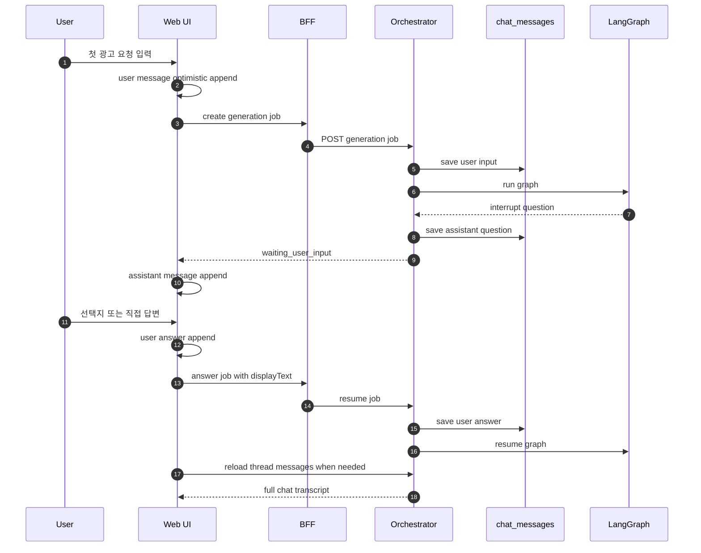
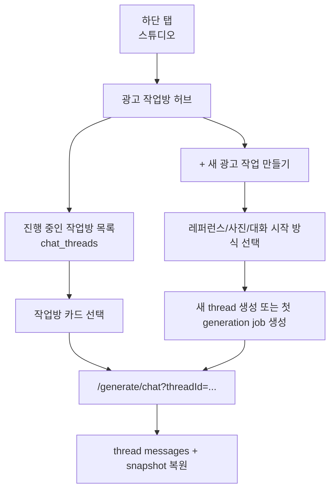

# Chat Transcript Continuity Plan

## Goal

대화로 광고를 만드는 화면에서 사용자의 입력과 AI 질문이 매번 새 대화처럼 리셋되지 않고, 하나의 LangGraph thread 안에서 자연스럽게 누적되도록 연결한다.

이번 작업의 목표는 네 가지다.

1. UI에서 대화 말풍선이 턴마다 누적되어 보이게 한다.
2. URL의 `threadId` 복원이나 graph snapshot 동기화가 현재 대화를 덮어쓰지 않게 한다.
3. LangGraph resume 단계에서 사용자의 답변도 `chat_messages`에 저장해 새로고침 후에도 같은 대화가 복원되게 한다.
4. 스튜디오 탭을 광고 작업방 허브로 확장해 사용자가 이전 thread를 찾아보고 이어서 작업할 수 있게 한다.

## Current Diagnosis

현재 흐름은 아래 이유 때문에 사용자가 “매번 AI가 새 대화를 시작한다”고 느낄 수 있다.

- `apps/web/lib/chat-flow.ts`의 `submitPrompt`가 `conversationMessages`를 새 배열로 교체한다.
- `ChatGenerateClient`가 reference image 정보 반영 시 `submitPrompt`를 한 번 더 호출할 수 있어, 단순 append로 바꾸면 중복 메시지가 생길 수 있다.
- 생성 job 시작 시 `threadIdParam`만 보고 있어, 라우터 query가 늦게 반영되면 기존 `state.threadId`가 무시될 수 있다.
- `router.replace(?threadId=...)` 이후 snapshot restore가 실행되면서 로컬 transcript를 다시 덮어쓸 수 있다.
- FE에는 `getChatThreadMessages()`가 이미 있지만 thread 복원 시 snapshot만 보고 있어 실제 메시지 히스토리를 사용하지 않는다.
- backend는 최초 user input과 assistant question은 저장하지만, graph resume에서 사용자가 고른 답변 또는 직접 입력한 답변을 `chat_messages`에 저장하지 않는다.
- `ChatHistoryStep`와 `/api/chat-threads` 조회는 이미 있지만, 사용자가 접근하기 쉬운 작업방 허브가 아니라 숨은 “이전 대화 기록”에 가깝다.
- `/studio`는 현재 새 작업 시작 옵션만 보여주기 때문에, 이미 만든 thread를 다시 찾아 이어갈 수 있는 메인 동선이 부족하다.

## Desired Flow



## Studio Workspace Flow

스튜디오 탭은 “새 광고를 시작하는 곳”에서 “광고 작업을 만들고 이어가는 곳”으로 확장한다.



스튜디오 화면의 1차 범위는 아래로 제한한다.

- 작업방 목록 조회
- 작업방 상태별 카드 표시
- 작업방 이어가기
- 새 광고 작업 만들기 진입
- 빈 상태와 로딩/에러 상태

작업방 삭제, 이름 변경, 필터 고도화, 공유 기능은 이번 범위에서 제외한다.

## Implementation Tasks

- [ ] 스튜디오 탭을 광고 작업방 허브로 확장한다.
  - 기존 `StudioEntryStep`는 “새 광고 작업 만들기” 화면 또는 섹션으로 재사용한다.
  - `/studio` 진입 시 `listChatThreads()`로 작업방 목록을 조회한다.
  - 진행 중/생성 중/완료/실패 상태를 사용자가 이해할 수 있는 문구로 변환한다.
  - 작업방 카드 클릭 시 `?threadId=...`가 포함된 대화 작업방으로 이동한다.
  - 작업방이 없을 때는 새 작업 만들기 CTA와 빈 상태를 보여준다.

- [ ] 이해/문구/브리프 확인 화면을 채팅 타임라인 카드로 통합한다.
  - `IntentReviewStep`, `CopyChannelStep`, `BriefConfirmStep`의 본문 UI를 재사용 가능한 카드 컴포넌트로 분리한다.
  - `/generate/chat` 작업방 안에서는 StepHeader가 매번 바뀌는 전체 화면 전환 대신 고정된 대화 헤더와 누적 transcript를 유지한다.
  - “AI가 이렇게 이해했어요”, “문구와 채널을 골라주세요”, “AI가 브리프를 정리했어요”는 assistant bubble 아래 카드로 표시한다.
  - 기존 step/state 흐름과 backend API 호출 순서는 유지해 백엔드 로직 변경 없이 1차 UX만 개선한다.

- [ ] Web reducer에 transcript update mode를 추가한다.
  - `submitPrompt` 기본 동작은 기존 메시지 뒤에 user turn을 append한다.
  - reference image path처럼 같은 턴을 보강하는 경우에는 `update_current_turn` 모드로 마지막 user message만 업데이트한다.
  - 기존 테스트를 새 기대 동작에 맞게 수정한다.

- [ ] thread restore 시 snapshot보다 message list를 우선 사용한다.
  - `getChatThreadState(threadId)`는 graph 진행 상태 복원에 사용한다.
  - `getChatThreadMessages(threadId)`는 화면에 보이는 transcript 복원에 사용한다.
  - 메시지 API가 비어 있거나 실패할 때만 snapshot 기반 fallback transcript를 사용한다.

- [ ] 같은 thread로 URL이 갱신될 때 로컬 transcript를 덮어쓰지 않도록 guard를 둔다.
  - job 생성 직후 `router.replace(?threadId=...)`로 인해 restore effect가 즉시 실행되어도 현재 입력 흐름을 보존한다.
  - 다른 thread를 직접 열 때만 서버 메시지로 transcript를 교체한다.

- [ ] 생성 job 시작 시 thread id fallback을 수정한다.
  - 현재 `threadIdParam || undefined` 대신 `threadIdParam || state.threadId || undefined`를 사용한다.
  - URL 반영 타이밍과 관계없이 기존 thread가 유지되게 한다.

- [ ] answer payload에 표시용 답변 텍스트를 포함한다.
  - frontend `answerGenerationJob` 요청에 `displayText`를 추가한다.
  - 선택지 답변은 버튼 label을, 직접 입력은 custom text를 저장한다.
  - backend schema에서는 `displayText`/`display_text`를 허용한다.

- [ ] orchestrator resume 단계에서 user answer를 `chat_messages`에 저장한다.
  - `resume_generation_job_graph`가 graph를 재개하기 전에 user answer message를 append한다.
  - DB-backed job과 memory-backed job 양쪽 동작을 맞춘다.
  - 중복 저장 방지를 위해 job event나 answer metadata 기준의 idempotency를 검토한다.

- [ ] 테스트를 추가/수정한다.
  - Web studio: 스튜디오 진입 시 작업방 목록을 표시하고, 카드 클릭 시 thread 화면으로 이동하는지 검증한다.
  - Web reducer: 여러 submit이 transcript를 누적하는지 검증한다.
  - Web mapper: `chat_messages` 응답을 UI transcript로 변환하는지 검증한다.
  - Web client: 같은 thread restore가 현재 transcript를 지우지 않는지 검증한다.
  - Orchestrator: resume answer가 `chat_messages`에 저장되는지 검증한다.
  - API: thread messages 조회 시 user input, assistant question, user answer 순서가 유지되는지 검증한다.

## Files To Touch

- `apps/web/types/marketing.ts`
- `apps/web/components/generate/StudioEntryStep.tsx`
- `apps/web/components/generate/ChatHistoryStep.tsx`
- `apps/web/lib/chat-flow.ts`
- `apps/web/lib/chat-flow.test.ts`
- `apps/web/lib/chat-thread-state-mapper.ts`
- `apps/web/lib/chat-thread-state-mapper.test.ts`
- `apps/web/lib/api-client.ts`
- `apps/web/app/generate/chat/ChatGenerateClient.tsx`
- `apps/web/app/generate/chat/ChatGenerateClient.test.tsx`
- `orchestrator/app/api/schemas/generation_jobs.py`
- `orchestrator/app/generation_jobs/execution.py`
- `orchestrator/app/generation_jobs/service.py`
- `orchestrator/tests/test_generation_job_graph_execution.py`
- `orchestrator/tests/test_multiturn_state_api.py`
- `orchestrator/tests/test_api_chat_threads.py`

## Verification Commands

```bash
cd apps/web
npm test -- --run lib/chat-flow.test.ts lib/chat-thread-state-mapper.test.ts app/generate/chat/ChatGenerateClient.test.tsx
npx tsc --noEmit
```

```bash
uv run python -m pytest orchestrator/tests/test_generation_job_graph_execution.py orchestrator/tests/test_multiturn_state_api.py orchestrator/tests/test_api_chat_threads.py -q
```

## Manual QA

- [ ] 하단 탭에서 스튜디오를 누르면 광고 작업방 목록이 보이는지 확인한다.
- [ ] 기존 작업방 카드의 `이어하기`를 누르면 해당 `threadId` 대화로 진입하는지 확인한다.
- [ ] 스튜디오의 `새 광고 작업 만들기`를 누르면 레퍼런스/사진/대화 시작 선택 화면으로 진입하는지 확인한다.
- [ ] 작업방이 없는 계정에서는 빈 상태와 새 작업 CTA가 어색하지 않게 보이는지 확인한다.
- [ ] 대화로 광고 만들기에서 첫 요청을 입력한다.
- [ ] AI가 부족한 정보를 물어보면 선택지로 답한다.
- [ ] 이전 user bubble과 assistant bubble이 그대로 남아 있는지 확인한다.
- [ ] 직접 입력 답변을 보낸 뒤에도 이전 대화가 사라지지 않는지 확인한다.
- [ ] 새로고침 후 같은 `threadId`에서 대화 내역이 복원되는지 확인한다.
- [ ] 생성 완료 후에는 깨진 이미지 미리보기로 이동하지 않고, 보관함에서 확인하라는 archive-first UX가 유지되는지 확인한다.

## Commit Plan

- [ ] `feat(web): add studio workspace hub`
- [ ] `fix(web): keep chat transcript across graph turns`
- [ ] `fix(orchestrator): persist generation resume answers`
- [ ] `test: cover chat thread continuity`

## Risks

- 기존 테스트 중 “submitPrompt가 transcript를 초기화한다”는 전제를 가진 테스트가 실패할 수 있다. 이 테스트는 현재 버그를 고정하고 있는 테스트이므로 새 UX 기준으로 수정한다.
- 스튜디오가 기존 “새 광고 만들기” 역할을 완전히 잃으면 사용자가 시작 동선을 못 찾을 수 있으므로, 작업방 목록 상단에 새 작업 CTA를 명확히 둔다.
- 작업방 목록과 보관함의 역할이 섞이면 혼란이 생긴다. 작업방은 대화/브리프/상태, 보관함은 완성 이미지/다운로드로 역할을 분리한다.
- reference image 보강 로직은 같은 user turn 업데이트인지 새 user turn append인지 구분하지 않으면 중복 말풍선이 생길 수 있다.
- backend answer 저장을 추가하면 기존 assistant question 저장과 순서가 꼬일 수 있으므로 message ordering 테스트가 필요하다.
