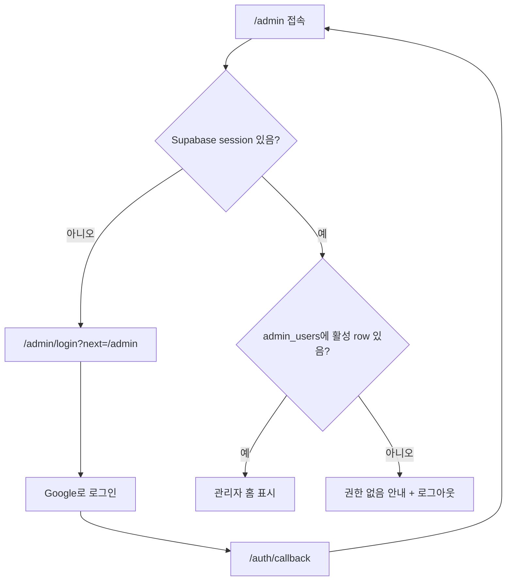

# Admin Google Auth Design

> 작성일: 2026-06-05
> 브랜치: `feat/fe/admin-google-auth`

## 목표

Supabase Google OAuth로 실제 사용자가 로그인하고, Supabase Auth의 `auth.users.id` UUID가 `public.admin_users`에 등록된 경우에만 관리자 화면에 접근할 수 있게 한다.

## 범위

이번 작업은 관리자 계정 기반을 만드는 1차 작업이다.

- 포함: Google 로그인, OAuth callback, 관리자 UUID 권한 테이블, `/admin` 접근 게이트, 관리자 홈 shell, 문서/테스트.
- 제외: 레퍼런스 이미지 CRUD, R2 업로드 UI, 관리자별 감사 로그, 서비스 역할 키를 쓰는 서버 API.

## 핵심 결정

관리자 권한은 이메일 문자열이 아니라 Supabase Auth UUID로 판단한다. 이메일은 바뀔 수 있고 대소문자/별칭 문제가 있지만 UUID는 Supabase 사용자를 안정적으로 식별한다. `ADMIN_ALLOWED_EMAILS` 환경변수는 사용하지 않는다.

## 데이터 모델

새 테이블은 `public.admin_users`다.

- `user_id uuid primary key references auth.users(id) on delete cascade`
- `email text`
- `role text check (role in ('owner', 'admin', 'editor'))`
- `active boolean`
- `created_at timestamptz`
- `updated_at timestamptz`

RLS는 켠다. 로그인한 사용자는 자신의 활성 관리자 row만 조회할 수 있다. 관리자 추가/삭제는 Supabase SQL Editor나 별도 운영 스크립트로 수행하며, 일반 클라이언트가 직접 insert/update/delete할 수 있는 정책은 만들지 않는다.

## 웹 플로우



## 사용자 운영 방식

1. 팀원이 `/admin/login`에서 Google로 한 번 로그인한다.
2. Supabase Dashboard의 Auth users 화면에서 해당 사용자의 UUID를 확인한다.
3. SQL Editor에서 다음처럼 등록한다.

```sql
insert into public.admin_users (user_id, email, role, active)
values ('00000000-0000-0000-0000-000000000000', 'admin@example.com', 'owner', true)
on conflict (user_id) do update
set email = excluded.email,
    role = excluded.role,
    active = excluded.active,
    updated_at = now();
```

4. 사용자가 `/admin`에 다시 접속하면 관리자 홈이 열린다.

## 테스트 전략

- 순수 함수 테스트: redirect path sanitizer, 관리자 role 판정.
- Next build/typecheck: Supabase env가 없을 때도 import/build가 깨지지 않아야 한다.
- 수동 QA: `/admin/login`에서 Google 로그인 후 callback, 미등록 UUID 접근 거부, 등록 UUID 접근 허용.

## 후속 작업

- 관리자 레퍼런스 목록/상세/삭제/추가 UI.
- R2 업로드 API와 DB catalog 동기화.
- 관리자 감사 로그.
- 관리자 권한 role별 기능 제한.
