# PR #44 생성 결과/레퍼런스 플로우 실제 데이터 연결 브리핑

> 작성일: 2026-06-01  
> 기준 PR: [#44 `[feat/fe] 생성 결과와 레퍼런스 플로우 실제 데이터 연결`](https://github.com/ming2tofu33/pjt-sprint_ai07_easyadsAGENT/pull/44)  
> 상태: `merged`  
> 대상 브랜치: `develop`  
> 작업 브랜치: `feat/fe/generation-mock-cleanup`  
> 변경 규모: 16 commits, 63 files changed, +4,681 / -783

## 1. 한 줄 요약

이번 PR은 **광고 생성 UI에서 남아 있던 mock/result fallback을 걷어내고, 실제 백엔드와 LangGraph 응답을 생성 화면, 완료 화면, 보관함까지 연결한 작업**입니다.

핵심은 사용자가 입력하거나 선택한 값이 FE에서 끝나지 않고, BFF와 Orchestrator를 거쳐 생성 결과 이미지 경로까지 다시 화면에 돌아오도록 만든 것입니다.

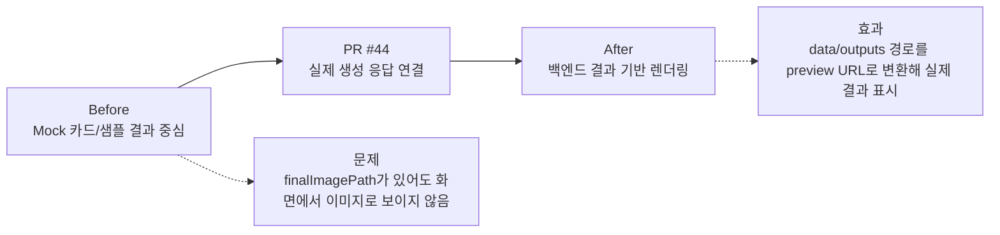

## 2. 이번 PR의 큰 작업 묶음

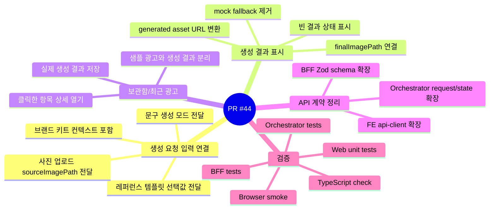

## 3. 변경된 주요 영역

| 영역 | 핵심 변경 | 대표 파일 |
| --- | --- | --- |
| Web 생성 플로우 | 생성 요청/응답을 실제 API 계약에 맞게 연결 | `apps/web/app/generate/chat/ChatGenerateClient.tsx` |
| Web 완료 화면 | `finalImagePath` 기반으로 실제 생성 이미지를 표시 | `apps/web/components/generate/GenerationCompleteStep.tsx` |
| Web 보관함/최근 광고 | 생성 결과와 샘플 광고를 분리하고 클릭 항목을 정확히 열도록 개선 | `apps/web/components/generate/RecentAdsStep.tsx`, `AdSaveFlowStep.tsx` |
| Reference Gallery | API 템플릿 목록 조회 및 선택값 생성 요청 전달 | `apps/web/components/generate/ReferenceBrowseStep.tsx` |
| API Client | 생성 요청 필드와 generated asset URL 처리 추가 | `apps/web/lib/api-client.ts`, `generation-result-utils.ts` |
| BFF | 생성 요청 schema와 reference/generated asset 프록시 확장 | `apps/bff/src/app.js` |
| Orchestrator | chat/photo start request에서 생성 옵션 필드 수신 후 graph state로 전달 | `orchestrator/app/api/chat.py`, `photo.py` |
| Tests | FE/BFF/Orchestrator 회귀 테스트 확장 | `*.test.tsx`, `*.test.ts`, `test_chat_api.py` |

## 4. 사용자가 보는 흐름

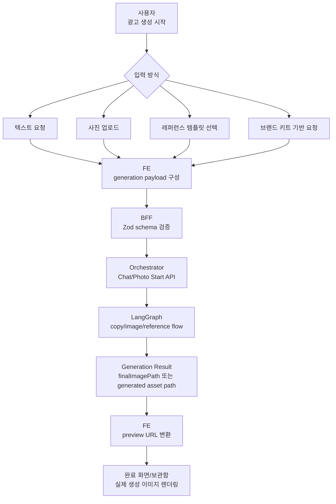

## 5. 데이터 전달 구조

### 5.1 생성 요청 입력값

이번 PR에서 FE-BFF-Orchestrator 사이에 전달되도록 정리한 주요 필드는 아래와 같습니다.

| 필드 | 의미 | 사용 흐름 |
| --- | --- | --- |
| `selectedReferenceTemplateId` | 사용자가 고른 레퍼런스 템플릿 ID | 레퍼런스 갤러리 선택 → 생성 요청 → graph state |
| `copyGenerationMode` | 문구 생성 방식 | `auto_pilot`, `custom_input`, `no_copy` 분기 |
| `userCustomHeadline` | 사용자가 직접 입력한 메인 카피 | custom input 모드 |
| `userCustomSubcopy` | 사용자가 직접 입력한 보조 카피 | custom input 모드 |
| `sourceImagePath` | 업로드된 제품 이미지 경로 | photo generation start 요청 |
| 브랜드 키트 컨텍스트 | 브랜드명/톤/상품 정보 등 | prompt에 추가 컨텍스트로 전달 |

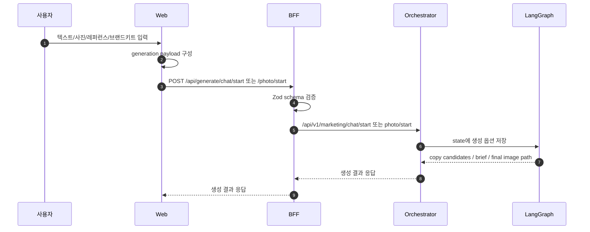

### 5.2 생성 이미지 렌더링

이번 PR의 중요한 문제 해결 포인트는 `data/outputs/...` 형태의 repo-local 경로를 화면에서 볼 수 있는 preview URL로 변환한 것입니다.

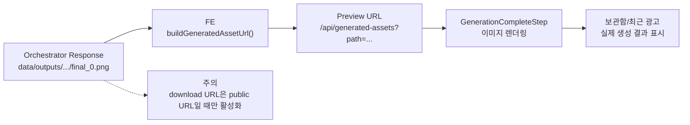

## 6. UI 상태 정리

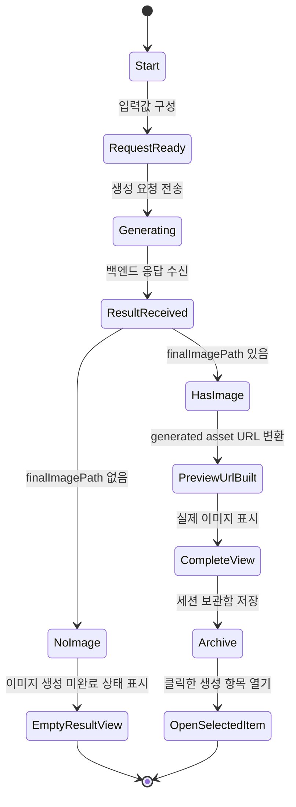

## 7. 이전 상태와 달라진 점

| Before | After |
| --- | --- |
| 생성 결과가 없거나 불완전하면 mock 카드가 섞여 보일 수 있었음 | 실제 이미지 경로가 없으면 명확한 빈 상태를 표시 |
| `final_image_path`가 있어도 public URL이 아니라서 화면 preview로 쓰기 어려웠음 | `buildGeneratedAssetUrl()`로 `/api/generated-assets?path=...` preview URL 생성 |
| 레퍼런스 템플릿 선택이 UI 상태에 가까웠음 | `selectedReferenceTemplateId`가 생성 요청 payload와 graph state로 전달 |
| 문구 생성 모드가 UI 선택에 머물 수 있었음 | `auto_pilot`, `custom_input`, `no_copy`가 API 요청으로 연결 |
| 사진 업로드 후 생성 요청 연결이 약했음 | `sourceImagePath`가 photo start 요청으로 전달 |
| 보관함에서 실제 생성 결과와 샘플 결과가 섞일 수 있었음 | 실제 생성 결과와 샘플 광고 표시를 분리 |

## 8. PR에 포함된 주요 커밋 흐름

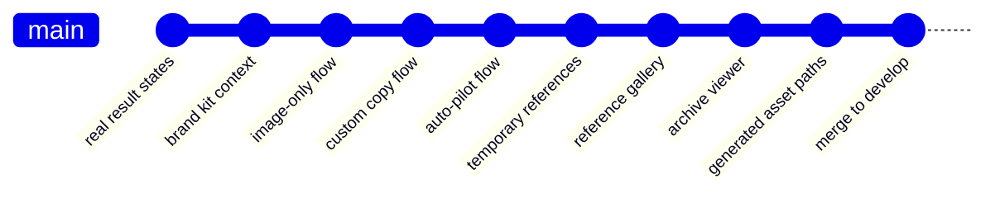

| 커밋 흐름 | 의미 |
| --- | --- |
| `wire real result states and photo edits` | 실제 생성 결과 상태와 사진 편집 흐름 연결 |
| `persist session brand kit across dashboard` | 브랜드 키트 입력값을 세션 단위로 유지 |
| `include brand kit context in requests` | 생성 요청에 브랜드 키트 컨텍스트 포함 |
| `connect image-only graph flow` | 이미지 전용 생성 모드 연결 |
| `connect custom copy input flow` | 사용자 직접 카피 입력 모드 연결 |
| `connect auto-pilot copy flow` | 자동 카피 생성 모드 연결 |
| `support temporary local templates` | 임시 로컬 레퍼런스 템플릿 지원 |
| `connect template gallery flow` | 레퍼런스 갤러리 선택 플로우 연결 |
| `add generated archive image viewer` | 보관함 생성 이미지 조회 화면 추가 |
| `render generated asset paths in result views` | `data/outputs/...` 경로를 결과 화면에서 렌더링 |

## 9. 테스트 및 검증

PR 본문 기준으로 아래 검증이 완료되었습니다.

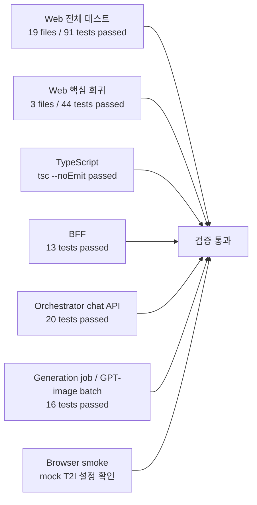

| 검증 항목 | 명령 | 결과 |
| --- | --- | --- |
| Web 전체 테스트 | `cd apps/web && npm test` | 19 files, 91 tests passed |
| Web 핵심 회귀 | `cd apps/web && npm test -- --run lib/generation-result-utils.test.ts lib/generated-assets.test.ts app/generate/chat/ChatGenerateClient.test.tsx` | 3 files, 44 tests passed |
| Web 타입 체크 | `cd apps/web && npx tsc --noEmit --pretty false` | passed |
| BFF 생성 API 테스트 | `cd apps/bff && npm test -- tests/generate.test.js` | 13 tests passed |
| Orchestrator chat API | `uv run python -m pytest orchestrator/tests/test_chat_api.py` | 20 tests passed |
| Generation job / GPT-image quality batch | `uv run python -m pytest orchestrator/tests/test_api_generation_jobs_router.py orchestrator/tests/test_gpt_image2_quality_batch_script.py` | 16 tests passed |

### 브라우저 스모크 확인

- 레퍼런스 선택 시 생성 요청 payload에 `selectedReferenceTemplateId` 포함
- 사진 업로드 시 `sourceImagePath`가 photo start 요청에 전달
- 보관함에서 클릭한 생성 항목이 그대로 열림
- `data/outputs/.../final_0.png`가 `/api/generated-assets?...`로 렌더링
- `finalImagePath`가 없으면 generated asset 이미지가 렌더링되지 않음

## 10. PR 상태

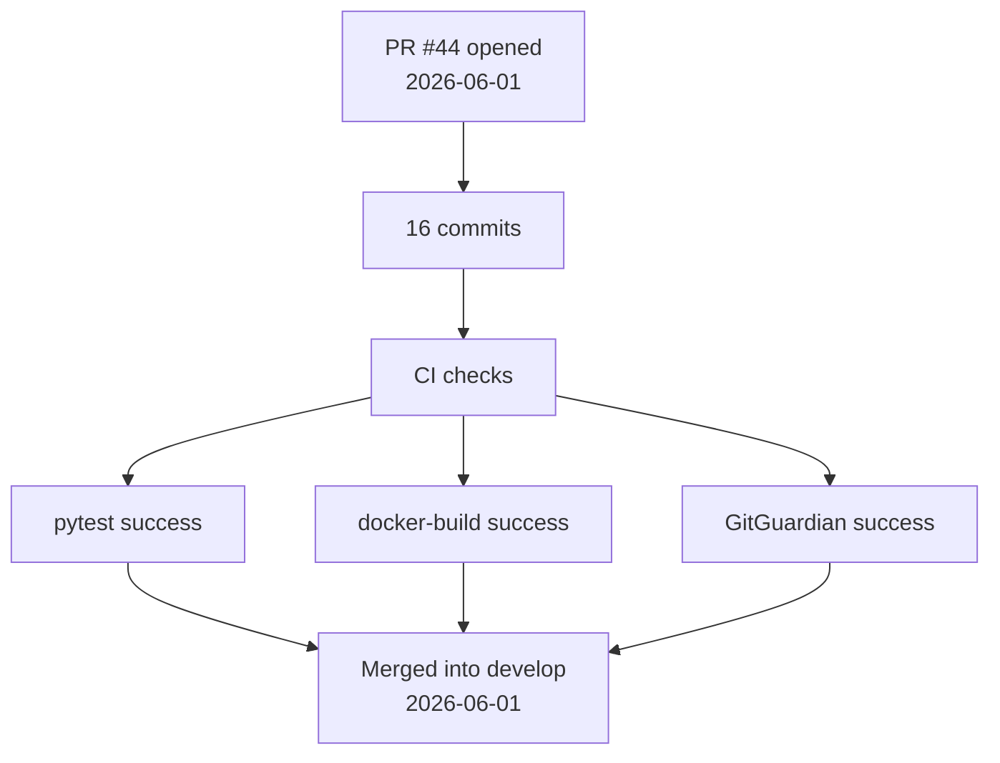

| 항목 | 상태 |
| --- | --- |
| PR 상태 | Merged |
| Merge target | `develop` |
| CI `pytest` | Success |
| CI `docker-build` | Success |
| GitGuardian Security Checks | Success |
| Docker build 로컬 확인 | PR 본문 기준 미확인 |

## 11. 남은 일과 리스크

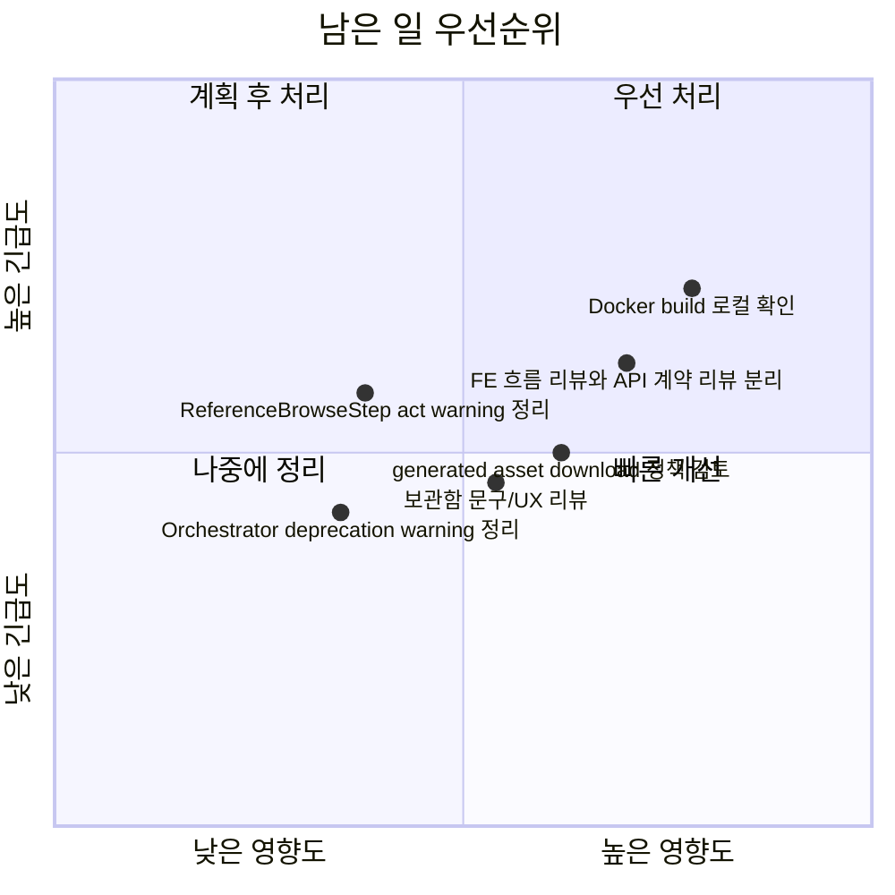

| 남은 일 | 이유 | 제안 우선순위 |
| --- | --- | --- |
| Docker build 로컬 확인 | PR 체크리스트에서 로컬 Docker build는 미확인으로 남아 있음 | 높음 |
| `data/outputs/...` download 정책 리뷰 | preview URL 변환은 완료, download는 public URL일 때만 활성화하는 정책 유지 | 중간 |
| 보관함 UX 문구 리뷰 | 실제 생성 결과와 샘플 광고를 분리해 보여주는 표현이 팀 기준에 맞는지 확인 필요 | 중간 |
| FE 흐름 리뷰 / Orchestrator 계약 리뷰 분리 | PR 범위가 커서 한 번에 보면 리뷰 피로도가 큼 | 중간 |
| React `act(...)` warning 정리 | 테스트 실패는 아니지만 테스트 품질 개선 여지 있음 | 낮음 |
| Python deprecation warning 정리 | 기존 경고로 보이며 즉시 기능 차단 요소는 아님 | 낮음 |

## 12. 팀 브리핑용 1분 스크립트

> 이번 PR은 생성 UI에 남아 있던 mock 결과 의존성을 줄이고, 실제 백엔드/LangGraph 응답을 화면에 연결한 작업입니다.  
> 레퍼런스 템플릿 선택, 문구 생성 모드, 사진 업로드 경로, 브랜드 키트 컨텍스트가 생성 요청 payload로 들어가고, Orchestrator state까지 전달됩니다.  
> 특히 백엔드가 반환하는 `data/outputs/...` 이미지 경로를 `/api/generated-assets?path=...` preview URL로 바꿔서 완료 화면과 보관함에서 실제 생성 이미지를 보여줄 수 있게 했습니다.  
> 테스트는 Web 91개, 핵심 회귀 44개, BFF 13개, Orchestrator chat API 20개, generation job/GPT-image batch 16개가 통과했고, PR은 develop에 merge되었습니다.

## 13. 팀 리뷰 때 보면 좋은 질문

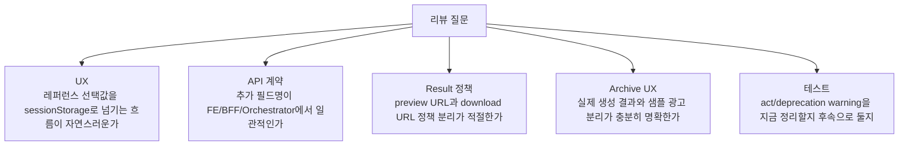

## 14. 결론

PR #44를 통해 광고 생성 플로우는 **mock 중심 화면**에서 **실제 생성 결과 기반 화면**으로 한 단계 넘어갔습니다.  
아직 로컬 Docker build 확인과 일부 warning 정리는 남아 있지만, 생성 요청 입력값 전달, 이미지 결과 preview, 보관함 표시까지 이어지는 FE-BFF-Orchestrator 연결은 PR 기준으로 검증되어 merge 완료된 상태입니다.

