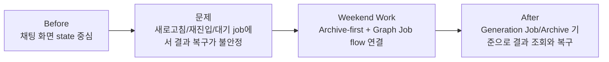
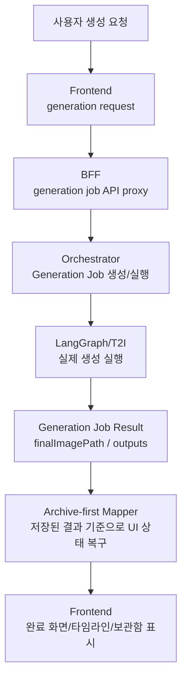
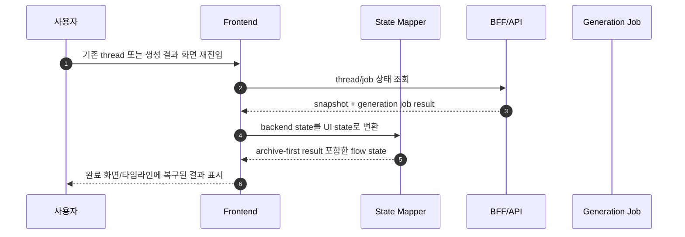
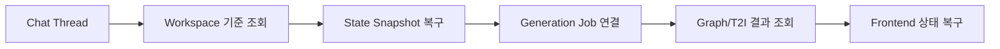
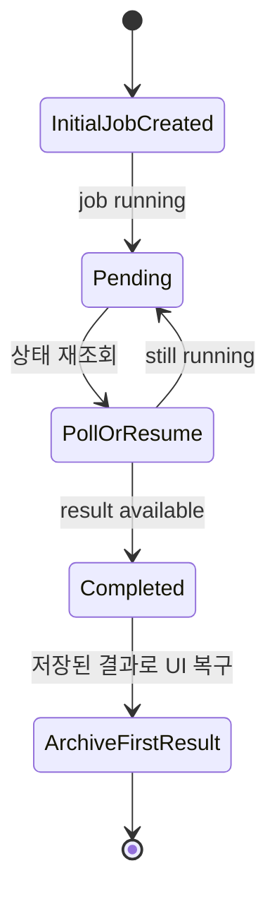
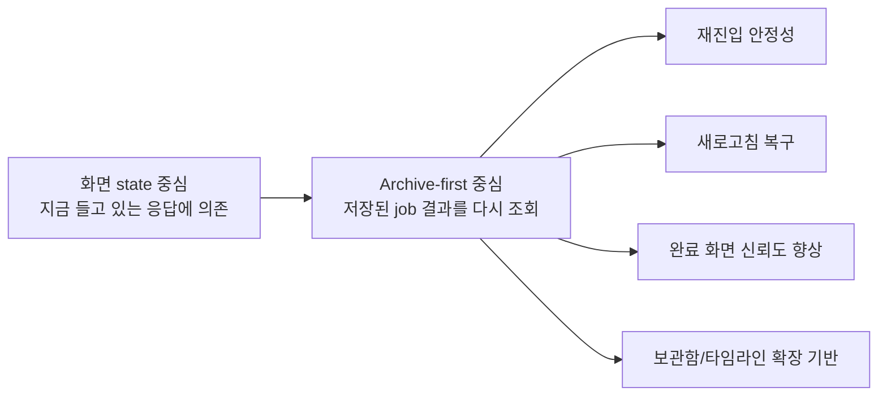

# 주말 작업 브리핑: Archive-first 생성 플로우와 Thread 복구 안정화

> 작성일: 2026-06-08  
> 대상 기간: 2026-06-06 토요일 ~ 2026-06-07 일요일  
> 기준: 해당 기간의 로컬 커밋 로그  
> 현재 작업 맥락: 생성 결과를 채팅 화면에서 안정적으로 이어 보고, 새로고침/재진입/뒤로가기에서도 결과와 상태가 깨지지 않도록 FE-BFF-Orchestrator 흐름을 정리

## 1. 한 줄 요약

주말 동안 한 작업은 **광고 생성 결과를 임시 UI 상태에만 의존하지 않고, Generation Job과 Archive를 기준으로 저장/조회/복구하는 흐름으로 바꾼 것**입니다.

기존에는 생성 결과가 화면 상태나 thread snapshot에만 기대는 부분이 있어서, 새로고침하거나 채팅에 다시 들어오거나 초기 생성 job이 아직 완료되지 않은 상태에서는 결과 표시가 흔들릴 수 있었습니다. 이번 작업에서는 생성 job을 더 중심에 두고, 프론트가 job 상태를 다시 읽어 실제 결과를 복구할 수 있게 만들었습니다.

## 2. 큰 작업 단위

| 작업 | 날짜 | 핵심 내용 |
| --- | --- | --- |
| Archive-first 생성 UX 설계 | 2026-06-06 | 생성 결과를 화면 state보다 archive/job 중심으로 다루는 방향을 문서화 |
| Orchestrator graph job 조회/복구 흐름 수정 | 2026-06-06 | generation job lookup, snapshot timestamp, thread workspace 복구 문제 수정 |
| Web 생성 결과 복구 방식 변경 | 2026-06-06 | 프론트에서 graph state를 보존하고 archive-first 결과를 우선 사용하도록 변경 |
| Archive-first graph job flow 연결 | 2026-06-07 | FE-BFF-Orchestrator 전반에 generation job 실행/조회/결과 복구 흐름 연결 |
| Pending initial generation job 처리 | 2026-06-07 | 최초 생성 job이 아직 진행 중이어도 UI가 끊기지 않도록 처리 |
| Chat start 뒤로가기 흐름 수정 | 2026-06-07 | chat start 화면에서 일반 브라우저 back이 아니라 생성 flow 기준 back navigation 사용 |
| Authenticated workspace lookup 복구 | 2026-06-07 | 로그인/워크스페이스 기반 thread/job 조회가 올바르게 동작하도록 서비스와 repository 수정 |
| Dynamic layout planner 테스트 기대값 갱신 | 2026-06-07 | 변경된 레이아웃 정책에 맞춰 orchestrator 테스트 expectation 정리 |

## 3. 왜 필요했는가

생성 플로우가 점점 실제 데이터 기반으로 바뀌면서, 단순히 “현재 화면에 응답을 들고 있음”만으로는 충분하지 않았습니다.

주요 문제는 다음과 같았습니다.

| 문제 | 사용자에게 보이는 현상 |
| --- | --- |
| 생성 결과가 화면 state에 강하게 묶임 | 새로고침/재진입 시 결과가 사라지거나 이전 상태로 보일 수 있음 |
| thread snapshot 복구가 workspace와 정확히 연결되지 않음 | 특정 thread를 다시 열 때 상태를 찾지 못하거나 잘못된 workspace 기준으로 조회될 수 있음 |
| generation job lookup 흐름이 불안정 | graph job 결과를 archive나 완료 화면에서 안정적으로 찾기 어려움 |
| 초기 생성 job이 pending 상태일 때 UI 처리 부족 | 생성이 끝나기 전 진입하면 화면이 어색하거나 결과 복구가 지연됨 |
| chat start의 back navigation이 flow와 어긋남 | 사용자가 뒤로가기를 했을 때 기대한 이전 단계로 돌아가지 않을 수 있음 |

## 4. 어떻게 고쳤는가

### 4.1 결과 조회 기준을 화면 state에서 Generation Job/Archive 중심으로 이동

기존에는 생성 완료 화면이 현재 chat flow state에 남아 있는 결과에 많이 의존했습니다. 이번 작업에서는 **생성 job과 archive에 저장된 결과를 우선적으로 읽는 방향**으로 바꿨습니다.

핵심은 “화면에 방금 응답이 있었는가?”보다 **“이 생성 job의 결과가 저장되어 있는가?”**를 기준으로 삼도록 한 것입니다.

### 4.2 FE에서 graph state와 archive-first result를 보존

프론트에서는 `ChatGenerateClient`, `chat-flow`, `chat-thread-state-mapper`, `generation-result-utils` 쪽을 손봤습니다.

주요 변경은 다음과 같습니다.

- thread에서 복구한 graph state를 프론트 chat flow state로 다시 매핑
- 생성 완료 화면에서 archive-first 결과를 우선 사용
- generated result가 있을 때 validation summary, mascot image, header 등 주변 UI가 같이 깨지지 않도록 정리
- `GenerationCompleteStep` 테스트를 보강해서 실제 결과 표시 흐름을 검증

### 4.3 Orchestrator에서 generation job lookup과 snapshot 복구를 수정

Orchestrator 쪽에서는 generation job과 thread snapshot을 찾는 흐름을 안정화했습니다.

수정한 포인트는 다음과 같습니다.

- graph job 실행 결과를 generation job repository/service에서 다시 찾을 수 있게 lookup 흐름 복구
- thread workspace 기준으로 snapshot을 복구하도록 chat thread service 수정
- snapshot timestamp를 normalize해서 저장/비교 시 포맷 차이로 흔들리지 않게 처리
- generation job graph execution 테스트를 보강해서 lookup/복구 흐름을 검증

### 4.4 Pending initial generation job 처리

생성 요청을 막 보낸 직후에는 job이 아직 끝나지 않았을 수 있습니다. 이 상태에서 사용자가 화면에 들어오면 완료 결과가 없어서 애매한 상태가 될 수 있습니다.

프론트에서 pending initial generation job을 처리하도록 수정했습니다.

- 초기 job이 아직 pending이면 완료 결과처럼 취급하지 않음
- 필요한 경우 진행 중 상태를 유지
- job이 완료되면 archive/job 결과를 다시 읽어 완료 화면으로 연결

### 4.5 Chat start 뒤로가기 동작을 flow 기준으로 수정

chat start 화면에서는 단순 브라우저 history 기준 뒤로가기보다, 생성 flow 안에서 이전 단계로 돌아가는 동작이 더 자연스럽습니다. 그래서 chat start에서 back navigation을 flow state 기준으로 사용하도록 수정했습니다.

이 변경으로 기대하는 동작은 다음과 같습니다.

- 생성 flow 내부에서는 이전 단계로 자연스럽게 이동
- 채팅 시작 화면에서 뒤로가기 시 의도치 않게 다른 라우트로 튀는 문제 방지
- 테스트에서 chat start back flow를 명시적으로 검증

## 5. 주요 변경 파일

| 영역 | 파일/모듈 | 역할 |
| --- | --- | --- |
| Web | `apps/web/app/generate/chat/ChatGenerateClient.tsx` | 생성 flow의 중심 컴포넌트. pending job, archive-first result, back navigation 처리 |
| Web | `apps/web/lib/chat-flow.ts` | 프론트 생성 flow state 정의와 상태 전환 |
| Web | `apps/web/lib/chat-thread-state-mapper.ts` | backend thread/snapshot 결과를 UI state로 변환 |
| Web | `apps/web/components/generate/GenerationCompleteStep.tsx` | 생성 완료 화면에서 archive-first 결과 표시 |
| Web | `apps/web/components/generate/ChatTimelineStep.tsx` | 생성 과정/대화 흐름을 timeline으로 표시 |
| BFF | `apps/bff/src/app.js` | generation job 관련 API proxy 확장 |
| Orchestrator | `orchestrator/app/generation_jobs/service.py` | generation job 생성/조회/실행 결과 관리 |
| Orchestrator | `orchestrator/app/generation_jobs/execution.py` | graph job 실행과 결과 연결 |
| Orchestrator | `orchestrator/app/chat_threads/service.py` | thread workspace 기반 snapshot 복구 |
| Orchestrator | `orchestrator/app/chat_threads/state_service.py` | snapshot timestamp normalize |
| Orchestrator | `orchestrator/app/t2i/graph_engines.py` | graph 기반 T2I engine 실행 경로 |

## 6. 테스트로 확인한 것

주말 커밋에는 아래 테스트들이 함께 보강되었습니다.

| 테스트 영역 | 확인 내용 |
| --- | --- |
| Web chat client tests | pending initial job, back navigation, archive-first result 사용 |
| `GenerationCompleteStep` tests | 저장된 생성 결과가 완료 화면에 표시되는지 확인 |
| `chat-flow` tests | graph state 보존과 상태 전환 검증 |
| `chat-thread-state-mapper` tests | backend snapshot을 UI state로 올바르게 변환하는지 확인 |
| BFF generate tests | generation job API proxy 흐름 확인 |
| Orchestrator generation job tests | graph execution, job lookup, service 동작 확인 |
| Chat thread service tests | workspace 기준 snapshot 복구 확인 |
| State snapshot tests | timestamp normalize 확인 |
| Dynamic layout planner test | 변경된 layout planner expectation 반영 |

## 7. 팀원들에게 설명할 때 쓸 수 있는 버전

### 30초 요약

> 주말에는 생성 결과를 화면 state에만 의존하지 않고, Generation Job과 Archive를 기준으로 다시 조회하고 복구하는 흐름을 연결했습니다.  
> 그래서 새로고침하거나 채팅 thread에 다시 들어와도 job 결과를 찾아 완료 화면과 타임라인에 복구할 수 있게 했습니다.  
> 동시에 pending job 처리, chat start 뒤로가기, workspace 기반 snapshot 조회 문제도 같이 정리했습니다.

### 2분 설명

> 기존 생성 플로우는 백엔드에서 결과가 와도 프론트의 현재 state에 많이 기대고 있어서, 재진입이나 새로고침 상황에서 결과 복구가 불안정할 수 있었습니다.  
> 그래서 이번에는 generation job을 중심에 두고, Orchestrator에서 graph job 실행 결과를 job service/repository로 조회할 수 있게 복구했습니다.  
> 프론트에서는 backend snapshot과 generation job result를 `chat-thread-state-mapper`로 UI state에 다시 매핑하고, 완료 화면에서는 archive-first result를 우선 사용하도록 바꿨습니다.  
> 추가로 초기 생성 job이 아직 pending인 경우를 처리하고, chat start 화면의 뒤로가기를 flow 기준으로 맞췄습니다.  
> 마지막으로 workspace 인증 기반 조회가 깨지는 부분을 고쳐서, 사용자의 workspace에 연결된 thread와 job을 안정적으로 찾을 수 있게 했습니다.

## 8. 이번 작업의 의미

이번 작업은 단순한 UI 수정이라기보다, 생성 플로우의 기준을 바꾸는 작업이었습니다.

이제 생성 결과는 일회성 응답이 아니라 **다시 찾고, 다시 보여주고, 이후 보관함/히스토리로 확장할 수 있는 데이터**에 가까워졌습니다.

## 9. 남은 일

| 남은 일 | 이유 |
| --- | --- |
| 실제 브라우저에서 archive-first 재진입 플로우 재확인 | 테스트는 보강됐지만 실제 사용 흐름에서도 UX가 자연스러운지 확인 필요 |
| Generation Job polling UX 정리 | pending 상태에서 사용자에게 어떤 진행 메시지를 보여줄지 다듬을 필요 있음 |
| Archive/Timeline 용어 정리 | 팀원과 사용자에게 “보관함”, “생성 기록”, “타임라인”의 역할이 명확해야 함 |
| Thread/workspace 권한 오류 메시지 정리 | 인증/워크스페이스 조회 실패 시 사용자에게 보여줄 문구를 더 다듬을 수 있음 |
| 관련 문서 최신화 | API contract와 deployment/runbook에 archive-first 흐름을 반영하면 좋음 |

## 10. 관련 커밋

| 커밋 | 내용 |
| --- | --- |
| `37b6cca6` | Archive-first generation UX 계획 문서 작성 |
| `6aebc7c2` | snapshot timestamp normalize |
| `3e25b4be` | graph job lookup flow 복구 |
| `a6b285d8` | thread workspace에서 snapshot 복구 |
| `f176b2f9` | Web에서 graph state 보존 및 archive-first result 사용 |
| `5ca49f26` | archive-first graph job flow 전체 연결 |
| `71e1a3ef` | pending initial generation job 처리 |
| `27383682` | chat start flow back navigation 수정 |
| `d4032b00` | authenticated workspace lookup 복구 |
| `7f36867b` | dynamic layout planner test expectation 갱신 |

