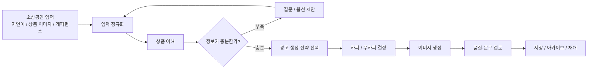
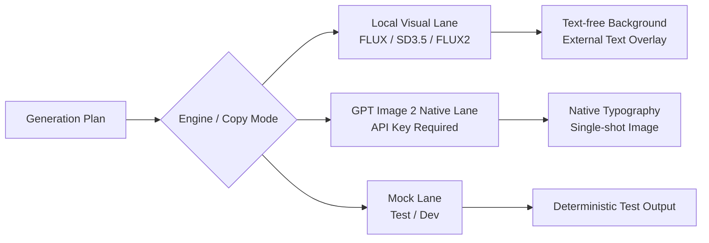
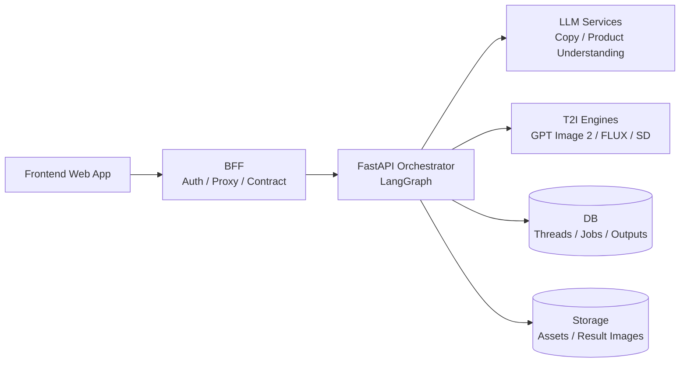
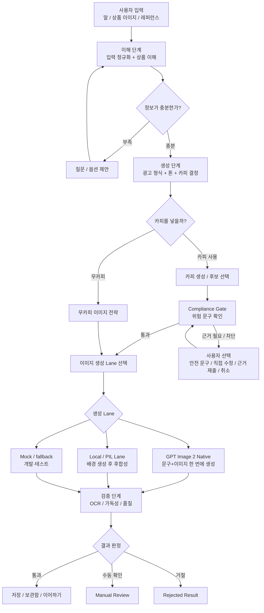
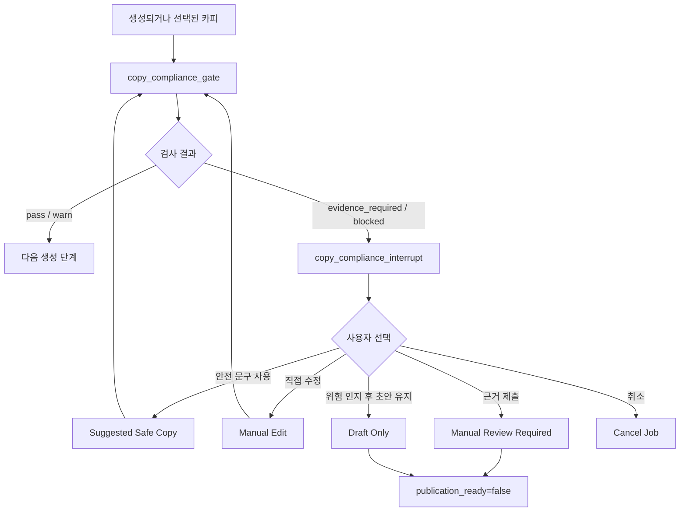
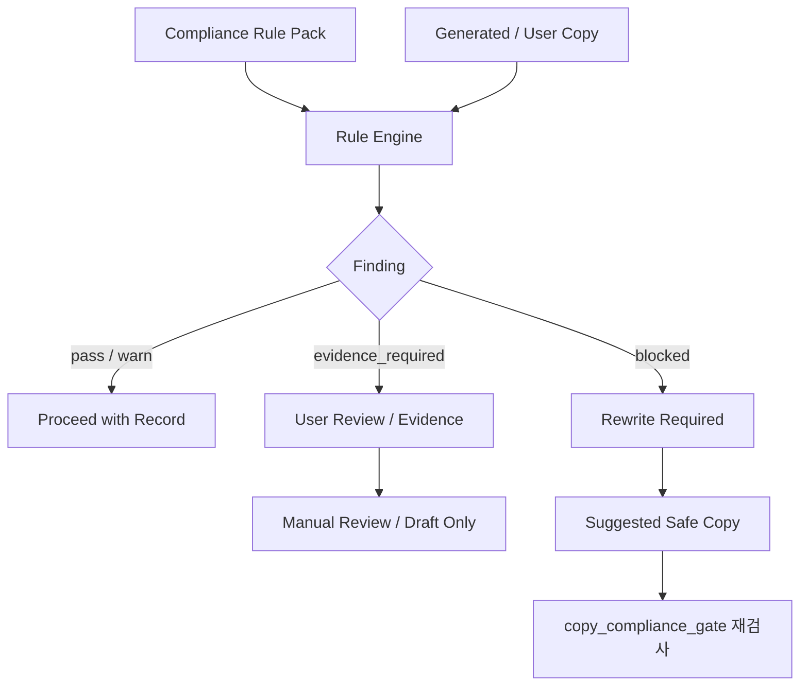
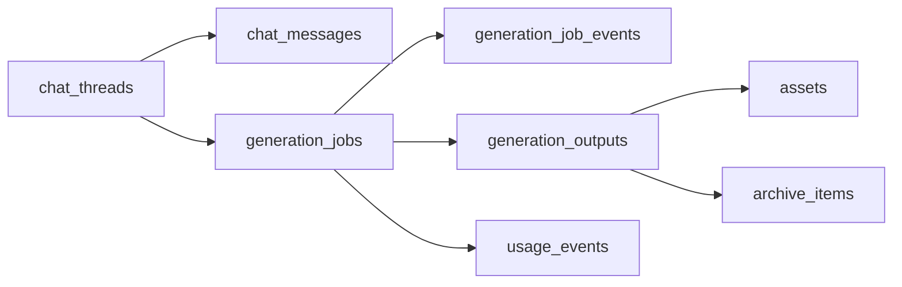
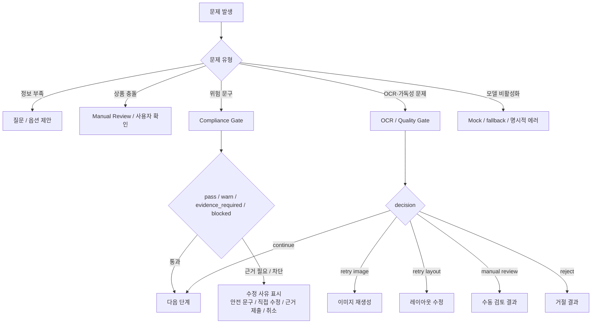
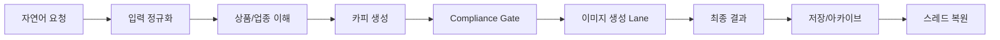

# 발표 자료 PPT 텍스트 최종_수정_v2

# 개떡찰떡 발표자료 v3.1 — 20분 발표 보강본

작성일: 2026-06-16

기준 문서: `presentation_outline_v2.md`, `presentation_outline_v2_feedback.md`, 회의 중 구두 피드백, `repomix-01` ~ `repomix-09`, `eval 요약본.md`

---

## 0. 이번 v3의 재작성 원칙

v2는 프로젝트 전체를 빠짐없이 담고 있었지만, 발표 흐름이 기술 문서 목차에 가까웠다.

이번 v3는 다음 방향으로 다시 정리한다.

1. **개떡찰떡다운 인트로**로 시작한다.
    
    딱딱한 아키텍처 설명이 아니라, 소상공인이 던지는 모호한 말을 광고 결과로 바꿔주는 서비스라는 이야기에서 출발한다.
    
2. **대표 결과와 사용자 경험을 앞에 둔다.**
    
    “무엇을 만들었는가?”를 먼저 보여주고, 그 결과를 만들기 위해 어떤 구조가 필요했는지 뒤에서 설명한다.
    
3. **기술 항목을 잘게 쪼개지 않는다.**
    
    Monorepo, BFF, 데이터 계약, LangGraph, 저장 구조를 각각 길게 설명하지 않고, 발표 본문에서는 “사용자 경험을 가능하게 한 구조”로 묶는다.
    
4. **차별점은 세 가지로 압축한다.**
    - 모호한 입력을 정리하는 **Input Evidence / Product Understanding**
    - 생성 모델별 특성을 반영하는 **Model-aware Generation Lane**
    - 광고 문구 위험을 줄이는 **Compliance Gate**
5. **지어내지 않는다.**
    
    실제 산출물 이미지, 테스트 통과 수, 정량 성능 수치는 발표 직전 실행 로그 또는 캡처가 있을 때만 넣는다. 이 문서에서는 repomix와 기존 문서에서 확인되는 구조·노드·파일·정책만 사용한다.
    

---

## 1. 발표의 새 중심 메시지

### 기존 v2의 중심 메시지

> “우리는 복잡한 서비스 아키텍처를 구현했다.”
> 

### v3에서 전달할 메시지

> **개떡찰떡은 소상공인이 던지는 모호한 말과 이미지를 광고 제작 근거로 정리하고, 상품과 상황에 맞는 생성 전략을 선택한 뒤, 카피·이미지·검수·저장·재개까지 이어주는 웹앱 기반 AI 광고 제작 에이전트이다.**
> 

### 한 문장 버전

> 말은 개떡같이 해도, 광고 결과는 찰떡같이 나오도록 만든 소상공인용 AI 광고 제작 웹앱입니다.
> 

---

## 2. 권장 발표 구성: 20분 기준 17장

| 순서 | 슬라이드 제목 | 역할 | 발표자 |
| --- | --- | --- | --- |
| 1 | 말은 개떡같이 해도, 광고는 찰떡같이 | 서비스 인트로와 대표 결과 | 도민님 |
| 2 | 소상공인에게 광고 제작은 왜 어려운가 | 문제 정의 | 수빈님 |
| 3 | 개떡찰떡이 추구한 사용자 경험 | 실제 UX 흐름 | 수성님 |
| 4 | 단순 이미지 생성으로는 부족했던 이유 | 기존 생성 방식의 문제 | 찬영님 |
| 5 | 모델별 생성 Lane과 API Key 기반 실제 생성 | 여러 모델을 거친 구현 스토리 | 수빈님 |
| 6 | 핵심 설계 원칙 | 발표 전체 프레임 | 찬영님 |
| 7 | 전체 구조: 웹앱에서 생성 에이전트까지 | Monorepo·책임 분리 짧게 | 운하님 |
| 8 | LangGraph: 광고 제작을 상태 기반 그래프로 관리 | 핵심 오케스트레이션 | 운하님 |
| 9 | 입력 정규화와 상품 이해 | 멀티모달·오픈 도메인 이해 | 찬영님 |
| 10 | 카피는 많이 넣는 것이 아니라 필요한 만큼만 | 카피 절제·문구 누수 방지 | 수성님 |
| 11 | Compliance Gate: 광고법 리스크를 서비스 흐름에 넣다 | 차별점 | 도민님 |
| 12 | Compliance Rule Pack 고도화 | 업종별 위험 표현 관리와 안전 rewrite | 도민님 |
| 13 | 저장과 재개: 한 번 만든 결과를 다시 이어가기 | 서비스화 근거 | 찬영님 |
| 14 | 엣지 케이스와 실패 관리 | 안정성·품질 관리 | 찬영님 |
| 15 | 실제 시연 흐름 | 대표 케이스를 안정적으로 보여주는 데모 순서 | 도민님 |
| 16 | 검증과 Eval Layer | 평가 체계 | 운하님 |
| 17 | 한계와 결론 | 한계 정리와 마무리 | 운하님 |

---

## 3. 슬라이드별 재작성안

---

# Slide 1. 말은 개떡같이 해도, 광고는 찰떡같이

## 핵심 메시지

개떡찰떡은 소상공인이 자연스럽게 던지는 말과 이미지를 실제 광고 결과로 바꿔주는 웹앱 기반 AI 광고 제작 서비스이다.

## 넣을 내용

- 서비스명: **개떡찰떡**
    - 내부 프로젝트명 또는 영문 표기는 **EasyAds**로만 보조 표기한다.
- 대상: 광고 제작이 부담스러운 소상공인
- 형식: 웹앱 기반 대화형 광고 제작 서비스
- 대표 Before → After 케이스:
    - 사용자 입력: “우리 카페 신메뉴 딸기라떼 홍보 이미지 만들어줘. 상큼하고 귀엽게.”
    - 레퍼러스 입력이나 이미지 입력이나 대화로 시작하는 흐름 소개 (UI 사진)
    - 시스템 이해: 상품=딸기라떼, 업종=카페, 목적=신메뉴 홍보, 톤=상큼/귀여움
    - 생성 결과: 실제 광고 시안 캡처
        
        
        
        
        
        
        

## 화면 구성 제안

- 왼쪽: 실제 서비스 화면 또는 UI 초안 사진
- 가운데: 대표 사용자 입력과 시스템 이해 결과
- 오른쪽: 실제 생성 결과 캡처
- 하단: “자연어 요청 → 광고 시안 → 저장/재개” 흐름

## 발표 멘트 예시

> “개떡찰떡은 이름 그대로, 사장님이 개떡같이 말해도 시스템이 찰떡같이 알아듣고 광고로 만들어주는 서비스를 목표로 했습니다. 단순히 예쁜 이미지를 한 장 만드는 것이 아니라, 소상공인이 광고를 만들 때 필요한 문구, 이미지, 검토, 저장까지 하나의 흐름으로 묶은 웹앱입니다.”
> 

## 발표 내용 가이드

> 이 슬라이드에서는 서비스의 정체성을 먼저 잡는다. 기술 설명보다 사용자가 무엇을 입력하고 어떤 광고 결과를 얻는지를 먼저 보여주며, 개떡찰떡이 ’모호한 요청을 광고 결과로 바꿔주는 웹앱’이라는 점을 각인시킨다. 대표 Before → After 자료를 중심으로, 자연어 요청이 상품·업종·목적·톤으로 정리되고 실제 광고 시안까지 이어진다는 흐름을 설명한다.
> 

## 주의

대표 결과 이미지는 실제 프로젝트 산출물, 실제 시연 캡처, 또는 현재 UI 초안 화면만 사용한다. 새로 꾸민 예시 이미지를 실제 결과처럼 넣지 않는다.

---

# Slide 2. 소상공인에게 광고 제작은 왜 어려운가

## 핵심 메시지

소상공인에게 어려운 것은 AI 이미지 생성 자체가 아니라, 무엇을 강조하고, 어떤 문구를 쓰고, 어떤 분위기로 만들고, 위험한 표현은 없는지 판단하는 광고 제작 전체 과정이다.

## 넣을 내용

중앙에는 고민하는 소상공인 또는 가게 운영자 일러스트를 두고, 주변에 질문형 문제 카드를 배치한다.

```
소상공인의 광고 제작 난점
 ├ 무엇을 강조해야 하지?
 ├ 어떤 분위기로 만들어야 하지?
 ├ 문구는 어떻게 써야 하지?
 ├ 이미지와 문구가 따로 놀면?
 ├ 위험한 표현이면?
 └ 만든 결과를 다시 이어서 수정하려면?
```

### 문제 카드

1. **강조점 선택의 어려움**
    - 맛, 가격, 분위기, 시즌성 중 무엇을 앞세울지 정하기 어렵다.
2. **광고 문구 작성의 어려움**
    - “홍보하고 싶다”는 의도는 있지만, 실제 광고에 들어갈 짧은 문구로 바꾸기 어렵다.
3. **업종과 상품에 맞는 분위기 설정의 어려움**
    - 같은 음식점이어도 된장찌개와 디저트 카페는 전혀 다른 분위기가 필요하다.
4. **이미지와 문구 불일치 문제**
    - 이미지는 괜찮아도 문구가 따로 놀거나, 문구가 이미지 안에서 잘 읽히지 않을 수 있다.
5. **광고 문구 리스크**
    - 할인, 효능, 보장, 1위, 최고 같은 표현은 근거가 없으면 위험할 수 있다.
6. **저장과 재수정의 어려움**
    - 한 번 만든 결과를 다시 열어 보고, 문구만 바꾸거나 이어서 작업할 수 있어야 실제 서비스가 된다.

## 발표 포인트

“AI 이미지 생성”이 아니라 “광고 제작 업무 전체”를 문제로 잡았다는 점을 강조한다.

## 발표 멘트 예시

> “처음에는 이미지를 잘 만드는 것이 핵심처럼 보였습니다. 하지만 실제 광고 제작 과정에서는 어떤 상품인지, 어떤 점을 강조해야 하는지, 어떤 분위기가 맞는지, 어떤 문구가 안전한지, 그리고 만든 결과를 다시 저장하고 수정할 수 있는지가 모두 중요했습니다. 그래서 저희는 사용자의 자연어 요청을 그대로 이미지 프롬프트로 넘기지 않고, 광고 제작에 필요한 정보로 구조화하는 과정을 문제로 잡았습니다.”
> 

## 발표 내용 가이드

> 이 슬라이드에서는 프로젝트의 문제 정의를 분명히 한다. 소상공인의 어려움은 이미지 생성 버튼을 누르는 것이 아니라, 무엇을 강조할지, 어떤 문구를 쓸지, 어떤 분위기가 맞는지, 위험한 표현은 없는지 판단하는 전체 광고 제작 과정에 있다는 점을 설명한다. 이후 슬라이드의 기술 구조가 이 문제를 해결하기 위한 장치라는 연결고리를 만든다.
> 

---

# Slide 3. 개떡찰떡이 추구한 사용자 경험

## 핵심 메시지

사용자는 복잡한 설정을 몰라도, 대화하듯 요청하고 결과를 확인하고 다시 이어갈 수 있어야 한다.

## 넣을 내용

- 사용자가 입력하는 것 (실제 서비스 화면 자료 이미지)
    - 자연어 요청
    - 상품 이미지
    - 참고 이미지 또는 레퍼런스
    - 광고 형식 선택
        
        
        
        
        
        
        
- 시스템이 처리하는 것
    - 부족한 정보 확인
    - 상품과 의도 정리
    - 카피 생성 또는 무카피 분기
    - 이미지 생성
    - 문구/품질 검증
    - 결과 저장

## Mermaid 흐름도



## 발표 멘트 예시

> “이 서비스의 사용자는 프롬프트 엔지니어가 아닙니다. 그래서 입력을 잘 쓰게 만드는 것이 아니라, 조금 모호한 입력도 시스템이 구조화하고 필요한 경우 질문하도록 만들었습니다.”
> 

## 발표 내용 가이드

> 이 슬라이드에서는 사용자가 경험하는 전체 흐름을 설명한다. 사용자는 프롬프트 엔지니어처럼 복잡한 설정을 할 필요 없이 자연어, 상품 이미지, 참고 이미지를 넣고 대화하듯 요청하면 된다. 시스템은 부족한 정보를 확인하고, 상품과 의도를 정리한 뒤, 카피 생성 여부와 이미지 생성 전략을 정해 결과를 저장·재개할 수 있게 만든다는 점을 말한다.
> 

---

# Slide 4. 단순 이미지 생성으로는 부족했던 이유

## 핵심 메시지

광고 제작에서는 이미지 품질만큼이나 “요청을 광고 문구로 착각하지 않는 것”, “상품과 업종을 혼동하지 않는 것”, “검증되지 않은 주장을 넣지 않는 것”이 중요했다.

## 넣을 내용

단순 생성 방식에서 생길 수 있는 문제를 4가지로 정리한다.

1. **사용자 요청 문장이 광고 문구로 새어 나감 - (된장찌개 실패 예시 사진)**
    - 예: “홍보하고 싶어”, “광고 만들어줘” 같은 말이 결과물 문구가 되면 안 됨
    
    
    
2. **업종 프리셋이 상품보다 앞섬 - (고기랑 감자튀김 실패 예시 사진)**
    - 음식점이라고 해서 모든 결과가 고기·그릴·바비큐 분위기로 흐르면 안 됨
    - 상품 자체를 중심에 놓아야 함
    
    
    
3. **근거 없는 CTA와 주장 생성 - (”확인하기” 문구 실패 예시 사진)**
    - 예약 링크, 할인, 가격, 효능, 보장 표현 등은 확인된 정보가 없으면 넣지 않아야 함
    
    
    
4. **생성 실패 이후 복구 흐름 부재 - (이미지 생성 실패 시 화면 사진)**
    - OCR 실패, 레이아웃 실패, 문구 위험, 모델 비활성화 같은 상황에서 안전하게 멈추거나 수정해야 함
    
    
    

## 발표 멘트 예시

> “이 지점에서 저희가 깨달은 것은, 좋은 광고 생성 시스템은 프롬프트를 길게 쓰는 시스템이 아니라 잘못된 해석을 막는 시스템이라는 점이었습니다.”
> 

## 발표 내용 가이드

> 이 슬라이드에서는 왜 단순 이미지 생성 호출만으로는 광고 제작 서비스가 되기 어려웠는지 설명한다. 사용자 요청 문장이 그대로 광고 문구로 새거나, 업종 프리셋이 상품보다 앞서거나, 근거 없는 CTA·효능·할인 문구가 생성되는 문제를 짚는다. 발표자는 이 실패 사례들이 ’프롬프트를 더 길게 쓰는 문제’가 아니라 ’잘못된 해석을 막는 구조’가 필요하다는 결론으로 이어졌다고 정리한다.
> 

---

# Slide 5. 모델별 생성 Lane과 API Key 기반 실제 생성

## 핵심 메시지

프로젝트는 여러 이미지 생성 방식을 시도했지만, 최종 발표 흐름에서는 실제 대표 결과를 안정적으로 보여주는 GPT Image 2 Native Lane과 개발·검증용 Local/Mock Lane을 구분한다.

## 넣을 내용

### 1. 우리가 거친 생성 방식 스토리

1. **처음 기대**
    - 이미지에서 글자 생성이 불안정 하다 생각했다.
    - PIL으로 텍스트를 후합성을 시도하기로 했다.
    - 포스터 처럼 이미지와 어우러져서 잘나오는 것을 기대 했다.
2. **초기 보류**
    - API Key, 비용, 호출 정책 때문에 바로 한 가지 모델에만 의존하지 않고 Local/Modal 후보를 함께 열어두었다.
3. **PIL 후합성 시도**
    - 텍스트 없는 배경을 만들고, PIL/TextRenderer로 문구를 얹는 방식을 시도했다.
    - 이 방식은 배경 여백, 문구 대비, 폰트 크기, OCR 검증을 다시 맞춰야 해서 후처리 부담이 컸다.
4. **GPT Image 2 Native Typography 검증**
    - 승인된 카피와 이미지 지시를 한 번에 넣어 광고 이미지와 한국어 문구를 함께 생성하는 방향을 검증했다.
    - 발표 대표 결과는 이 Lane의 실제 생성 캡처를 중심으로 보여준다.

## Lane 선택 기준

| 상황 | 선택 Lane | 이유 |
| --- | --- | --- |
| 실제 발표 대표 결과 | GPT Image 2 Native | 품질과 한국어 타이포그래피 안정성 |
| 승인된 카피를 이미지 안에 바로 넣어야 함 | GPT Image 2 Native Typography | PIL 후합성 부담 감소 |
| 텍스트 없는 배경이 필요함 | Local / Guarded Visual | 후합성 전제, 비용 절감 후보 |
| 테스트 자동화 | Mock Lane | 결과를 결정론적으로 검증 |
| API Key 또는 모델 설정이 없음 | Mock / fallback | 실패 대신 개발 흐름 유지 |

## 비교 사진 제안

- 왼쪽: PIL 후합성 결과 또는 시도 캡처
- 가운데: GPT Image 2 Native Typography 결과 캡처
- 오른쪽: Mock/fallback 결과는 실제 생성이 아님을 표시

## Mermaid 분기



## 발표 멘트 예시

> “처음부터 API 모델 하나만 쓰려고 한 것은 아니었습니다. 로컬 Lane은 비용 절감과 fallback 가능성을 보기 위해 열어두었고, PIL 후합성도 시도했습니다. 하지만 실제 광고처럼 보이려면 문구 위치, 대비, OCR까지 다시 맞춰야 했습니다. 그래서 발표 대표 결과는 API Key 기반 GPT Image 2 Native Lane으로 보여주고, Local과 Mock은 개발·테스트·fallback 경로로 구분했습니다.”
> 

## 발표 내용 가이드

> 이 슬라이드에서는 여러 이미지 생성 모델을 모두 같은 방식으로 쓰지 않고, 모델 특성에 맞는 Lane으로 나누어 다룬 점을 설명한다. Mock은 테스트와 안정성 확인에, API 기반 모델은 실제 생성에, FLUX/SD 계열은 로컬·Modal 실행 실험에 연결된다. 핵심은 ’모델을 많이 붙였다’가 아니라, 모델별 실패 가능성과 비용·환경 차이를 서비스 흐름 안에서 분기하도록 만들었다는 점이다.
> 

## 주의

특정 모델의 품질 우열을 단정하지 않는다. 발표에서는 “실제 대표 결과 Lane”과 “개발·테스트·fallback Lane”으로 구분해 설명한다.

---

# Slide 6. 핵심 설계 원칙

## 핵심 메시지

개떡찰떡은 생성 모델을 그냥 호출하는 것이 아니라, 광고 제작에 필요한 판단을 단계별로 분리한 시스템으로 설계했다.

특히 핵심은 **Text-Layout-First Pipeline(TLFP)** 이다. 광고 이미지에서 가장 문제가 되기 쉬운 한국어 문구, 여백, 가독성, 상품 영역 침범 문제를 모델에게만 맡기지 않고, 카피 구조와 텍스트 배치 계약을 먼저 만든 뒤 이미지 생성과 렌더링, 검수로 넘긴다.

## 넣을 내용

### 1. Text-Layout-First Pipeline (TLFP)

개떡찰떡의 핵심 설계는 **이미지를 먼저 만들고 나중에 글자를 얹는 방식**이 아니라, **광고 문구와 텍스트 위치를 먼저 구조화한 뒤 이미지 생성으로 넘기는 방식**이다.

생성된 `MarketingCopy`는 `CopySpecParserNode`, `TextStyleBinderNode`, `TextLayoutPlannerNode`를 거치며 광고 문구의 역할, 우선순위, 크기, 위치, 안전 여백으로 정리된다. 이때 `TextLayoutSpec.slots`가 이후 텍스트 합성의 기준 계약이 된다.

그 다음 `ImagePromptPlannerNode`는 `reserved_text_areas`를 이미지 프롬프트에 반영해, 문구가 들어갈 영역을 미리 비워 둔 배경 이미지를 만들도록 유도한다. 즉, 이미지 모델은 배경과 시각 요소를 만들고, 한국어 문구 자체는 모델이 직접 그리지 않도록 분리한다.

이후 `TextRendererNode`가 한국어 카피를 결정론적으로 합성하고, `ReadabilityGate`가 대비, 배치, 잘림 위험을 점검한다. 그래서 TLFP는 단순한 프롬프트 개선이 아니라, **카피 → 레이아웃 → 이미지 여백 → 텍스트 렌더링 → 가독성 검수**를 하나의 파이프라인으로 묶은 구조다.

### 2. Human In The Loop (HITL)

정보가 부족하거나 카피 후보 선택, 사용자 직접 입력, 수동 검토가 필요한 지점에서는 그래프를 멈추고 사용자 선택을 받아 이어간다.

특히 TLFP 흐름 안에서도 사용자는 카피 후보를 고르거나 직접 문구를 입력할 수 있고, 시스템은 그 문구를 임의로 바꾸기보다 검증과 배치 흐름으로 연결한다.

### 3. End-to-End First

이미지 하나가 아니라 입력, 대화, 카피, 이미지, 검증, 저장까지 연결한다.

### 4. Evidence First

사용자 입력과 이미지에서 확인된 근거를 먼저 정리하고, 근거 없는 주장은 제한한다.

### 5. Product First

업종 프리셋보다 실제 상품과 서비스 정체성을 우선한다.

### 6. Model-aware Generation

모든 모델을 같은 방식으로 쓰지 않고, 모델 특성에 맞는 생성 Lane을 둔다.

### 7. Fail-closed

불확실하거나 위험한 경우 임의로 진행하지 않고 질문, 수동 검토, 안전 문구, 취소 흐름으로 보낸다.

### 8. Persistent Workflow

생성 결과와 대화 상태를 저장해 사용자가 다시 이어갈 수 있게 한다.

## 발표 내용 가이드

> 이 슬라이드에서는 개떡찰떡의 핵심 설계 원칙을 설명한다. 특히 가장 먼저 TLFP를 강조한다. 개떡찰떡은 이미지 모델에게 한국어 문구까지 한 번에 그리게 맡기는 방식이 아니라, 카피를 먼저 구조화하고, `TextLayoutSpec.slots`로 문구 위치를 계약한 뒤, `reserved_text_areas`로 이미지 안의 여백을 확보하고, 이후 `TextRenderer`와 `ReadabilityGate`로 한국어 문구를 합성·검수하는 구조라고 설명한다.
> 
> 
> 즉, TLFP는 단순히 프롬프트를 잘 쓰는 기술이 아니라, 광고 이미지에서 중요한 카피·여백·가독성을 시스템이 직접 통제하기 위한 파이프라인이다. 그 위에 HITL, Evidence First, Product First, Model-aware Generation, Fail-closed, Persistent Workflow가 붙으면서 광고 제작 전체 흐름이 안정적으로 이어진다는 점을 말한다.
> 

---

# Slide 7. 전체 구조: 웹앱에서 생성 에이전트까지

## 핵심 메시지

Monorepo와 서비스 책임 분리는 길게 설명하지 않고, “웹앱에서 AI 생성 흐름까지 안정적으로 연결하기 위한 구조”로 짧게 보여준다.

## 넣을 내용

- **Frontend / Web App**
    - 사용자 입력, 이미지 업로드, 결과 확인, 아카이브 UI
- **BFF**
    - 인증 경계
    - Frontend와 Orchestrator 사이 API 라우팅
    - 요청 검증, 에러 응답 표준화, 내부 시크릿 전달
- **FastAPI Orchestrator**
    - LangGraph 실행
    - 상태 관리
    - 생성 작업 관리
- **AI / T2I Workers**
    - LLM 호출
    - 이미지 생성 Lane
    - 로컬/Modal/API 기반 실행 분기
- **DB / Storage**
    - 대화, 작업, 산출물, 에셋, 아카이브 저장

## Mermaid 구조도



## 발표 멘트 예시

> “아키텍처의 핵심은 복잡함 자체가 아니라 책임 분리입니다. 웹앱은 사용자 경험에 집중하고, BFF는 인증과 API 경계를 맡고, Orchestrator는 광고 제작 그래프를 실행하며, 생성 모델은 별도의 Lane으로 분리했습니다.”
> 

## 발표 내용 가이드

> 이 슬라이드에서는 시스템 구조를 세부 폴더 목록이 아니라 책임 분리 관점에서 설명한다. 웹앱은 사용자 경험과 화면을 담당하고, BFF는 인증과 API 경계를 담당하며, Orchestrator는 LangGraph 기반 생성 흐름을 실행한다. LLM/T2I Worker는 실제 모델 호출과 이미지 생성을 맡고, DB와 Storage는 대화·작업·산출물을 저장한다는 식으로 각 구성요소의 역할을 명확히 말한다.
> 

---

# Slide 8. LangGraph: 광고 제작을 상태 기반 그래프로 관리

## 핵심 메시지

LangGraph는 광고 제작을 “이해 → 생성 → 검증/저장”으로 나누고, 정보 부족·문구 위험·OCR 실패·수동 검토 같은 분기를 상태로 관리하기 위한 그래프이다.

## 넣을 내용

발표 본문에서는 노드 이름을 모두 늘어놓지 않고, 실제 역할 중심으로 단순화해 보여준다.

### 구현 범위 표시

| 기능 | 상태 | 시연/제시 방식 |
| --- | --- | --- |
| 자연어 입력 정규화 | 구현 | 화면 또는 로그로 제시 |
| 상품 이해 / 확인된 사실 분리 | 구현 | 딸기라떼 예시로 제시 |
| 카피 생성 / 무카피 분기 | 구현 | 대표 흐름으로 제시 |
| Compliance Gate | 구현 | 위험 문구 예시와 선택지로 제시 |
| GPT Image 2 Native Lane | 실제 생성 검증 | 캡처 기반 시연 |
| FLUX / SD Local Lane | 실험·보조 | 발표 핵심이 아닌 보조 경로 |
| Mock / fallback Lane | 개발·테스트용 | 실제 생성 결과와 구분해 설명 |
| Eval Layer | 구조 구현·검증용 | 최종 판정 구조 요약 |

## Mermaid 그래프



## 발표 멘트 예시

> “LangGraph를 쓴 이유는 광고 제작이 한 번에 끝나는 직선 흐름이 아니었기 때문입니다. 정보가 부족하면 질문해야 하고, 문구가 위험하면 멈춰야 하고, 이미지에 이상한 텍스트가 들어가면 재생성하거나 수동 검토로 보내야 합니다. 그래서 발표에서는 노드명을 외우게 하기보다, 이해·생성·검증이라는 세 단계로 보여주겠습니다.”
> 

## 발표 내용 가이드

> 이 슬라이드에서는 LangGraph를 ’광고 제작 절차를 상태 기반으로 관리하는 장치’로 설명한다. 사용자의 입력이 들어오면 입력 정규화, 상품 이해, 정보 부족 확인, 카피·이미지 생성, 검증, 결과 저장이 순서대로 상태에 기록된다. 중간에 정보가 부족하거나 위험 표현이 발견되면 질문하거나 멈출 수 있기 때문에, 단발성 생성보다 서비스 흐름에 적합하다는 점을 강조한다.
> 

---

# Slide 9. 입력 정규화와 상품 이해

## 핵심 메시지

개떡찰떡의 첫 단계는 생성이 아니라, 사용자의 말과 이미지를 광고 제작에 쓸 수 있는 근거로 정리하는 것이다.

## 넣을 내용

### 실제 변환 예시

입력:

> “우리 카페 신메뉴 딸기라떼 홍보 이미지 만들어줘. 상큼하고 귀엽게.”
> 

정규화 결과:

```
상품명: 딸기라떼
업종: 카페
캠페인 의도: 신메뉴 홍보
톤: 상큼함, 귀여움
비표시 지시문: 홍보 이미지 만들어줘
표시 가능한 문구: 없음
확인된 사실: 신메뉴, 딸기라떼
알 수 없는 정보: 가격, 매장명, 할인 여부, 판매 기간
```

### Input Evidence Bundle

- 입력 모드 구분
    - `text_only`
    - `image_only`
    - `text_and_image`
- 사용자 입력에서 분리하는 것
    - 상품명
    - 캠페인 의도
    - 비표시 지시문
    - 사용자가 정확히 넣고 싶은 문구
    - 확인된 사실
    - 이미지 관찰 정보
    - 충돌 정보
    - 알 수 없는 필드

### Product Understanding

- 상품명
- 정규화된 상품 유형
- 넓은 카테고리
- 카테고리 경로
- 검증된 사실
- 시각 관찰
- 알 수 없는 정보
- 지원되지 않는 주장 카테고리
- 신뢰도
- 수동 검토 필요 여부

## 발표 멘트 예시

> “예를 들어 사용자가 ’딸기라떼 홍보 이미지 만들어줘’라고 입력했을 때, 시스템은 이 문장을 그대로 광고 카피로 쓰지 않습니다. ’딸기라떼’는 상품 정체성으로, ’신메뉴 홍보’는 캠페인 의도로, ’홍보 이미지 만들어줘’는 실제 이미지에 표시하면 안 되는 지시문으로 분리합니다.”
> 

## 화면 구성 제안

왼쪽: 사용자 입력

가운데: Input Evidence Bundle 요약

오른쪽: Product Understanding 요약

## 발표 내용 가이드

> 이 슬라이드에서는 사용자의 말을 그대로 프롬프트로 넘기지 않고 광고 제작 근거로 바꾸는 과정을 설명한다. 예를 들어 ’딸기라떼 홍보 이미지’라는 요청에서 상품, 업종, 목적, 톤, 사용 가능한 근거와 금지해야 할 추정을 분리한다. 발표자는 이 단계가 있어야 업종 프리셋에 끌려가지 않고 실제 상품 중심의 광고 전략을 세울 수 있다고 설명한다.
> 

---

# Slide 10. 카피는 많이 넣는 것이 아니라 필요한 만큼만

## 핵심 메시지

좋은 광고 카피 생성은 많은 문구를 넣는 것이 아니라, **사용자 요청, 상품 정보, 도메인 라우팅, 실제 표시 문구를 분리하고 검증되지 않은 표현을 줄이는 것**이다.

개떡찰떡은 `business_type`만 보고 카피를 바로 생성하지 않는다. 도메인 라우팅, 상품 시각 맥락, 비주얼 전략, fallback 여부를 함께 판단해 **상품과 다른 주장이나 과장된 문구가 광고에 새지 않도록 통제**한다.

## 넣을 내용

- 사용자 요청은 광고 문구가 아니다.
    - “홍보하고 싶어”
    - “광고 만들어줘”
    - “손님 많이 오게 해줘”
    - 이런 문장은 사용자의 의도이지, 광고 이미지에 그대로 들어갈 표시 문구가 아님
- 시스템이 해야 하는 일
    - 사용자 요청, 상품 정체성, 업종/도메인, 실제 표시 문구를 분리
    - `business_type` 기반 도메인 라우팅은 하되, 업종명만 보고 상품 효능·가격·전문성·시각 요소를 단정하지 않음
    - 실제 상품 정보와 도메인 판단이 어긋나면 generic fallback, 추가 질문, 수동 검토로 보냄
    - Product Visual Context와 Visual Strategy 판단을 통해 이미지에 들어갈 요소와 카피의 방향을 함께 검토
    - 사용자가 정확히 넣으라고 한 문구만 표시 문구로 인정
    - CTA는 근거가 있을 때만 사용
    - 가격, 할인, 효능, 보장, 전화번호, 주소 등은 검증 정보 없으면 생성하지 않음
    - AI copy가 실제 LLM 결과인지, mock/fallback 결과인지 lineage를 남겨 검증 가능하게 함
- 카피 분기
    - 카피 후보 생성
    - 사용자 선택
    - 자동 카피
    - 사용자 직접 입력
    - 무카피 배경 생성
    - fallback 또는 수동 검토
- 이 설계로 막는 문제
    - 요청문이 그대로 광고 문구로 들어가는 문제
    - 업종명만 보고 존재하지 않는 효능이나 혜택을 만드는 문제
    - 상품과 맞지 않는 시각 요소가 이미지에 들어가는 문제
    - mock/fallback 결과를 실제 모델 생성 결과처럼 오해하는 문제
    - 검증되지 않은 CTA, 가격, 할인, 보장 문구가 생성되는 문제

## 발표 멘트 예시

> “카피를 잘 만든다는 것은 더 화려한 문장을 만드는 것이 아니라, 넣으면 안 되는 문장을 넣지 않는 것입니다. 예를 들어 사용자가 ‘홍보하고 싶어’라고 말했을 때, 이 문장은 광고에 들어갈 카피가 아니라 요청 의도입니다. 그래서 개떡찰떡은 요청문, 상품 정보, 도메인 라우팅 결과, 실제 표시 문구를 분리합니다.”
> 
> 
> “또한 업종명이 음식점이라고 해서 무조건 맛집, 할인, 인기 메뉴 같은 표현을 만들지 않습니다. 실제 상품 정보와 근거가 있을 때만 카피로 사용하고, 정보가 부족하거나 도메인과 상품이 맞지 않으면 fallback이나 추가 질문, 수동 검토로 보냅니다.”
> 
> “최근 PR에서 강화된 도메인 라우팅과 Visual Strategy 흐름은 바로 이 지점을 보완합니다. 카피가 상품과 맞는지, 이미지에 들어갈 시각 요소가 도메인과 맞는지, fallback이 사용됐는지 추적해서 광고 문구와 이미지가 서로 어긋나지 않게 만드는 구조입니다.”
> 

## 발표 내용 가이드

> 이 슬라이드에서는 카피 정책을 설명한다. 광고 문구는 많이 넣는 것이 아니라, 상품과 상황에 맞게 필요한 만큼만 넣어야 한다. 사용자의 요청 문장과 실제 광고에 들어갈 문구를 분리하고, 무카피 이미지가 더 적절한 경우에는 문구를 넣지 않는 선택지도 둔다.
> 
> 
> 특히 최근 PR에서 정리된 `business_type` 도메인 라우팅 SSOT, Product Visual Context, Visual Strategy Resolver/Decision/Validator, fallback/trace 흐름을 연결해서 설명한다. 이 구조는 단순히 업종별 템플릿을 고르는 것이 아니라, 상품 정보와 도메인 판단, 시각 전략, 카피 생성 결과가 서로 맞는지 확인하기 위한 장치다.
> 
> 따라서 ‘홍보하고 싶어’ 같은 요청문이 광고 문구로 새지 않도록 막고, 업종명만 보고 실제 상품과 다른 주장이나 시각 요소가 생성되지 않게 하는 것이 핵심이라고 말한다. 또한 AI copy가 실제 LLM 결과인지, mock 또는 fallback 결과인지 구분하는 lineage를 남겨 QA와 검증이 가능하도록 했다는 점도 함께 설명한다.
> 

---

# Slide 11. Compliance Gate: 광고법 리스크를 서비스 흐름에 넣다

## 핵심 메시지

Compliance Gate는 광고 문구를 자동으로 법률 판단하는 기능이 아니라, 위험 표현을 감지하고 사용자가 안전하게 수정·보류·취소할 수 있도록 흐름을 막아주는 검토 단계이다.

## 넣을 내용

### 왜 중요한가

- 소비자 또는 소상공인은 광고법상 위험 표현을 모를 수 있다.
- AI는 그럴듯한 문구를 만들 수 있지만, 그 문구가 안전하다는 보장은 없다.
- 따라서 광고 생성 서비스는 카피 생성 이후 별도의 검토 Gate가 필요하다.

### 실제 구현 흐름

1. `state_update_selected_copy`, `auto_pilot_copywriting`, `custom_copy_validation` 뒤에서 `copy_compliance_gate`가 카피를 검사한다.
2. 결과가 `pass` 또는 `warn`이면 다음 생성 단계로 진행한다.
3. 결과가 `evidence_required` 또는 `blocked`이면 `copy_compliance_interrupt`로 멈추고 사용자 선택을 받는다.
4. 사용자는 안전 문구 사용, 직접 수정, 근거 제출, 위험 인지 후 초안 유지, 취소 중에서 선택한다.
5. 근거 제출 또는 위험 인지 후 유지처럼 검증이 끝나지 않은 경우에는 `publication_ready=false`로 남긴다.

## 상태 의미

| 상태 | 의미 | 다음 흐름 |
| --- | --- | --- |
| `pass` | 위험 표현 없음 | 다음 생성 단계로 진행 |
| `warn` | 주의 표현이지만 차단은 아님 | 진행 가능, 기록 유지 |
| `evidence_required` | 1위, 최고, 효능 등 근거가 필요한 주장 | 사용자 선택 / 근거 제출 / 수동 검토 |
| `blocked` | 보장·치료·완치처럼 차단해야 할 표현 | 안전 문구 또는 직접 수정 필요 |
| `manual_review_required` | 사용자가 근거 제출 또는 위험 인지 후 유지 선택 | 초안은 가능하지만 publication ready는 아님 |

## Mermaid 흐름도



## 발표 멘트 예시

> “이 부분은 단순 품질 검사가 아니라 서비스 차별점으로 봤습니다. 사용자는 광고법을 모를 수 있고, AI는 위험한 표현을 그럴듯하게 만들 수 있습니다. 그래서 문구 생성 뒤에 Compliance Gate를 두고, 위험하면 바로 다음 단계로 넘기지 않고 사용자 선택을 받도록 했습니다.”
> 

## 표현 주의

- “법률 자문을 제공한다”라고 말하지 않는다.
- “광고 문구 리스크를 줄이는 검토 구조”라고 표현한다.

## 발표 내용 가이드

> 이 슬라이드에서는 Compliance Gate가 왜 차별점인지 설명한다. 생성된 문구를 그대로 내보내는 것이 아니라, 할인·효능·보장·최고·1위처럼 근거가 필요하거나 위험할 수 있는 표현을 검사한다. 문제가 있으면 안전 문구 제안, 사용자 직접 수정, 근거 제출, 취소 같은 흐름으로 멈출 수 있게 만들어, 광고 결과를 무심코 배포하지 않도록 한 구조라고 설명한다.
> 

---

# Slide 12. Compliance Rule Pack 고도화

## 핵심 메시지

Compliance Gate가 차별점이 되려면 “LLM에게 조심하라고 말하는 것”을 넘어서, 위험 표현을 규칙으로 관리하고 감지 결과와 publication ready 상태를 서비스 흐름에 남겨야 한다.

## 넣을 내용

### 1. 왜 Rule Pack이 필요한가

- 광고 문구 리스크는 업종마다 다르게 나타난다.
    - 음식: 원산지, 성분, 효능, 과장 표현
    - 뷰티/헬스: 개선 효과, 전후 변화, 보장 표현
    - 일반 광고: 1위, 최고, 한정, 무료, 할인 등 근거가 필요한 표현
- LLM에게 “조심해서 써줘”라고 지시하는 것만으로는 안정성이 부족하다.
- 따라서 위험 표현을 deterministic rule pack으로 관리하고, 생성 결과를 Gate에서 다시 확인하는 구조가 필요하다.

### 2. Rule Pack이 관리하는 정보

- `rule_id`
- 업종 또는 domain
- 위험도: `warn` / `evidence_required` / `block`
- 감지 패턴과 matched text
- 위험 사유와 사용자에게 보여줄 메시지
- 근거 자료가 필요한 표현인지 여부
- 안전한 rewrite 방향 또는 suggested copy
- publication ready 여부

### 3. 실제 Rule 예시 - (실제 해당 시스템이 어떤식으로 작동하는지 보이는 이미지)


| 생성 문구 | 감지 결과 | 이유 | 대체 방향 |
| --- | --- | --- | --- |
| “피부가 3일 만에 확 달라져요” | `evidence_required` | 효능·변화 주장 근거 필요 | “피부에 산뜻한 사용감을 전해요” |
| “제주 1등 맛집” | `evidence_required` | 1위 주장 근거 필요 | “제주의 맛을 담은 인기 메뉴” |
| “무조건 매출 상승” | `blocked` | 성과 보장 표현 | “매장 홍보를 더 쉽게 시작해보세요” |
| “디톡스 딸기라떼” | `warn` | 건강 관련 암시 표현 | 필요 시 더 중립적인 문구로 조정 |

### 4. 서비스 차별점

- 사용자가 광고법을 몰라도 위험 문구를 그대로 이미지 생성으로 넘기지 않는다.
- 위험 문구가 있으면 사용자에게 선택지를 준다.
    - 안전 문구 사용
    - 직접 수정
    - 근거 제출
    - 위험을 인지하고 초안으로만 유지
    - 생성 취소
- 단순 카피 생성기가 아니라, 광고 문구를 운영 가능한 상태로 관리하는 서비스 흐름을 만든다.

## Mermaid 흐름도



## 발표 멘트 예시

> “Compliance Gate의 핵심은 LLM에게 조심하라고 말하는 것이 아니라, 위험 표현을 규칙으로 관리하고 그 결과를 서비스 흐름에 남기는 것입니다. 특히 소상공인은 어떤 표현이 광고법상 위험할 수 있는지 모를 수 있기 때문에, 시스템이 rule pack으로 먼저 감지하고 안전 문구나 직접 수정 같은 선택지를 제공하도록 만들었습니다.”
> 

## 표현 주의

- “광고법을 자동으로 준수한다”라고 말하지 않는다.
- “업종별 위험 표현을 감지하고, 안전한 수정 흐름을 제공한다”라고 표현한다.

## 발표 내용 가이드

> 이 슬라이드에서는 Compliance Gate를 규칙 묶음으로 확장한 이유를 설명한다. 모든 업종에 같은 금지어 목록을 적용하는 것이 아니라, 건강식품·미용·교육·가격 할인처럼 업종별로 위험 표현의 성격이 다를 수 있음을 말한다. 발표자는 이 슬라이드에서 ’법률 자문을 자동화했다’가 아니라 ’위험 표현을 줄이고 사용자 확인을 유도하는 안전장치를 만들었다’는 표현을 유지해야 한다.
> 

---

# Slide 13. 저장과 재개: 한 번 만든 결과를 다시 이어가기

## 핵심 메시지

개떡찰떡은 데모성 이미지 생성이 아니라, 대화·작업·결과·에셋을 저장하고 사용자가 이전 작업을 다시 열어볼 수 있는 서비스 흐름을 갖는다.

## 넣을 내용

### 사용자 기준 설명

사용자가 어제 만든 광고를 다시 열면, 단순히 이미지만 보이는 것이 아니라 당시 요청, 선택한 카피, 생성 결과, 실패/검토 기록까지 함께 복원되어야 한다. 그래서 사용자는 이전 시안을 보고 이어서 작업할 수 있다.

### 화면에 넣을 캡처

- 보관함 목록 화면
- 보관함에서 특정 결과를 다시 여는 화면
- 이어하기 또는 이전 작업 복원 화면

> 보관함에서 “만든 결과 수정” 기능이 실제로 추가되면 그때 수정 기능 설명을 넣는다. 현재는 보류하고, 저장/조회/이어가기 중심으로만 말한다.
> 

### 저장 대상

- 대화 스레드
- 대화 메시지
- 업로드/생성 에셋
- 생성 작업
- 생성 결과
- 작업 이벤트
- 아카이브 아이템
- 사용량 이벤트

## Mermaid 구조



## 발표 멘트 예시

> “사용자 입장에서는 한 번 만든 광고를 다시 보고 이어갈 수 있어야 합니다. 그래서 결과 이미지만 저장하는 것이 아니라 대화, 작업, 산출물, 에셋, 아카이브를 분리해서 관리했습니다. 다만 결과 수정 기능은 실제 구현 상태가 확정된 뒤에만 발표 내용에 넣겠습니다.”
> 

## 발표 내용 가이드

> 이 슬라이드에서는 생성 결과를 저장하고 다시 이어갈 수 있는 구조를 설명한다. 단순 데모라면 이미지를 한 번 만들고 끝나지만, 실제 서비스에서는 사용자가 이전 작업을 다시 열어보고, 문구만 바꾸거나, 이어서 생성하고, 결과를 아카이브할 수 있어야 한다. 따라서 chat thread, generation job, output, asset, archive 같은 저장 단위가 필요했다는 점을 서비스 관점에서 설명한다.
> 

---

# Slide 14. 엣지 케이스와 실패 관리

## 핵심 메시지

개떡찰떡은 실패를 숨기지 않고, 불확실한 상황을 질문·재시도·수동 검토·거절 결과로 분기하도록 설계했다.

## 넣을 내용

실패 관리는 체크리스트가 아니라 “문제가 생겼을 때 사용자가 어떤 상태를 보게 되는가” 중심으로 설명한다.

| 실제로 마주한 문제 | 예시 | 처리 방식 |
| --- | --- | --- |
| 입력 정보 부족 | 상품명, 광고 형식, 목적이 부족함 | `validator → options → state_update` 루프로 질문 후 상태 업데이트 |
| 상품 정체성 충돌 | 텍스트는 딸기라떼인데 이미지가 다른 상품으로 보임 | 잘못 단정하지 않고 manual review 또는 사용자 확인으로 보냄 |
| 요청 문장 누수 | “된장찌개를 만들고 싶어”가 광고 문구처럼 들어감 | 비표시 지시문과 표시 가능한 문구를 분리 |
| 위험 문구 | “무조건 개선”, “1위”, “완치 보장” | Compliance Gate에서 `evidence_required` 또는 `blocked` 처리 |
| OCR / 문구 검수 경고 | 이미지 안에 원치 않는 글자, 잘못된 문구, 가독성 문제 | `background_ocr_gate` 또는 `final_ocr_gate`에서 `continue`, `ocr_image_revision`, `ocr_layout_revision`, `manual_review_result`, `rejected_result`로 분기 |
| 모델/API 비활성화 | API Key, HF Token, enable flag가 없음 | 실제 생성과 Mock/fallback을 구분하고 명시적 상태로 처리 |
| 근거 없는 주장 | 가격, 할인, 효능, 보장, 성분, 원산지 정보가 없음 | verified fact가 없으면 unsupported claim으로 관리 |
| 사용자에게 보여줄 수정 내용 | 위험 문구, 정보 부족, 도메인/상품 불일치로 수정이 필요함 | 수정 전 문구, 수정 제안, 수정 사유, 승인/직접수정/취소 선택지를 함께 표시 |

## Mermaid 흐름도



## 발표 멘트 예시

> “서비스에서는 성공 케이스보다 실패 케이스 관리가 더 중요했습니다. 잘 모르겠는 상황에서 그럴듯하게 만들어버리면 광고 리스크가 커지기 때문에, 정보가 부족하면 질문하고, 상품이 충돌하면 수동 검토로 보내고, OCR이나 문구 검수에서 문제가 생기면 재생성·레이아웃 수정·수동 검토·거절 결과로 분기하도록 설계했습니다. 이때 사용자는 단순히 실패했다는 메시지가 아니라, 어떤 문구가 왜 수정되어야 하는지와 승인·직접수정·취소 선택지를 보게 됩니다.”
> 

## 발표 내용 가이드

> 이 슬라이드에서는 실패 상황을 어떻게 관리했는지 설명한다. 이미지 생성 실패, 모델 비활성화, OCR/레이아웃 문제, 정보 부족, 위험 문구 감지 같은 상황에서 시스템이 무조건 결과를 내는 것이 아니라 멈추거나 fallback하거나 사용자에게 선택을 요청한다. 발표자는 이 부분을 ’완벽히 실패하지 않는 시스템’이 아니라 ’실패를 서비스 흐름 안에서 안전하게 다루는 시스템’으로 설명한다.
> 

---

# Slide 15. 실제 시연 흐름

## 핵심 메시지

20분 발표에서는 기술 설명만으로 끝내지 않고, 대표 케이스 하나를 안정적으로 따라가며 “입력 → 이해 → 생성 → 검토 → 저장” 흐름을 보여준다.

## 넣을 내용

### 1. 대표 케이스 선정 기준

- 실제 생성 결과와 캡처가 있는 케이스만 사용한다.
- 발표용으로는 결과가 안정적이고 설명하기 쉬운 케이스를 우선한다.
    - 카페/디저트: 가장 demo-safe한 흐름으로 사용 가능
    - 음식점/고깃집: 업종 적합성과 광고 느낌이 강한 대표 후보
    - 뷰티: 결과가 좋더라도 사람 모델 중심이거나 업종 해석이 흔들리면 보조 사례로만 사용
- 최종 발표에서는 실제 산출물 캡처가 준비된 케이스만 사용한다.

### 2. 시연 순서

1. 사용자가 자연어로 요청한다.
    - 예: “우리 카페 신메뉴 딸기라떼 홍보 이미지 만들어줘”
2. 시스템이 입력을 정리한다.
    - 상품, 업종, 목적, 광고 형식, 톤
3. Product Understanding과 Domain/Format 판단을 거쳐 생성 전략을 정한다.
4. 카피가 필요한 경우 카피 후보 또는 자동 카피를 만든다.
5. Compliance Gate에서 위험 문구를 확인한다.
6. 이미지 생성 Lane을 선택하고 결과를 만든다.
7. 최종 결과를 확인하고 저장/아카이브한다.
8. 스레드를 다시 열어 결과가 복원되는 흐름까지 보여준다.

### 3. 데모 안정성 전략

- 실제 라이브 생성이 불안정하면, 미리 생성한 결과 캡처와 짧은 녹화본을 함께 준비한다.
- API Key, 모델 enable flag, 네트워크, GPU 상태에 의존하는 부분은 발표 중 즉석 생성보다 준비된 대표 결과로 보여준다.
- 단, “실제 실행 결과”와 “설명용 다이어그램”을 혼동하지 않게 구분한다.

## Mermaid 흐름도



## 발표 멘트 예시

> “이제 실제 사용 흐름을 하나의 대표 케이스로 보겠습니다. 사용자는 복잡한 프롬프트를 쓰지 않고 자연어로 요청합니다. 시스템은 이 요청을 상품과 업종, 광고 목적, 카피 전략으로 정리하고, 위험 문구를 확인한 뒤 이미지 생성과 저장까지 이어갑니다. 이 시연은 기능을 하나씩 보여주는 것이 아니라, 소상공인이 실제로 광고를 만드는 흐름을 보여주는 데 목적이 있습니다.”
> 

## 발표 내용 가이드

> 이 슬라이드에서는 실제 시연을 어떤 순서로 보여줄지 안내한다. 대표 케이스 하나를 정해 입력, 정보 정리, 추가 질문 또는 옵션 선택, 카피·이미지 생성, 검증, 결과 저장, 아카이브 확인까지 끊기지 않게 보여주는 것이 중요하다. 데모에서는 모든 기능을 다 보여주려 하기보다, 프로젝트의 핵심 차별점 세 가지가 자연스럽게 드러나도록 구성한다.
> 

## 주의

- 실제 산출물 없는 케이스를 대표 결과처럼 말하지 않는다.
- 라이브 생성이 실패해도 발표가 이어질 수 있도록 캡처 기반 backup 흐름을 준비한다.


---

# Slide 16. 검증과 Eval Layer

## 핵심 메시지

생성 결과를 그냥 믿지 않고, Auto / LLM / VLM / Human 평가를 분리해 최종적으로 `ship_ready`, `minor_revision`, `major_revision`, `rejected` 같은 Verdict로 판단한다.

## 넣을 내용

### 1. 왜 만들었는가

- 실제 모델 호출 결과인지, mock/fallback 결과인지 구분하기 위해
- 결과가 품질 기준을 통과했는지 확인하기 위해
- 어느 단계에서 실패했는지, 사용자가 봐도 되는 결과인지 판단하기 위해

### 2. 어떻게 평가하는가

| 평가 방식 | 역할 |
| --- | --- |
| Auto | 규칙 기반 Pass/Fail, 스키마·기본 조건 확인 |
| LLM | 광고 카피의 자연스러움과 요청 의도 부합 여부 평가 |
| VLM | 이미지 레이아웃, 시각적 완성도, 광고 이미지 적합성 평가 |
| Human | 사람이 직접 점수로 보정하고 AI 평가가 놓치는 부분 확인 |

### 3. 결과가 무엇인가

- 최종 Verdict:
    - `ship_ready`
    - `minor_revision`
    - `major_revision`
    - `rejected`
    - `pending_scores`
- 단순 점수가 아니라 “이 결과물을 실제 서비스에서 보여줘도 되는가?”를 판단하는 구조다.

## 발표 멘트 예시

> “마지막 검증은 테스트 목록을 많이 보여주는 것이 아니라, 생성 결과를 어떻게 믿을 수 있게 만들었는지를 보여주는 단계입니다. 실제 결과인지, fallback인지, 품질을 통과했는지 확인하기 위해 Auto, LLM, VLM, Human 평가를 분리했고, 최종적으로 ship ready인지 수정이 필요한지 판정하도록 만들었습니다.”
> 

## 발표 내용 가이드

> 이 슬라이드에서는 Eval Layer를 ’결과를 믿을 수 있게 만드는 평가 구조’로 설명한다. 단순히 테스트를 많이 돌렸다는 식으로 말하지 않고, Auto rule, LLM 평가, VLM 평가, Human 평가를 분리해 생성 결과가 실제 서비스에 보여줄 만한지 판단하는 구조를 만들었다고 설명한다. 수치가 확정되지 않았다면 테스트 개수는 말하지 말고 평가 기준과 흐름 중심으로 발표한다.
> 

## 주의

세부 테스트 목록과 긴 검증 항목은 Appendix F로 보낸다. 테스트 개수는 발표 직전 실제 실행 로그가 있을 때만 숫자로 말한다.

---

# Slide 17. 한계와 결론

## 핵심 메시지

개떡찰떡은 완성형 광고 자동화 도구라기보다, 소상공인의 모호한 요청을 광고 제작 흐름으로 구조화하고 검증 가능한 서비스 파이프라인으로 연결한 MVP이다.

## 한계

- 실제 산출물 품질은 모델과 입력 품질에 영향을 받는다.
- Compliance Gate는 법률 자문이 아니라 위험 문구를 줄이는 보조 장치이다.
- 모든 업종과 상품을 완벽히 커버하려면 Domain Routing SSOT와 Compliance Rule Pack 고도화가 계속 필요하다.
- 실제 운영 환경에서는 비용, 지연 시간, 모델 장애 대응이 더 중요해진다.
- 테스트 수치와 정량 지표는 발표 직전 실제 실행 로그로 확정해야 한다.

## 결론 문장

> 개떡찰떡은 단순 이미지 생성 데모가 아니라, 소상공인의 모호한 요청을 광고 제작 근거로 정리하고, 모델별 생성 전략과 Compliance Gate, 저장·재개 구조, Eval Layer를 통해 실제 서비스 흐름으로 연결한 AI 광고 제작 웹앱입니다.
> 

## 발표 내용 가이드

> 이 슬라이드에서는 프로젝트의 성과와 한계를 균형 있게 정리한다. 개떡찰떡은 완성형 광고 자동화 솔루션이라기보다, 모호한 요청을 광고 제작 근거로 구조화하고 생성·검수·저장·평가까지 연결한 MVP라는 점을 말한다. 모델 품질, 업종 커버리지, 법률 리스크, 운영 비용 같은 한계를 인정하면서도, 단순 이미지 생성 데모를 넘어 실제 서비스 파이프라인을 구현했다는 결론으로 마무리한다.
> 

---

## 4. 20분 발표에서 본문에 포함한 보강 슬라이드

20분 발표에서는 기존 v3 흐름을 유지하되, Eval Layer와 한계/결론을 분리해 총 17장으로 구성한다.

| 기존 기준 추가 위치 | 추가 슬라이드 | 반영 후 번호 | 이유 |
| --- | --- | --- | --- |
| Slide 11 뒤 | Compliance Rule Pack 고도화 | Slide 12 | Compliance Gate의 차별점을 더 자세히 설명 가능 |
| Slide 13 뒤 | 실제 시연 흐름 | Slide 15 | 대표 케이스를 더 안정적으로 보여줄 수 있음 |
| Slide 16 분리 | 한계와 결론 | Slide 17 | Eval Layer가 과밀해지는 것을 방지 |

BFF와 데이터 계약, Domain Routing SSOT는 중요하지만 발표 본문이 다시 기술 목록처럼 보이지 않도록 Appendix 또는 질의응답에서 보조 설명으로 사용한다.

---

## 5. 발표에서 뒤로 빼야 할 내용

다음 내용은 본문에서 길게 설명하지 않고 Appendix로 이동한다.

1. Monorepo 전체 폴더 구조
2. BFF route 목록 전체
3. Pydantic/Zod 스키마 상세
4. LangGraph 전체 노드 전체 목록
5. DB 테이블 전체 설명
6. Modal/GPU 세팅 상세
7. 테스트 파일 전체 목록
8. Compliance rule pack 상세 규칙
9. 향후 Vision 고도화 세부 계획

---

## 6. Appendix 구성안

## Appendix A. Monorepo와 서비스 책임 분리

### 넣을 내용

- `apps/web`
- BFF API route
- Orchestrator
- AI / T2I Worker
- DB / Storage

### 발표 포인트

본문에서는 “책임 분리”만 설명하고, 질문이 들어오면 Appendix에서 폴더 구조를 보여준다.

## 발표 내용 가이드

> 이 Appendix는 본문에서 짧게 언급한 전체 구조를 더 자세히 설명할 때 사용한다. 질문이 들어오면 각 서비스가 어떤 책임을 맡았는지, 왜 Monorepo 안에서 역할을 나눴는지 보조 자료로 보여준다.
> 

---

## Appendix B. BFF와 데이터 계약

### 넣을 내용

- Orchestrator proxy
- Supabase principal 확인
- 내부 시크릿 헤더 전달
- 요청 검증
- 에러 응답 표준화

### 발표 포인트

“BFF는 단순 중계가 아니라 인증 경계와 API 안정성을 담당했다.”

## 발표 내용 가이드

> 이 Appendix는 인증과 API 경계에 대한 질문을 받을 때 사용한다. BFF가 단순 프록시가 아니라 사용자 인증 확인, 요청 검증, 내부 시크릿 전달, 에러 응답 표준화의 경계 역할을 한다는 점을 설명한다.
> 

---

## Appendix C. LangGraph 전체 노드 지도

### 넣을 내용

- `input`
- `input_evidence_normalizer`
- `product_understanding`
- `validator`
- `options`
- `state_update`
- `format_planner`
- `tone_binding`
- `copy_compliance_gate`
- `image_prompt_planner`
- `t2i_generation`
- `background_ocr_gate`
- `safe_area_gate`
- `final_validation`
- `gpt_image_2_native_single_shot`
- `result`

### 발표 포인트

본문에는 중요한 노드만, Appendix에는 전체 확장 구조를 둔다.

## 발표 내용 가이드

> 이 Appendix는 LangGraph 전체 노드가 궁금하다는 질문에 대응하기 위한 자료다. 본문에서는 핵심 흐름만 설명하고, 여기서는 입력 정규화부터 생성·검증·결과 반환까지 전체 노드 지도를 보여준다.
> 

---

## Appendix D. 저장 구조

### 넣을 내용

- `chat_threads`
- `chat_messages`
- `assets`
- `generation_jobs`
- `generation_outputs`
- `generation_job_events`
- `archive_items`
- `usage_events`

### 발표 포인트

“결과 이미지 하나가 아니라 서비스 상태 전체를 저장한다.”

## 발표 내용 가이드

> 이 Appendix는 저장 구조를 더 깊게 설명할 때 사용한다. 결과 이미지 하나만 저장한 것이 아니라 대화, 작업 상태, 생성 결과, 에셋, 아카이브, 사용량까지 서비스 운영에 필요한 단위를 나누어 저장했다는 점을 말한다.
> 

---

## Appendix E. Compliance Gate 상세

### 넣을 내용

- 입력 사전 감지
- 카피 생성 후 검사
- HITL interrupt
- 안전 문구 제안
- 직접 수정
- 근거 제출
- publication ready false 처리

### 발표 포인트

“광고법을 완전히 해결했다”가 아니라 “위험 문구를 무심코 내보내지 않도록 흐름을 설계했다.”

## 발표 내용 가이드

> 이 Appendix는 Compliance Gate의 상세 동작을 설명할 때 사용한다. 입력 사전 감지, 생성 후 검사, HITL interrupt, 안전 문구 제안, 직접 수정, 근거 제출, publication ready 판정의 흐름을 보조 자료로 보여준다.
> 

---

## Appendix F. 테스트와 Eval Layer

### 넣을 내용

- API/BFF 테스트
- LangGraph 테스트
- Product Understanding 테스트
- Compliance 테스트
- T2I engine 테스트
- 저장/아카이브 테스트
- OCR/품질 Gate 테스트
- Regression / Smoke / Eval 시나리오

### Eval Layer 상세

- `orchestrator/eval`은 생성 결과물의 평가 레이어를 담당한다.
- 평가 계층:
    - `auto_eval.py`: 비용 없는 규칙 기반 Pass/Fail gate
    - `llm_eval.py`: 광고 카피 의미·품질 평가
    - `vlm_eval.py`: 생성 이미지의 시각적 품질 평가
    - `human_eval.py`: 사람이 직접 1~5점으로 보정하는 평가
- `ensemble.py`, `scoring.py`는 평가 결과를 종합해 최종 Verdict를 계산한다.
- verdict는 `ship_ready`, `minor_revision`, `major_revision`, `rejected`, `pending_scores`로 정리한다.
- `easyads_ops.db`에는 실행 로그를, `easyads_eval.db`에는 평가 결과를 분리해 저장한다.
- 생성과 평가는 분리한다.
    - 생성 단계: 결과물과 메타데이터를 기록하고 Auto gate 중심으로 확인
    - Judge 단계: 저장된 Job을 불러와 LLM/VLM/Human 평가 수행
- 이 구조 덕분에 fallback 여부, 실제 모델 호출 여부, 토큰/비용, 실패 원인, 재시도 가능성을 추적할 수 있다.

### 발표 포인트

“테스트를 많이 했다”보다 “생성 결과를 실제 서비스 기준으로 판단할 수 있는 평가 레이어를 만들었다”라고 설명한다.

### 주의

테스트 개수는 `pytest`, `vitest` 실제 실행 로그가 있을 때만 숫자로 말한다.

## 발표 내용 가이드

> 이 Appendix는 테스트와 평가 구조를 상세히 질문받았을 때 사용한다. 생성 단계와 Judge 단계를 분리했고, Auto·LLM·VLM·Human 평가 결과를 종합해 ship ready 여부를 판단하는 구조라는 점을 설명한다.
> 

---

## 7. 수정된 발표 멘트 묶음

## 7.1 인트로 멘트

> “저희 서비스 이름은 개떡찰떡입니다. 소상공인 사장님이 ’우리 신메뉴 좀 고급스럽게 홍보하고 싶어’처럼 편하게 말하면, 시스템이 그 말을 그대로 광고에 박아 넣는 것이 아니라 상품, 의도, 톤, 문구, 이미지 전략으로 나눠서 실제 광고 시안으로 만들어주는 웹앱입니다.”
> 

## 7.2 문제 정의 멘트

> “광고 제작에서 어려운 점은 이미지를 생성하는 버튼 하나가 아닙니다. 어떤 상품을 강조할지, 어떤 문구를 써도 되는지, 이미지와 문구를 어떻게 맞출지, 만든 결과를 어떻게 저장하고 다시 수정할지까지가 모두 문제였습니다.”
> 

## 7.3 LangGraph 멘트

> “LangGraph를 사용한 이유는 이 흐름이 직선형 파이프라인이 아니기 때문입니다. 정보가 부족하면 다시 질문해야 하고, 문구가 위험하면 멈춰야 하며, 이미지에 원치 않는 텍스트가 나오면 다시 생성하거나 수동 검토로 보내야 했습니다.”
> 

## 7.4 Compliance 멘트

> “소상공인 사용자는 광고법상 어떤 표현이 위험한지 모를 수 있습니다. 그래서 저희는 카피 생성 뒤에 Compliance Gate를 두고, 위험 문구는 바로 이미지 생성으로 넘기지 않도록 했습니다.”
> 

## 7.5 모델/API Key 스토리 멘트

> “처음부터 API 모델만 쓰려고 한 것은 아니었습니다. SD3.5, FLUX, GPT Image 계열을 모두 Lane으로 열어두고 비교했습니다. 그런데 로컬 모델은 GPU와 VRAM, 모델 로드, 의존성 준비가 무겁고, PIL 후합성까지 거치면 가독성과 OCR 검증이 또 필요했습니다. 반면 GPT Image 2 actual batch는 대표 케이스에서 실제 생성이 성공했고, 발표용 MVP 품질을 보여주기에 더 안정적이었습니다. 그래서 로컬 Lane은 테스트와 fallback 후보로 남기고, 실제 데모와 premium 품질 검증은 API Key 기반 GPT Image 2 Lane으로 정리했습니다.”
> 

## 7.6 Eval Layer 멘트

> “마지막으로 Eval Layer를 추가한 이유는, 결과물이 생성됐다는 사실만으로는 서비스 품질을 판단할 수 없었기 때문입니다. 실제 모델 호출인지 fallback인지, 어느 노드에서 비용이 발생했는지, 카피와 이미지 품질이 기준을 통과했는지를 추적하고, Auto·LLM·VLM·Human 평가를 종합해 최종 Verdict를 낼 수 있게 했습니다.”
> 

## 7.7 결론 멘트

> “결국 개떡찰떡은 이미지 생성 모델 데모가 아니라, 소상공인의 모호한 요청을 광고 제작 근거로 바꾸고, 카피·이미지·검수·저장·재개·평가까지 연결한 AI 광고 제작 시스템입니다.”
> 

---

## 8. 발표자료에 넣을 실제 캡처 체크리스트

발표 슬라이드에 이미지를 넣을 때는 아래 자료만 사용한다.

- 실제 웹앱 첫 화면 캡처
- 실제 서비스 화면 또는 UI 초안 사진
- 실제 대화 입력 화면 캡처
- 실제 생성 결과 캡처
- 된장찌개 실패 이미지 예시
- PIL 후합성 결과와 GPT Image 2 Native 결과 비교 캡처
- 실제 보관함 목록/이어하기 화면 캡처
- 실제 Compliance Gate 또는 문구 검토 화면 캡처
- 실제 LangGraph Mermaid 다이어그램
- 실제 DB/작업 상태 화면이 있다면 일부 캡처
- Eval 결과 또는 verdict 화면/로그가 있다면 일부 캡처

넣지 말아야 할 것:

- 실제로 생성하지 않은 예시 광고 이미지
- 테스트 로그 없이 “통과율”을 단정하는 그래프
- 법률 자문처럼 보이는 표현
- native app으로 오해될 수 있는 표현
- “완전 자동”, “완벽한 준수”, “모든 업종 지원” 같은 과장 표현

---

## 9. 기존 v2 대비 변경 요약

| v2 | v3 |
| --- | --- |
| 기술 항목 중심 22장 | 20분 발표용 스토리 중심 17장 |
| 아키텍처가 초반 주인공 | 대표 결과와 UX를 초반 배치 |
| T2I-first MVP 표현 | End-to-End 광고 제작 흐름으로 재정의 |
| Monorepo/BFF/LangGraph 분리 설명 | 한 장으로 압축 후 LangGraph만 핵심 설명 |
| Compliance가 후반 기능 설명 | Compliance Gate와 Rule Pack을 차별점으로 분리 |
| 테스트/저장/품질이 나열식 | Eval Layer와 서비스 안정성 근거로 재배치 |
| 모델 설명이 기술 목록 | 여러 모델 실험 → Lane 분리 → API Key 실제 생성 스토리로 정리 |

---

## 10. 최종 발표 목차 확정안

1. 말은 개떡같이 해도, 광고는 찰떡같이
2. 소상공인에게 광고 제작은 왜 어려운가
3. 개떡찰떡이 추구한 사용자 경험
4. 단순 이미지 생성으로는 부족했던 이유
5. 핵심 설계 원칙
6. 전체 구조: 웹앱에서 생성 에이전트까지
7. LangGraph: 광고 제작을 상태 기반 그래프로 관리
8. 입력 정규화와 상품 이해
9. 모델별 생성 Lane과 API Key 기반 실제 생성
10. 카피는 많이 넣는 것이 아니라 필요한 만큼만
11. Compliance Gate: 광고법 리스크를 서비스 흐름에 넣다
12. Compliance Rule Pack 고도화
13. 저장과 재개: 한 번 만든 결과를 다시 이어가기
14. 엣지 케이스와 실패 관리
15. 실제 시연 흐름
16. 검증과 Eval Layer
17. 한계와 결론

---

## 11. 발표 준비 우선순위

1. Slide 1에 넣을 실제 대표 결과 캡처 선정
2. Slide 3 사용자 흐름 캡처 준비
3. Slide 7 LangGraph Mermaid 다이어그램 정리
4. Slide 11 Compliance Gate 화면 또는 흐름도 준비
5. Slide 12 Compliance Rule Pack 설명 자료 준비
6. Slide 13 저장/아카이브 화면 준비
7. Slide 15 실제 시연 케이스 캡처 또는 녹화본 준비
8. Slide 16 Eval 결과 또는 검증 근거 확인
9. Slide 17 한계와 결론 멘트 정리
10. 발표 대본을 20분 분량으로 정리

---

## 12. 발표자가 피해야 할 표현

| 피해야 할 표현 | 대체 표현 |
| --- | --- |
| 완벽한 광고법 준수 | 광고 문구 리스크를 줄이는 Compliance Gate |
| 모든 업종 완벽 지원 | 오픈 도메인 상품 이해를 목표로 한 구조 |
| 마이크로서비스 아키텍처 | 서비스 책임을 분리한 monorepo 구조 |
| 자동으로 법적 문제 해결 | 위험 문구를 감지하고 사용자 선택을 받는 흐름 |
| 그냥 여러 모델을 붙임 | 모델 특성에 맞게 생성 Lane을 분리함 |
| 이미지 생성 앱 | 카피·이미지·검수·저장·재개를 연결한 광고 제작 웹앱 |

---

## 13. 한 장 요약용 최종 문장

> **개떡찰떡은 소상공인의 모호한 광고 요청을 Input Evidence와 Product Understanding으로 정리하고, LangGraph 기반 상태 그래프에서 카피·이미지·Compliance·저장·Eval 흐름을 연결해 실제 사용 가능한 광고 시안을 만들고 검증하는 웹앱 기반 AI 광고 제작 서비스입니다.**
>